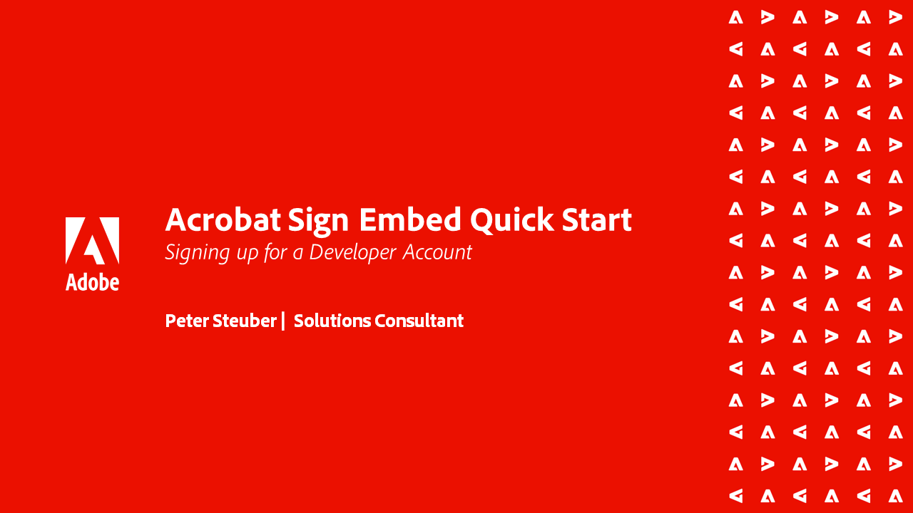

# Självstudiekurser om Acrobat Sign API

Med Acrobat Sign API:er kan du skapa program och bädda in Acrobat Sign-gränssnittet och -funktionerna i dina program.

## Komma igång

<table style="table-layout:fixed">
<tr>
   <td>
    
    

    <a href="signapi.md"><strong>Komma igång</strong></a>
    

    <em>Lär dig hur du inkluderar Sign API i programmet för att samla in signaturer och annan information</em>
     
  </td>
  <td>
    
    

     
  </td>
  <td>
    
    

     
  </td>
  <td>
    
    

     
  </td>
</tr>
</table>

## Snabbstartsguide till Acrobat Sign Embed

Lär dig hur Kom igång med att bädda in OEM-versionen av Acrobat Sign i ditt program. Den här guiden är särskilt utformad för OEM-partners som skapar och bäddar in en signeringsprocess i sina program.

<table style="table-layout:fixed">
<tr>
 <td>
   
    

   <a href="sign-up-developer-account.md"><strong>Registrera dig för ett utvecklarkonto</strong></a>
    

    <em>Läs hur du registrerar dig för ett utvecklarkonto för Acrobat Sign som är fullt aktiverat med Sign- och API-funktioner</em>
     
  </td>
  <td>
   
    

   <a href="creating-your-application.md"><strong>Skapa ditt program</strong></a>
    

    <em>Lär dig skapa ett program i Acrobat Sign</em>
     
  </td>
   <td>
   
    

   <a href="creating-an-embed-link.md"><strong>Skapa en inbäddningslänk</strong></a>
    

    <em>Lär dig hur du skapar en inbäddningslänk för OAuth, vilket är metoden som programmet får behörigheter för användare</em>
     
  </td>
  <td>
   
    

   <a href="generating-an-access-token.md"><strong>Genererar en åtkomsttoken</strong></a>
    

    <em>Lär dig hur du genererar en åtkomsttoken som kan användas med Acrobat Sign API</em>
     
  </td>
</tr>
<tr>
  <td>
   
    

   <a href="creating-a-transient-document.md"><strong>Skapa ett övergående dokument</strong></a>
    

    <em>Lär dig skapa ett tillfälligt dokument som kan användas med Acrobat Sign-åtkomstpunkten</em>
     
  </td>
  <td>
    
    

     
  </td>
   <td>
    
    

     
  </td>
  <td>
    
    

     
  </td>
</tr>
</table>
