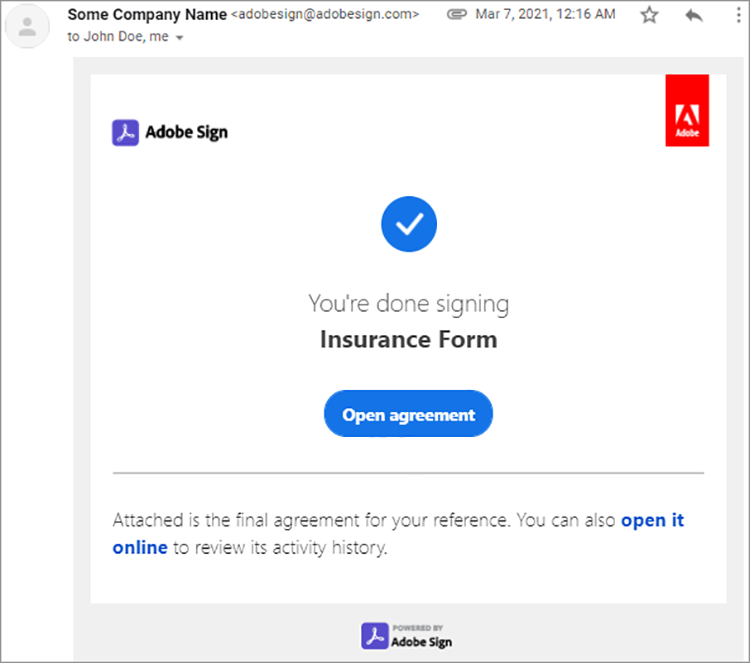

# Komma igång med Adobe Sign API


[Acrobat Sign API](https://www.adobe.io/apis/documentcloud/sign.html) är ett bra sätt att förbättra hur du hanterar signerade avtal. Utvecklare kan enkelt integrera sina system med Sign API, som är ett tillförlitligt och enkelt sätt att ladda upp dokument, skicka dem för signering, skicka påminnelser och samla in e-signaturer.

## Vad du kan lära dig

Den här praktiska självstudiekursen förklarar hur utvecklare kan använda Sign API för att förbättra program och arbetsflöden som skapas med [!DNL Adobe Acrobat Services]. [!DNL Acrobat Services] inkluderar [Adobe PDF Services API](https://www.adobe.io/apis/documentcloud/dcsdk/pdf-tools.html), [Adobe PDF Embed API](https://www.adobe.io/apis/documentcloud/viesdk) (gratis), och [Adobe-API för dokumentgenerering](https://www.adobe.io/apis/documentcloud/dcsdk/doc-generation.html).

Läs mer specifikt om hur du inkluderar Acrobat Sign API i programmet för att samla in signaturer och annan information, till exempel information om anställda i ett försäkringsformulär. Allmänna steg med förenklade HTTP-begäranden och svar används. Du kan implementera dessa begäranden på ditt favoritspråk. Du kan skapa en PDF genom att kombinera [[!DNL Acrobat Services] API:er](https://www.adobe.io/apis/documentcloud/dcsdk/), överför den till Sign-API:et som en [flyktig](https://www.adobe.io/apis/documentcloud/sign/docs.html#!adobedocs/adobe-sign/master/overview/terminology.md) och begära signaturer från slutanvändarna med hjälp av avtalet eller [widget](https://www.adobe.io/apis/documentcloud/sign/docs.html#!adobedocs/adobe-sign/master/overview/terminology.md) arbetsflöde.

## Skapa ett PDF-dokument

Börja med att skapa en Microsoft Word-mall och spara den som en PDF. Du kan också automatisera pipeline med hjälp av dokumentgenererings-API:t för att överföra en mall som har skapats i Word och sedan generera ett PDF-dokument. API för dokumentgenerering ingår i [!DNL Acrobat Services], [kostnadsfritt i sex månader och sedan betala per överföring för endast 0,05 USD per dokumenttransaktion](https://www.adobe.io/apis/documentcloud/dcsdk/pdf-pricing.html).

I det här exemplet är mallen bara ett enkelt dokument med några signerarfält att fylla i. Namnge fälten för nu och infoga sedan de faktiska fälten i den här självstudiekursen.


## Identifiera den giltiga API-åtkomstpunkten

Innan du börjar arbeta med Sign API [skapa ett kostnadsfritt utvecklarkonto](https://acrobat.adobe.com/ca/en/sign/developer-form.html) för att få åtkomst till API:et, testa dokumentutbyte och -körning och testa e-postfunktionen.

Adobe distribuerar Acrobat Sign API över hela världen i många driftsättningsenheter som kallas &quot;shards&quot;. Varje delkonto används av en kund, till exempel NA1, NA2, NA3, EU1, JP1, AU1, IN1 med flera. Delningsnamnen motsvarar de geografiska platserna. Dessa shards utgör bas-URI (åtkomstpunkter) för API-slutpunkterna.

För att få åtkomst till Sign API måste du först identifiera rätt åtkomstpunkt för ditt konto, som kan vara api.na1.adobesign.com, api.na4.adobesign.com, api.eu1.adobesign.com eller andra, beroende på din plats.

```
  GET /api/rest/v6/baseUris HTTP/1.1
  Host: https://api.adobesign.com
  Authorization: Bearer {YOUR-INTEGRATION-KEY-HERE}
  Accept: application/json

  Response Body (example):

  {
    "apiAccessPoint": "https://api.na4.adobesign.com/", 
    "webAccessPoint": "https://secure.na4.adobesign.com/" 
  }
```

I ovanstående exempel är ett svar med värdet som åtkomstpunkt.

>[!IMPORTANT]
>
>I det här fallet måste alla efterföljande begäranden som du gör till Sign-API:t använda den åtkomstpunkten. Om du använder en åtkomstpunkt som inte fungerar i din region visas ett felmeddelande.

## Överföra ett övergående dokument

Med Adobe Sign kan du skapa olika flöden som förbereder dokument för signering eller datainsamling. Oavsett programmets flöde måste du först överföra ett dokument, som bara är tillgängligt i sju dagar. Efterföljande API-anrop måste sedan referera till det här tillfälliga dokumentet.

Dokumentet överförs via en begäran om POST till `/transientDocuments` slutpunkt. Multipart-begäran består av filnamnet, en filström och dokumentfilens MIME-typ (media). Slutpunktssvaret innehåller ett ID som identifierar dokumentet.

Dessutom kan programmet ange en återanrops-URL för Acrobat Sign till ping, vilket meddelar programmet när signeringsprocessen är klar.


```
  POST /api/rest/v6/transientDocuments HTTP/1.1
  Host: {YOUR-API-ACCESS-POINT}
  Authorization: Bearer {YOUR-INTEGRATION-KEY-HERE}
  x-api-user: email:your-api-user@your-domain.com
  Content-Type: multipart/form-data
  File-Name: "Insurance Form.pdf"
  File: "[path]\Insurance Form.pdf"
  Accept: application/json

  Response Body (example):

  {
     "transientDocumentId": "3AAA...BRZuM"
  }
```

## Skapa ett webbformulär

Webbformulär (som tidigare kallades signeringswidgetar) är värdbaserade dokument som alla som har åtkomst till kan signera. Exempel på webbformulär är registreringsformulär, undantag och andra dokument som många öppnar och signerar online.

Om du vill skapa ett nytt webbformulär med Sign-API:t måste du först överföra ett tillfälligt dokument. Begäran om POST till `/widgets` slutpunkten använder det returnerade `transientDocumentId` .

I det här exemplet är webbformuläret `ACTIVE`, men du kan skapa den i ett av tre olika lägen:

* UTKAST - för att stegvis skapa webbformuläret

* REDIGERING - lägga till eller redigera formulärfält i webbformuläret

* AKTIV - för att omedelbart vara värd för webbformuläret

Informationen om formulärets deltagare måste också definieras. Den `memberInfos` -egenskapen innehåller data om deltagarna, till exempel e-post. För närvarande stöder denna uppsättning inte mer än en medlem. Men eftersom e-postadressen till webbformulärssigneraren är okänd när webbformuläret skapas, ska e-postadressen lämnas tom, som i följande exempel. Den `role` definierar den roll som medlemmarna i `memberInfos` (t.ex. signerare och godkännare).

```
  POST /api/rest/v6/widgets HTTP/1.1
  Host: {YOUR-API-ACCESS-POINT}
  Authorization: Bearer {YOUR-INTEGRATION-KEY-HERE}
  x-api-user: email:your-api-user@your-domain.com
  Content-Type: application/json

  Request Body:

  {
    "fileInfos": [
      {
      "transientDocumentId": "YOUR-TRANSIENT-DOCUMENT-ID"
      }
     ],
    "name": "Insurance Form",
      "widgetParticipantSetInfo": {
          "memberInfos": [{
              "email": ""
          }],
      "role": "SIGNER"
      },
      "state": "ACTIVE"
  }

  Response Body (example):

  {
     "id": "CBJ...PXoK2o"
  }
```

Du kan skapa ett webbformulär som `DRAFT` eller `AUTHORING`och sedan ändra status när formuläret passerar genom programpipeline. Om du vill ändra ett webbformulärsläge går du till [PUT /widgets/{widgetId}/state](https://secure.na4.adobesign.com/public/docs/restapi/v6#!/widgets/updateWidgetState) slutpunkt.

## Läser webbformulärets URL

Nästa steg är att identifiera webbformulärets URL. Slutpunkten /widgets hämtar en lista med webbformulärdata, inklusive webbformulärets värd-URL som du vidarebefordrar till användarna, för att samla in signaturer och andra formulärdata.

Den här slutpunkten returnerar en lista så att du kan hitta det specifika formuläret med dess ID i `userWidgetList` innan webbformulärets URL hämtas:

```
  GET /api/rest/v6/widgets HTTP/1.1
  Host: {YOUR-API-ACCESS-POINT}
  Authorization: Bearer {YOUR-INTEGRATION-KEY-HERE}
  Accept: application/json

  Response Body:

  {
    "userWidgetList": [
      {
        "id": "CBJCHB...FGf",
        "name": "Insurance Form",
        "groupId": "CBJCHB...W86",
        "javascript": "<script type='text/javascript' ...
        "modifiedDate": "2021-03-13T15:52:41Z",
        "status": "ACTIVE",
        "Url":
        "https://secure.na4.adobesign.com/public/esignWidget?wid=CBFCIB...Rag*",
        "hidden": false
      },
      {
        "id": "CBJCHB...I8_",
        "name": "Insurance Form",
        "groupId": "CBJCHBCAABAAyhgaehdJ9GTzvNRchxQEGH_H1ya0xW86",
        "javascript": "<script type='text/javascript' language='JavaScript'
        src='https://sec
        "modifiedDate": "2021-03-13T02:47:32Z",
        "status": "ACTIVE",
        "Url":
        "https://secure.na4.adobesign.com/public/esignWidget?wid=CBFCIB...AAB",
        "hidden": false
      },
      {
        "id": "CBJCHB...Wmc",
```

## Hantera ditt webbformulär

Det här formuläret är ett PDF-dokument som användare kan fylla i. Du måste dock tala om för formulärets redigerare vilka fält som användarna måste fylla i och var de finns i dokumentet:


Dokumentet ovan visar inte fälten - än. De läggs till när du definierar vilka fält som samlar in signerarens information, samt deras storlek och position.

Gå till [Webbformulär](https://secure.na4.adobesign.com/public/agreements/#agreement_type=webform) på sidan &quot;Dina avtal&quot; och hitta formuläret du skapade.


Klicka **Redigera** för att öppna dokumentredigeringssidan. De tillgängliga fördefinierade fälten finns på den högra panelen.


I redigeraren kan du dra och släppa text- och signaturfält. När du har lagt till alla nödvändiga fält kan du ändra storlek på och justera dem för att finjustera formuläret. Klicka slutligen på **Spara** för att skapa formuläret.


## Skicka ett webbformulär för signering

När du har slutfört webbformuläret måste du skicka det så att användarna kan fylla i och signera det. När du har sparat formuläret kan du visa och kopiera webbadressen och den inbäddade koden.

**Kopiera URL för webbformulär**: Använd denna URL för att skicka användare till en värdversion av avtalet för granskning och signering. Till exempel:

[https://secure.na4.adobesign.com/public/esignWidget?wid=CBFCIBAA3...babw\*](https://secure.na4.adobesign.com/public/esignWidget?wid=CBFCIBAA3AAABLblqZhCndYscuKcDMPiVfQlpaGPb-5D7ebE9NUTQ6x6jK7PIs8HCtTzr3HOx8U6D5qqbabw*)

**Kopiera inbäddningskod för webbformulär**: lägg till avtalet på webbplatsen genom att kopiera koden och klistra in den i HTML.

Till exempel:

```
<iframe
src="https://secure.na4.adobesign.com/public/esignWidget?wid=CBFC
...yx8*&hosted=false" width="100%" height="100%" frameborder="0"
style="border: 0;
overflow: hidden; min-height: 500px; min-width: 600px;"></iframe>
```


När dina användare öppnar den värdbaserade versionen av formuläret, granskar de det tillfälliga dokumentet som först laddats upp med de angivna fälten.


Användaren fyller sedan i fälten och signerar formuläret.


Sedan signerar användaren dokumentet med en tidigare lagrad signatur eller med en ny.


När användaren klickar **Använd**, Adobe instruerar dem att öppna sitt e-postmeddelande och bekräfta signaturen. Signaturen väntar på att bekräftas.


Denna autentisering lägger till multifaktorautentisering och stärker säkerheten i signeringsprocessen.




## Läser färdiga webbformulär

Nu är det dags att hämta formulärdata som användarna fyllt i. Den `/widgets/{widgetId}/formData` slutpunkten hämtar data som användaren anger i ett interaktivt formulär när hen signerar formuläret.

```
GET /api/rest/v6/widgets/{widgetId}/formData HTTP/1.1
Host: {YOUR-API-ACCESS-POINT}
Authorization: Bearer {YOUR-INTEGRATION-KEY-HERE}
Accept: text/csv
```

CSV-filströmmen som skapas innehåller formulärdata.

```
Response Body:
"Agreement
name","completed","email","role","first","last","title","company","agreementId",
"email verified","web form signed/approved"
"Insurance Form","","myemail@email.com","SIGNER","John","Doe","My Job Title","My
Company Name","","","2021-03-07 19:32:59"
```

## Skapa ett avtal

Som ett alternativ till webbformulär kan du skapa avtal. I följande avsnitt beskrivs några enkla steg för att hantera avtal med Sign-API:t.

Ett avtal skapas när ett dokument skickas till angivna mottagare för signering eller godkännande. Du kan spåra status och slutförande av ett avtal med API:er.

Du kan skapa ett avtal med en [tillfälligt dokument](https://helpx.adobe.com/sign/kb/how-to-send-an-agreement-through-REST-API.html), [biblioteksdokument](https://www.adobe.io/apis/documentcloud/sign/docs.html#!adobedocs/adobe-sign/master/samples/send_using_library_doc.md)eller URL. I det här exemplet baseras avtalet på `transientDocumentId`, precis som webbformuläret som skapades tidigare.

```
POST /api/rest/v6/agreements HTTP/1.1
Host: {YOUR-API-ACCESS-POINT}
Authorization: Bearer {YOUR-INTEGRATION-KEY-HERE}
x-api-user: email:your-api-user@your-domain.com
Content-Type: application/json
Accept: application/json
Request Body:
{
    "fileInfos": [
      {
      "transientDocumentId": "{transientDocumentId}"
      }
     ],
    "name": "{agreementName}",
    "participantSetsInfo": [
      {
      "memberInfos": [
          {
          "email": "{signerEmail}"
          }
        ],
        "order": 1,
        "role": "SIGNER"
      }
    ],
    "signatureType": "ESIGN",
    "state": "IN_PROCESS"
  }
```

I det här exemplet skapas avtalet som IN_PROCESS, men du kan skapa det i ett av tre olika lägen:

* UTKAST - att stegvis skapa avtalet innan det skickas ut

* REDIGERING - lägga till eller redigera formulärfält i avtalet

* IN_PROCESS - för att omedelbart skicka avtalet

Om du vill ändra avtalsstatus använder du `PUT /agreements/{agreementId}/state` slutpunkt för att utföra en av de tillåtna tillståndsövergångarna nedan:

* UTKAST TILL REDIGERING

* REDIGERA TILL IN_PROCESS

* PÅGÅENDE_PROCESS TILL AVBRUTEN

Den `participantSetsInfo` Egenskapen ovan innehåller e-postmeddelanden om personer som förväntas delta i avtalet och vilka åtgärder de utför (signera, godkänna, bekräfta och så vidare). I exemplet ovan finns det bara en deltagare: signeraren. Skrivna signaturer är begränsade till fyra per dokument.

När du skapar ett avtal skickas det automatiskt för signering i Adobe, till skillnad från webbformulär. Slutpunkten returnerar avtalets unika identifierare.


```
  Response Body:

  {
     id (string): The unique identifier of the agreement
  }
```

## Hämta information om avtalsmedlemmar

När du har skapat ett avtal kan du använda kommandot `/agreements/{agreementId}/members` slutpunkt för att hämta information om medlemmar i avtalet. Du kan till exempel kontrollera om en deltagare har signerat avtalet.

```
GET /api/rest/v6/agreements/{agreementId}/members HTTP/1.1
Host: {YOUR-API-ACCESS-POINT}
Authorization: Bearer {YOUR-INTEGRATION-KEY-HERE}
Accept: application/json
```

Den resulterande JSON-svarstexten innehåller information om deltagarna.

```
  Response Body:

  {
     "participantSets":[
        {
           "memberInfos":[
              {
                 "id":"CBJ...xvM",
                 "email":"participant@email.com",
                 "self":false,
                 "securityOption":{
                    "authenticationMethod":"NONE"
                 },
                 "name":"John Doe",
                 "status":"ACTIVE",
                 "createdDate":"2021-03-16T03:48:39Z",
                 "userId":"CBJ...vPv"
              }
           ],
           "id":"CBJ...81x",
           "role":"SIGNER",
           "status":"WAITING_FOR_MY_SIGNATURE",
           "order":1
        }
     ],
```

## Skicka avtalspåminnelser

Beroende på affärsreglerna kan en deadline förhindra deltagarna från att signera avtalet efter ett visst datum. Om avtalet har ett förfallodatum kan du påminna deltagarna när det datumet närmar sig.

Baserat på den avtalsmedlemsinformation du fick efter samtalet till `/agreements/{agreementId}/members` i det sista avsnittet kan du skicka e-postpåminnelser till alla deltagare som fortfarande inte har signerat avtalet.

En begäran om POST till `/agreements/{agreementId}/reminders` slutpunkten skapar en påminnelse för de angivna deltagarna i ett avtal som identifieras av `agreementId` -parametern.

```
POST /agreements/{agreementId}/reminders HTTP/1.1
Host: {YOUR-API-ACCESS-POINT}
Authorization: Bearer {YOUR-INTEGRATION-KEY-HERE}
x-api-user: email:your-api-user@your-domain.com
Content-Type: application/json
Accept: application/json
  Request Body:

  {
    "recipientParticipantIds": [{agreementMemberIdList}],
    "agreementId": "{agreementId}",
    "note": "This is a reminder that you haven't signed the agreement yet.",
    "status": "ACTIVE"
  }

  Response Body:

  {
     id (string, optional): An identifier of the reminder resource created on the
     server. If provided in POST or PUT, it will be ignored
  }
```

När du har publicerat påminnelsen får användarna ett e-postmeddelande med avtalsinformationen och en länk till avtalet.


## Läser slutförda avtal

Precis som webbformulär kan du läsa information om avtal som mottagarna har signerat. Den `/agreements/{agreementId}/formData` slutpunkten hämtar data som anges av användaren när denne signerade webbformuläret.

```
GET /api/rest/v6/agreements/{agreementId}/formData HTTP/1.1
Host: {YOUR-API-ACCESS-POINT}
Authorization: Bearer {YOUR-INTEGRATION-KEY-HERE}
Accept: text/csv
Response Body:
"completed","email","role","first","last","title","company","agreementId"
"2021-03-16 18:11:45","myemail@email.com","SIGNER","John","Doe","My Job Title","My
Company Name","CBJCHBCAABAA5Z84zy69q_Ilpuy5DzUAahVfcNZillDt"
```

## Nästa steg

Med Acrobat Sign API kan du hantera dokument, webbformulär och avtal. De förenklade men kompletta arbetsflödena som skapas med hjälp av webbformulär och avtal görs på ett allmänt sätt så att utvecklare kan implementera dem på valfritt språk.

En översikt över hur Sign API fungerar finns i [Användarhandbok för API-utvecklare](https://www.adobe.io/apis/documentcloud/sign/docs.html#!adobedocs/adobe-sign/master/api_usage.md). Den här dokumentationen innehåller korta artiklar om många av de steg som har följts i artikeln samt andra relaterade ämnen.

Acrobat Sign API är tillgängligt via flera nivåer av [e-signaturplaner för en eller flera användare](https://acrobat.adobe.com/se/sv/sign/pricing/plans.html), så att du kan välja en prismodell som passar dina behov bäst. Nu när du vet hur enkelt det är att införliva Sign API i dina program kan du vara intresserad av andra funktioner som [Acrobat Sign Webhooks](https://www.adobe.io/apis/documentcloud/sign/docs.html#!adobedocs/adobe-sign/master/webhooks.md), en push-baserad programmeringsmodell. Istället för att kräva att appen utför frekventa kontroller i Acrobat Sign-händelser kan du med Webhooks registrera en HTTP-URL där Sign API kör en begäran om återanrop till POSTEN när en händelse inträffar. Webhooks möjliggör robust programmering genom att förse programmet med uppdateringar i realtid och direkt.

Kolla in [fördelningspris](https://www.adobe.io/apis/documentcloud/dcsdk/pdf-pricing.html), när din sex månader långa kostnadsfria testperiod med Adobe PDF Services API avslutas, och det kostnadsfria Adobe PDF Embed API.

Kom igång med att lägga till spännande funktioner som automatiskt skapande av dokument och dokumentsignering i programmet [[!DNL Adobe Acrobat Services]](https://www.adobe.io/apis/documentcloud/dcsdk/gettingstarted.html).
