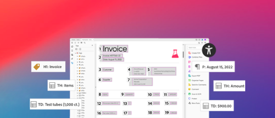

# [!DNL Adobe Acrobat Services] API-självstudiekurser

[!DNL Adobe Acrobat Services] har sex huvudsakliga API:er:

* [!DNL Adobe PDF Services API]
* [!DNL Adobe PDF Embed API]
* [!DNL Adobe Document Generation API]
* [!DNL Adobe PDF Electronic Seal API]
* [!DNL Adobe PDF Extract API]
* [!DNL Adobe PDF Accessibility Auto-Tag API]

De två senare API:erna och deras SDK:er paketeras i [!DNL Adobe PDF Services API] som en del av ett betalerbjudande. [!DNL PDF Embed API] är ett kostnadsfritt erbjudande. Dessa API:er automatiserar generering, ändring och omvandling av dokumentinnehåll via en uppsättning moderna molnbaserade webbtjänster. De hjälper dig att leverera enklare, snabbare och varumärkesanpassade upplevelser så att du kan styra användarinteraktionen med dina dokument, effektivisera arbetsflöden i PDF och främja användning och kvarhållning. Dessa självstudiekurser hjälper dig att komma igång med att leverera enklare, snabbare varumärkesupplevelser med API:erna för [!DNL Adobe Acrobat Services].

<table style="table-layout:fixed">
<tr>
  <td>
    
    

      <a href="pdfservices/overview-pdfservices.md"><strong>PDF Services API</strong></a>
      

      PDF API:er med SDK:er för node.js, .Net och Java för att skapa, konvertera, OCR PDF och mer
       
  </td>
  <td>
    
    

      <a href="docgen/overview-docgen.md"><strong>Dokumentgenererings-API</strong></a>
      

      Generera PDF- och Word-dokument från Word-mallar och JSON-data
       
  </td>  
  <td>
    
    

      <a href="pdfaccessibility/overview-accessibility.md"><strong>PDF Accessibility Auto-tag API</strong></a>
      

      Detta AI-drivna API taggar automatiskt dokument och gör det enkelt att skala PDF-tillgänglighet
       
  </td>
  <td>
    
     

      <a href="pdfaccessibility/overview-accessibility.md"><strong>PDF Extract API</strong></a>
      

      Lås upp strukturen och innehållselementen i PDF med en webbtjänst som drivs av Adobe Sensis maskininlärning
       
  </td>
</tr>
<tr>
  <td>
    
    

      <a href="pdfelectronicseal/overview-electronic-seal.md"><strong>PDF Electronic Seal API</strong></a>
      

      Lär dig hur du använder en manipuleringssäker sigill på PDF i stor skala
       
  </td>
  <td>
    
    

      <a href="pdfembed/overview-embed.md"><strong>PDF Embed API</strong></a>
      

      Kostnadsfritt JavaScript API för att bädda in PDF med hög originalåtergivning, aktivera samarbete och se analyser
       
  </td>
  <td>
    
    

      <a href="acrobatsign/overview-sign.md"><strong>Acrobat Sign API</strong></a>
      

      Integrera e-signaturer i din plattform eller ditt program
       
  </td>
   <td>
    
    

      <a href="usecases/overview-usecases.md"><strong>Användningsfall i Acrobat Services API</strong></a>
      

      Ett stort antal olika användningsfall för Acrobat Services API
       
  </td>
</tr>
</table>
