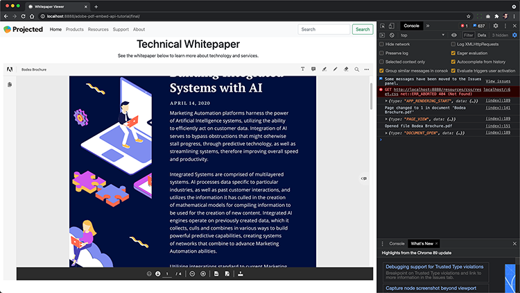

# Styr din onlineupplevelse i PDF och samla in analyser

Publicerar din organisation PDF på din webbplats? Lär dig hur du använder Adobe PDF Embed API för att kontrollera utseende, aktivera samarbetsfunktioner och samla in analyser om hur användare interagerar med PDF, inklusive tid på en sida och sökningar. Inled den här praktiska självstudiekursen med fyra delar genom att välja *Komma igång med PDF Embed API*.

<table style="table-layout:fixed">
<tr>
  <td>
    <a href="controlpdfexperience.md#part1">
        
    </a>
    <div>
    <a href="controlpdfexperience.md#part1"><strong>Del 1: Komma igång med PDF Embed API</strong></a>
    </div>
  </td>
  <td>
    <a href="controlpdfexperience.md#part2">
        
    </a>
    <div>
    <a href="controlpdfexperience.md#part2"><strong>Del 2: Lägger till PDF Embed API på en webbsida</strong></a>
    </div>
  </td>
  <td>
   <a href="controlpdfexperience.md#part3">
      
   </a>
    <div>
    <a href="controlpdfexperience.md#part3"><strong>Del 3: Åtkomst till Analytics API:er</strong></a>
    </div>
  </td>
  <td>
   <a href="controlpdfexperience.md#part4">
      
   </a>
    <div>
    <a href="controlpdfexperience.md#part4"><strong>Del 4: Lägg till interaktivitet baserat på händelser</strong></a>
    </div>
  </td>
</tr>
</table>

## Del 1: Komma igång med PDF Embed API {#part1}

I del 1 lär du dig hur du kommer igång med allt du behöver för delarna 1-3. Du börjar med att få API-inloggningsuppgifter.

**Vad du behöver**

* Självstudieresurser [hämtas](https://github.com/benvanderberg/adobe-pdf-embed-api-tutorial)
* Adobe ID [skaffa ett här](https://accounts.adobe.com/se)
* Webbserver (nod JS, PHP osv.)
* Arbetskunskaper om HTML / JavaScript / CSS

**Vad vi använder**

* En grundläggande webbserver (nod)
* Visual Studio Code
* GitHub

### Hämtar autentiseringsuppgifter

1. Gå till webbplatsen [Adobe.io](https://www.adobe.io/).
1. Klicka på **[!UICONTROL Läs mer]** under Skapa engagerande dokumentupplevelser.

   

   Du kommer då till startsidan för [!DNL Adobe Acrobat Services].

1. Klicka på **[!UICONTROL Kom igång]** i navigeringsfältet.

   Du ser ett alternativ i **Kom igång med [!DNL Acrobat Services] API:er** för att **skapa nya autentiseringsuppgifter** eller **hantera befintliga autentiseringsuppgifter**.

1. Klicka på knappen **[!UICONTROL Kom igång]** under **[!UICONTROL Skapa nya autentiseringsuppgifter]**.

   

1. Markera alternativknappen **[!UICONTROL PDF Embed API]** och lägg till valfritt inloggningsnamn och en programdomän i nästa fönster.

   >[!NOTE]
   >
   >Dessa autentiseringsuppgifter kan bara användas för den programdomän som anges här. Du kan använda vilken domän som helst.

   

1. Klicka på **[!UICONTROL Skapa autentiseringsuppgifter]**.

   På den sista sidan i guiden får du information om dina klientautentiseringsuppgifter. Lämna det här fönstret öppet så att du kan komma tillbaka till det och kopiera klient-ID:t (API-nyckel) för senare bruk.

1. Klicka på **[!UICONTROL Visa dokumentation]** om du vill gå till dokumentationen med detaljerad information om hur du använder detta API.

   

## Del 2: Lägga till PDF Embed API till en webbsida {#part2}

I del 2, du kommer att lära dig hur du enkelt bädda in PDF Embed API i en webbsida. Du gör det genom att använda Adobe PDF Embed API online-demo för att skapa vår kod.

### Hämta träningskoden

Vi har skapat kod som du kan använda. Du kan använda din egen kod, men demonstrationerna sker i samband med självstudieresurserna. Hämta exempelkoden [här](https://github.com/benvanderberg/adobe-pdf-embed-api-tutorial).

1. Gå till [[!DNL Adobe Acrobat Services] webbplats](https://www.adobe.io/apis/documentcloud/dcsdk/).

   ![Skärmbild av [!DNL Adobe Acrobat Services] webbplats](assets/ControlPDF_6.png)

1. Klicka på **[!UICONTROL API:er]** i navigeringsfältet och gå sedan till sidan **[!UICONTROL PDF Embed API]** i listrutan.

   

1. Klicka på **[!UICONTROL Prova demon]**.

   Ett nytt fönster visas med utvecklarsandlådan för PDF Embed API.

   

   Här visas alternativen för de olika visningslägena.

1. Klicka på de olika visningslägena för Helfönster, Behållare i storlek, Inline och Ljuslåda.

   

1. Klicka på visningsläget **[!UICONTROL Fullständigt fönster]** och klicka sedan på knappen **[!UICONTROL Anpassa]** för att aktivera och inaktivera alternativen.

   

1. Inaktivera alternativet **[!UICONTROL Hämta]** PDF.
1. Klicka på knappen **[!UICONTROL Generera kod]** för att se kodförhandsgranskningen.
1. Kopiera **[!UICONTROL Klient-ID]** från fönstret Klientautentiseringsuppgifter från del 1.

   

1. Öppna filen **[!UICONTROL Webb]** -> **[!UICONTROL resurser]** -> **[!UICONTROL js]** -> **[!UICONTROL dc-config.js]** i kodredigeraren.

   Du ser att variabeln clientID finns där.

1. Klistra in klientautentiseringsuppgifterna mellan de dubbla citattecknen för att ange klient-ID till dina autentiseringsuppgifter.

1. Gå tillbaka till kodförhandsgranskningen för utvecklarsandlådan.

1. Kopiera den andra raden som har skriptet Adobe:

   ```
   <script src=https://documentccloud.adobe.com/view-sdk/main.js></script>
   ```

   

1. Gå till kodredigeraren och öppna filen **[!UICONTROL Webb]** -> **[!UICONTROL övning]** -> **[!UICONTROL index.html]**.

1. Klistra in skriptkoden i `<head>` i filen på rad 18 under kommentaren som säger: **TODO: EXERCISE 1: INSERT EMBED API SCRIPT TAG**.

   

1. Gå tillbaka till kodförhandsgranskningen för utvecklarsandlådan och kopiera den första kodraden som har:

   ```
   <div id="adobe-dc-view"></div>
   ```

   

1. Gå till kodredigeraren och öppna filen **[!UICONTROL Webb]** -> **[!UICONTROL övning]** -> **[!UICONTROL index.html]** igen.

1. Klistra in `<div>`-koden i `<body>` i filen på rad 67 under kommentaren som säger **TODO: EXERCISE 1: INSERT PDF EMBED API CODE**.

   

1. Gå tillbaka till kodförhandsgranskningen för utvecklarsandlådan och kopiera kodraderna för `<script>` nedan:

   ```
   <script type="text/javascript">
       document.addEventListener("adobe_dc_view_sdk.ready",             function(){ 
           var adobeDCView = new AdobeDC.View({clientId:                     "<YOUR_CLIENT_ID>", divId: "adobe-dc-view"});
           adobeDCView.previewFile({
               content:{location: {url: "https://documentcloud.                adobe.com/view-sdk-demo/PDFs/Bodea Brochure.                    pdf"}},
               metaData:{fileName: "Bodea Brochure.pdf"}
           }, {showDownloadPDF: false});
       });
   </script>
   ```

1. Gå till kodredigeraren och öppna filen **[!UICONTROL Webb]** -> **[!UICONTROL övning]** -> **[!UICONTROL index.html]** igen.

1. Klistra in `<script>`-koden i `<body>` i filen på rad 68 under taggen `<div>`.

1. Ändra rad 70 i samma **index.html**-fil för att inkludera variabeln clientID som skapades tidigare.

   

1. Ändra rad 72 i samma **index.html**-fil om du vill uppdatera platsen för PDF-filen så att den använder en lokal fil.

   Det finns en i självstudiekursfilerna i **/resources/pdfs/whitepaper.pdf**.

1. Spara dina ändrade filer och förhandsgranska webbplatsen genom att bläddra till **`<your domain>`/Summit21/web/motion/**.

   Du bör se den tekniska vitboken återges i helfönsterläge i webbläsaren.

## Del 3: Åtkomst till Analytics API:er {#part3}

Nu när du har skapat en webbsida där PDF Embed API har renderat ett PDF kan du i del 3 utforska hur du använder JavaScript-händelser för att mäta analyser för att förstå hur användare använder PDF.

### Hitta dokumentation

Det finns en hel del olika JavaScript-händelser tillgängliga som en del av PDF Embed API. Du kan komma åt dem från dokumentationen för [!DNL Adobe Acrobat Services].

1. Gå till webbplatsen [dokumentation](https://www.adobe.io/apis/documentcloud/dcsdk/docs.html).
1. Granska de olika händelsetyperna som är tillgängliga som en del av API:et. De är användbara som referens och kommer också att vara till hjälp för dina framtida projekt.

   

1. Kopiera exempelkoden på webbplatsen.

   Använd den här koden som grund för vår kod och ändra den.

   

   ```
   const eventOptions = {
     //Pass the PDF analytics events to receive.
      //If no event is passed in listenOn, then all PDF         analytics events will be received.
   listenOn: [ AdobeDC.View.Enum.PDFAnalyticsEvents.    PAGE_VIEW, AdobeDC.View.Enum.PDFAnalyticsEvents.DOCUMENT_DOWNLOAD],
     enablePDFAnalytics: true
   }
   
   
   adobeDCView.registerCallback(
     AdobeDC.View.Enum.CallbackType.EVENT_LISTENER,
     function(event) {
       console.log("Type " + event.type);
       console.log("Data " + event.data);
     }, eventOptions
   );
   ```

1. Leta reda på det kodavsnitt som du lade till tidigare och som ser ut så här nedan. Lägg till koden ovan i **index.html**:

   

1. Läs in sidan i webbläsaren och öppna konsolen för att visa konsolutdata från de olika händelserna när du interagerar med visningsprogrammet för PDF.

   

   

### Lägg till brytare för att hämta händelser

Nu när du har de händelser som matas ut till console.log ska vi ändra beteendet utifrån vilka händelser som inträffar. För att göra det använder du ett exempel.

1. Gå till **snippets/eventsSwitch.js** och kopiera innehållet i filen i självstudiekursen.

   

1. Klistra in koden i händelseavlyssnarfunktionen.

   

1. Kontrollera att konsolen matas ut korrekt när sidan har lästs in och att du interagerar med visningsprogrammet för PDF.

### Adobe Analytics

Om du vill lägga till Adobe Analytics-support till din läsare kan du följa anvisningarna som finns dokumenterade på webbplatsen.

>[!IMPORTANT]
>
>Din webbsida måste redan ha Adobe Analytics inläst på sidan i sidhuvudet.

Gå till [Adobe Analytics-dokumentationen](https://www.adobe.com/devnet-docs/dcsdk_io/viewSDK/howtodata.html#adobe-analytics) och granska om Adobe Analytics redan är aktiverat på webbsidan. Följ instruktionerna för att konfigurera en reportSuite.

### Google Analytics


Adobe PDF Embed API tillhandahåller färdig integrering med Adobe Analytics. Men eftersom alla händelser finns tillgängliga som JavaScript-händelser går det att integrera med Google Analytics genom att hämta PDF-händelser och använda ga()-funktionen för att lägga till händelsen i Adobe Analytics.

1. Gå till **snippets/eventsSwitchGA.js** om du vill se hur du kan integrera med Google Analytics.
1. Granska och använd den här koden som ett exempel om din webbsida spåras med Adobe Analytics och redan är inbäddad på webbsidan.

   

## Del 4: Lägg till interaktivitet baserat på händelser {#part4}

I del 4 går du igenom hur du lägger en betalvägg ovanpå din PDF-tittare som syns efter att du har bläddrat förbi den andra sidan.

### Exempel på betalvägg

Navigera till [exemplet på en PDF bakom en betalvägg](https://www3.technologyevaluation.com/research/white-paper/the-forrester-wave-digital-decisioning-platforms-q4-2020.html). I det här exemplet får du lära dig att lägga till interaktivitet utöver en visningsupplevelse i PDF.

### Lägg till betalvägskod

1. Gå till snippets/paywallCode.html och kopiera innehållet.
1. Sök efter `<!-- TODO: EXERCISE 3: INSERT PAYWALL CODE -->` på exercise/index.html.

   

1. Klistra in den kopierade koden efter kommentaren.
1. Gå till **snippets/paywallCode.js** och kopiera innehållet.

   

1. Klistra in koden på den platsen.

### Testa demo med betalvägg

Nu kan du visa demon.

1. Läs in **index.html** på nytt på din webbplats.
1. Bläddra ner till en sida > 2.
1. Visa dialogrutan för att verifiera användaren efter den andra sidan.

   

## Ytterligare resurser

Ytterligare resurser finns [här](https://www.adobe.io/apis/documentcloud/dcsdk/docs.html).
