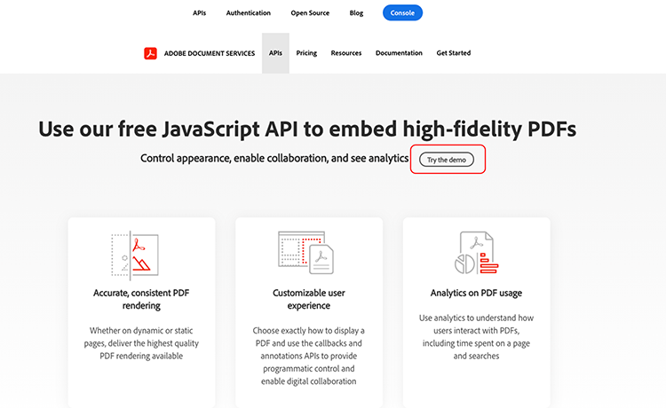
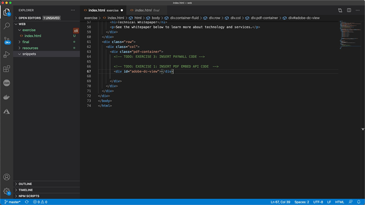

# Styr onlineupplevelsen i PDF och samla in analyser

Publicerar ni PDF på er webbplats? Lär dig hur du använder Adobe PDF Embed API för att styra utseendet, möjliggöra samarbete och samla in analyser om hur användare interagerar med PDF, inklusive hur mycket tid som läggs ned på en sida och sökningar. Om du vill påbörja den här praktiska självstudiekursen i fyra delar väljer du *Komma igång med PDF Embed API*.

<table style="table-layout:fixed">
<tr>
  <td>
    <a href="controlpdfexperience.md#part1">
        
    </a>
    <div>
    <a href="controlpdfexperience.md#part1"><strong>Del 1: Komma igång med PDF Embed API</strong></a>
    </div>
  </td>
  <td>
    <a href="controlpdfexperience.md#part2">
        
    </a>
    <div>
    <a href="controlpdfexperience.md#part2"><strong>Del 2: Lägga till PDF Embed API på en webbsida</strong></a>
    </div>
  </td>
  <td>
   <a href="controlpdfexperience.md#part3">
      
   </a>
    <div>
    <a href="controlpdfexperience.md#part3"><strong>Del 3: Åtkomst till Analytics API:er</strong></a>
    </div>
  </td>
  <td>
   <a href="controlpdfexperience.md#part4">
      
   </a>
    <div>
    <a href="controlpdfexperience.md#part4"><strong>Del 4: Lägga till interaktivitet baserat på händelser</strong></a>
    </div>
  </td>
</tr>
</table>

## Del 1: Komma igång med PDF Embed API {#part1}

I del 1 lär du dig komma igång med allt du behöver för delarna 1-3. Du börjar med att hämta API-uppgifter.

**Det du behöver**

* Resurser för självstudiekurser [hämta](https://github.com/benvanderberg/adobe-pdf-embed-api-tutorial)
* Adobe ID [skaffa en här](https://accounts.adobe.com/se)
* Webbserver (Node JS, PHP osv.)
* Tillräckliga kunskaper om HTML / JavaScript / CSS

**Vad vi använder**

* En grundläggande webbserver (nod)
* Visual Studio Code
* GitHub

### Hämtar autentiseringsuppgifter

1. Gå till [Adobe.io webbplats](https://www.adobe.io/).
1. Klicka **[!UICONTROL Läs mer]** under Skapa engagerande dokumentupplevelser.

   

   Detta tar dig till [!DNL Adobe Acrobat Services] startsida.

1. Klicka **[!UICONTROL Kom igång]** i navigeringsfältet.

   Du ser ett alternativ i **Kom igång med [!DNL Acrobat Services] API:er** till **Skapa nya autentiseringsuppgifter** eller **Hantera befintliga autentiseringsuppgifter**.

1. Klicka **[!UICONTROL Kom igång]** knapp under **[!UICONTROL Skapa nya autentiseringsuppgifter]**.

   

1. Välj **[!UICONTROL PDF Embed API]** alternativknapp och lägg till valfritt användarnamn och en programdomän i nästa fönster.

   >[!NOTE]
   >
   >Dessa autentiseringsuppgifter kan bara användas på den programdomän som anges här. Du kan använda vilken domän som helst.

   

1. Klicka **[!UICONTROL Skapa autentiseringsuppgifter]**.

   På den sista sidan i guiden får du information om dina klientautentiseringsuppgifter. Lämna fönstret öppet så att du kan gå tillbaka till det och kopiera klient-ID:t (API-nyckel) för senare användning.

1. Klicka **[!UICONTROL Visa dokumentation]** om du vill gå till dokumentationen med detaljerad information om hur du använder detta API.

   

## Del 2: Lägga till PDF Embed API på en webbsida {#part2}

I del 2, du kommer att lära dig hur man enkelt bädda in PDF Embed API i en webbsida. Det gör du genom att använda onlinedemon av Adobe PDF Embed API för att skapa koden.

### Hämta träningskoden

Vi har skapat kod som du kan använda. Du kan använda din egen kod, men demonstrationerna sker i samband med självstudieresurserna. Hämta exempelkod [här](https://github.com/benvanderberg/adobe-pdf-embed-api-tutorial).

1. Gå till [[!DNL Adobe Acrobat Services] webbplats](https://www.adobe.io/apis/documentcloud/dcsdk/).

   ![Skärmdump av [!DNL Adobe Acrobat Services] webbplats](assets/ControlPDF_6.png)

1. Klicka **[!UICONTROL API:er]** i navigeringsfältet och sedan gå till **[!UICONTROL PDF Embed API]** i listrutan.

   

1. Klicka **[!UICONTROL Prova demon]**.

   Ett nytt fönster visas med utvecklarsandlådan för PDF Embed API.

   

   Här visas alternativen för de olika visningslägena.

1. Klicka på de olika visningslägena för Fullständigt fönster, Behållare, Inline och Ljuslåda.

   

1. Klicka **[!UICONTROL Fullständigt fönster]** visningsläge och klicka sedan på **[!UICONTROL Anpassa]** knapp för att slå på och av alternativ.

   

1. Inaktivera **[!UICONTROL Hämta]** PDF.
1. Klicka **[!UICONTROL Generera kod]** för att se kodförhandsgranskningen.
1. Kopiera **[!UICONTROL Klient-ID]** från fönstret Client Credentials i del 1.

   

1. Öppna **[!UICONTROL Webb]** -> **[!UICONTROL tillgångar]** -> **[!UICONTROL js]** -> **[!UICONTROL dc-config.js]** i kodredigeraren.

   Du ser att variabeln clientID finns där.

1. Klistra in dina klientautentiseringsuppgifter mellan dubbla citattecken för att ställa in klient-ID till dina autentiseringsuppgifter.

1. Gå tillbaka till kodförhandsgranskningen för utvecklarsandlådan.

1. Kopiera den andra raden som har skriptet Adobe:

   ```
   <script src=https://documentccloud.adobe.com/view-sdk/main.js></script>
   ```

   

1. Gå till kodredigeraren och öppna **[!UICONTROL Webb]** -> **[!UICONTROL utöva]** -> **[!UICONTROL index.html]** fil.

1. Klistra in skriptkoden i `<head>` av filen på rad 18 under kommentaren som säger: **ATT GÖRA: ÖVNING 1: INFOGA API-SKRIPTTAGG**.

   

1. Gå tillbaka till kodförhandsgranskningen för utvecklarsandlådan och kopiera den första kodraden som har:

   ```
   <div id="adobe-dc-view"></div>
   ```

   

1. Gå till kodredigeraren och öppna **[!UICONTROL Webb]** -> **[!UICONTROL utöva]** -> **[!UICONTROL index.html]** filen igen.

1. Klistra in `<div>` koden till `<body>` av filen på rad 67 under kommentaren som säger **ATT GÖRA: ÖVNING 1: INFOGA PDF-INBÄDDAD API-KOD**.

   

1. Gå tillbaka till kodförhandsgranskningen för utvecklarsandlådan och kopiera kodraderna för `<script>` nedan:

   ```
   <script type="text/javascript">
       document.addEventListener("adobe_dc_view_sdk.ready",             function(){ 
           var adobeDCView = new AdobeDC.View({clientId:                     "<YOUR_CLIENT_ID>", divId: "adobe-dc-view"});
           adobeDCView.previewFile({
               content:{location: {url: "https://documentcloud.                adobe.com/view-sdk-demo/PDFs/Bodea Brochure.                    pdf"}},
               metaData:{fileName: "Bodea Brochure.pdf"}
           }, {showDownloadPDF: false});
       });
   </script>
   ```

1. Gå till kodredigeraren och öppna **[!UICONTROL Webb]** -> **[!UICONTROL utöva]** -> **[!UICONTROL index.html]** filen igen.

1. Klistra in `<script>` koden till `<body>` på rad 68 under rubriken `<div>` tagg.

1. Ändra rad 70 av samma **index.html** filen som ska inkludera variabeln clientID som skapades tidigare.

   

1. Ändra rad 72 av samma **index.html** för att uppdatera PDF-filens plats så att en lokal fil används.

   Det finns en i självstudiekurserna i **/resources/pdfs/whitepaper.pdf**.

1. Spara dina ändrade filer och förhandsgranska webbplatsen genom att bläddra till **`<your domain>`/Summit21/web/motion/**.

   Den tekniska rapporten visas i helfönsterläge i webbläsaren.

## Del 3: Åtkomst till Analytics API:er {#part3}

Nu när du har skapat en webbsida där PDF Embed API renderar en PDF kan du i del 3 utforska hur du använder JavaScript-händelser för att mäta analyser för att förstå hur användare använder PDF.

### Hitta dokumentation

Det finns många olika JavaScript-händelser som ingår i PDF Embed API. Du kan komma åt dem från [!DNL Adobe Acrobat Services] dokumentation.

1. Gå till [dokumentation](https://www.adobe.io/apis/documentcloud/dcsdk/docs.html) webbplats.
1. Granska de olika händelsetyperna som ingår i API:et. Dessa är användbara som referens och kommer också att vara till hjälp för dina framtida projekt.

   

1. Kopiera exempelkoden som visas på webbplatsen.

   Använd detta som grund för vår kod och ändra den.

   

   ```
   const eventOptions = {
     //Pass the PDF analytics events to receive.
      //If no event is passed in listenOn, then all PDF         analytics events will be received.
   listenOn: [ AdobeDC.View.Enum.PDFAnalyticsEvents.    PAGE_VIEW, AdobeDC.View.Enum.PDFAnalyticsEvents.DOCUMENT_DOWNLOAD],
     enablePDFAnalytics: true
   }
   
   
   adobeDCView.registerCallback(
     AdobeDC.View.Enum.CallbackType.EVENT_LISTENER,
     function(event) {
       console.log("Type " + event.type);
       console.log("Data " + event.data);
     }, eventOptions
   );
   ```

1. Hitta det kodavsnitt som du lade till tidigare och som ser ut så här nedan och lägg till koden ovan efter den här koden i **index.html**:

   

1. Läs in sidan i webbläsaren och öppna konsolen för att visa konsolutdata från de olika händelserna när du interagerar med visningsprogrammet i PDF.

   

   

### Lägg till växel för hämtade händelser

Nu när händelserna har skickats till console.log kan vi ändra beteendet utifrån vilka händelser som har inträffat. För att göra detta använder du ett exempel på byte.

1. Gå till **snippets/eventsSwitch.js** och kopiera innehållet i filen i självstudiekurskoden.

   

1. Klistra in koden i händelseavlyssnarfunktionen.

   

1. Kontrollera att konsolen matas ut korrekt när sidan läses in och att du interagerar med visningsprogrammet för PDF.

### Adobe Analytics

Om du vill lägga till Adobe Analytics-stöd i visningsprogrammet kan du följa anvisningarna på webbplatsen.

>[!IMPORTANT]
>
>Din webbsida måste redan ha Adobe Analytics inläst på sidan i sidhuvudet.

Gå till [Adobe Analytics-dokumentation](https://www.adobe.com/devnet-docs/dcsdk_io/viewSDK/howtodata.html#adobe-analytics) och granska om du redan har aktiverat Adobe Analytics på webbsidan. Följ instruktionerna för att konfigurera en reportSuite.

### Google Analytics


Adobe PDF Embed API har färdig integrering med Adobe Analytics. Men eftersom alla händelser är tillgängliga som JavaScript-händelser går det att integrera med Google Analytics genom att hämta PDF-händelser och använda ga()-funktionen för att lägga till händelsen i Adobe Analytics.

1. Gå till **snippets/eventsSwitchGA.js** för att se hur du kan integrera med Google Analytics.
1. Granska och använd den här koden som ett exempel om webbsidan spåras med Adobe Analytics och redan är inbäddad på webbsidan.

   

## Del 4: Lägga till interaktivitet baserat på händelser {#part4}

I del 4, du kommer att gå igenom hur man lager ovanpå din PDF-tittare en lönevägg som visas efter att du bläddrar förbi den andra sidan.

### Exempel på betalvägg

Navigera till den här [exempel på en PDF bakom en betalvägg](https://www3.technologyevaluation.com/research/white-paper/the-forrester-wave-digital-decisioning-platforms-q4-2020.html). I det här exemplet lär du dig lägga till interaktivitet utöver en visningsupplevelse i PDF.

### Lägg till betalvägskod

1. Gå till snippets/paywallCode.html och kopiera innehållet.
1. Sök efter `<!-- TODO: EXERCISE 3: INSERT PAYWALL CODE -->` i exercise/index.html.

   

1. Klistra in den kopierade koden efter kommentaren.
1. Gå till **snippets/paywallCode.js** och kopiera innehållet.

   

1. Klistra in koden på den platsen.

### Prova demo med Paywall

Nu kan du se demon.

1. Läs in igen **index.html** på din webbplats.
1. Bläddra ner till en sida > 2.
1. Visa dialogrutan som visar användaren efter den andra sidan.

   

## Ytterligare resurser

Ytterligare resurser finns [här](https://www.adobe.io/apis/documentcloud/dcsdk/docs.html).
