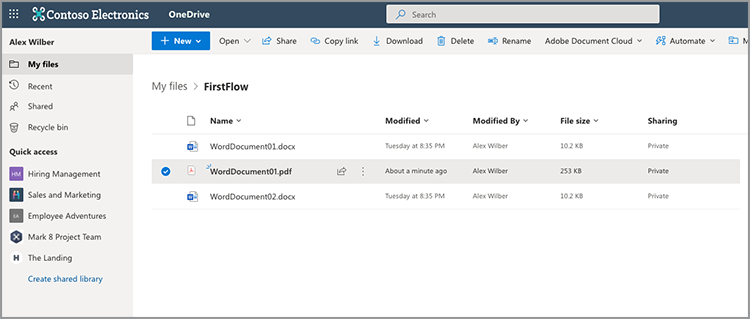

# Skapa ditt första arbetsflöde i Microsoft Power Automate

Lär dig hur du skapar ditt första flöde i [Microsoft Power Automate](https://flow.microsoft.com) med hjälp av [Adobe PDF-tjänster](https://us.flow.microsoft.com/sv-se/connectors/shared_adobepdftools/adobe-pdf-services/) anslutningsprogram.

I den här praktiska självstudien lär du dig att:

* Konvertera Word-dokument till PDF
* Kombinera PDF-dokument till ett PDF
* Protect ett PDF-dokument med ett lösenord

## Förberedelse

### Vad du behöver

* **Inloggningsuppgifter för provperiod eller produktion för Adobe PDF-tjänster**
Läs mer om hur du får och konfigurerar inloggningsuppgifter i Microsoft Power Automate [här](https://experienceleague.adobe.com/docs/document-services/tutorials/pdfservices/getting-credentials-power-automate.html).
* **Microsoft Power Automate med Premium-anslutningar**
Lär dig kontrollera licensieringsnivån för Power Automate [här](https://docs.microsoft.com/en-us/power-platform/admin/power-automate-licensing/types).
* **OneDrive**
I den här självstudiekursen används OneDrive-lagringskontakten, men du kan byta ut en valfri lagringskontakt.

### Exempelfiler

Det finns två [exempelfiler](assets/sample-assets.zip) som du behöver för att packa upp och ladda upp till OneDrive:

* WordDocument01.docx
* WordDocument02.docx

### Hämtar autentiseringsuppgifter

För att slutföra den här självstudiekursen behöver du dina inloggningsuppgifter som redan har konfigurerats i Microsoft Power Automate för Adobe PDF-tjänster. Om du inte har slutfört detta steg kan du gå till [instruktioner här](https://experienceleague.adobe.com/docs/document-services/tutorials/pdfservices/getting-credentials-power-automate.html).

## Del 1: Skapa nytt flöde och konvertera Word till PDF

### Skapa flödet

I den här delen skapar du ett nytt [Microsoft Power Automate](https://flow.microsoft.com) använda ett direktflöde, lägga till parametrar, hämta filer från OneDrive och konvertera dem till PDF.

1. Gå till [Microsoft Power Automate](https://flow.microsoft.com) och logga in med dina inloggningsuppgifter.
1. Välj i sidofältet **[!UICONTROL Skapa]**.

   

1. Välj **[!UICONTROL Omedelbart flöde]**.
1. Ge ditt flöde ett namn.
1. Under *Välj hur flödet ska utlösas*, välj **[!UICONTROL Utlösa ett flöde manuellt]**.
1. Välj **[!UICONTROL Skapa]**.

### Hämta filinnehåll för filer

Hämta sedan filinnehållet för exempelfilerna.

>[!PREREQUISITES]
>
>Om du inte har överfört [exempelfiler](assets/sample-assets.zip) till OneDrive, packa upp dem och ladda upp dem.


1. in [Power Automate](https://flow.microsoft.com), välj **[!UICONTROL + Nytt steg]**.
1. Sök efter *OneDrive* i sökfältet.
1. Välj antingen ditt arbets- eller personliga OneDrive-konto genom att välja **[!UICONTROL OneDrive för företag]** eller **[!UICONTROL OneDrive]**.
1. Sök efter *Hämta filinnehåll* i sökfältet.
1. I dialogrutan **[!UICONTROL Fil]** väljer du mappikonen för att gå till *WordDocument01.docx* -filen i OneDrive.

   

### Konvertera fil till PDF

Nu när du har filinnehållet kan du konvertera dokumentet till PDF.

1. in [Power Automate](https://flow.microsoft.com), välj **[!UICONTROL + Nytt steg]**.
1. Sök efter *Adobe PDF-tjänster* i sökfältet.
1. Välj **[!UICONTROL Adobe PDF-tjänster]**.
1. Sök efter *Konvertera Word till PDF* i sökfältet.
1. in **[!UICONTROL Filnamn]**, namnge filen som du önskar men den måste sluta med *.docx*. Det här tillägget krävs för att konvertera dokument från Word till PDF.
1. Placera markören i rutan **[!UICONTROL Filinnehåll]** område.
1. Använda **[!UICONTROL Dynamiskt innehåll]** panel, välj **[!UICONTROL Filinnehåll]**.

   

### Spara filen på OneDrive

Spara filen i OneDrive när dokumentet har skapats.

1. in [Microsoft Power Automate](https://flow.microsoft.com), välj **[!UICONTROL + Nytt steg]**.
1. Sök efter *OneDrive* i sökfältet.
1. Välj antingen ditt arbets- eller personliga OneDrive-konto genom att välja **[!UICONTROL OneDrive för företag]** eller **[!UICONTROL OneDrive]**.
1. Sök efter *Hämta filinnehåll* i sökfältet.
1. Sök efter *Skapa fil* i sökfältet.
1. Välj **[!UICONTROL Skapa fil]**.
1. I dialogrutan **[!UICONTROL Mappsökväg]** markerar du mappikonen och anger var du vill spara filen i OneDrive.
1. in **[!UICONTROL Filnamn]**, namnge filen som du önskar men den måste sluta med *.docx*. Det här tillägget krävs för att konvertera dokument från Word till PDF.
1. I dialogrutan **[!UICONTROL Filinnehåll]** fält, använda **[!UICONTROL Dynamiskt innehåll]** för att infoga variabeln Innehåll i PDF-fil.

### Testa flöde

1. I det övre vänstra hörnet väljer du **[!UICONTROL Namnlös]** om du vill byta namn på flödet.
1. Välj **[!UICONTROL Spara]**.
1. Välj **[!UICONTROL Testa]**.
1. Välj **[!UICONTROL Manuellt]** och därefter **[!UICONTROL Spara och testa]**.
1. Välj **[!UICONTROL Fortsätt]**.
1. Välj **[!UICONTROL Kör flöde]**.

I OneDrive-mappen bör du nu se det konverterade PDF.



## Del 2: Generera ett dynamiskt dokument från en mall

Denna nästa del bygger på del 1 och använder *Generera dokument från Word* mall för att dynamiskt sammanfoga data i dokumentet.

### Granska dokumentmallen

Öppna *WordDocument02_.docx* från dina exempelfiler i OneDrive. Word-dokumentet innehåller flera olika texttaggar som representerar platser där data fylls i i dokumentet.

### Lägg till parametrar som ska utlösas

Om du vill att dynamiska data ska överföras till dokumentet måste du skapa några parametrar som utlösaren kan använda för att fråga efter värden.

1. När du redigerar flödet väljer du **[!UICONTROL Utlösa ett flöde manuellt]** för att expandera åtgärden.
1. Välj **[!UICONTROL Lägg till indata]**.
1. Välj **[!UICONTROL Text]**.
1. Namnge fältet *Förnamn*.

Upprepa steg 2-4 för att lägga till följande fält:

* Efternamn
* Lön


### Hämta filinnehåll för en mall

Om du vill generera ett dokument måste du först hämta Word-mallens filinnehåll.

1. I Power Automate väljer du + **[!UICONTROL Nytt steg]**.
1. Sök efter *OneDrive* i sökfältet.
1. Välj antingen ditt arbets- eller personliga OneDrive-konto genom att välja **[!UICONTROL OneDrive för företag]** eller **[!UICONTROL OneDrive]**.
1. Sök efter *Hämta filinnehåll* i sökfältet.
1. I dialogrutan **[!UICONTROL Fil]** väljer du mappikonen för att gå till *WordDocument02.docx* -filen i OneDrive.


### Generera dokument från mall

1. I Power Automate väljer du **[!UICONTROL + Nytt steg]**.
1. Sök efter *Adobe PDF-tjänster* i sökfältet.
1. Välj **[!UICONTROL Adobe PDF-tjänster]**.
1. Välj **[!UICONTROL Generera dokument från Word-mall]** åtgärd.
1. I dialogrutan **[!UICONTROL Mallfilens namn]** -fältet, namnge filen som du vill men den måste sluta med *.docx*.

#### Sammanfoga data

Använda *Generera dokument från Word-mall* kan du koppla data till dokumentet från någon av de olika variablerna i flödet med hjälp av Dynamiskt innehåll.

Kopiera JSON-data nedan till **Sammanfoga data** fält:

```
{
    "FirstName": "",
    "LastName": "",
    "Salary": ""
}
```

1. Placera markören i fältet mellan de två citattecknen för *FirstName* värde.
1. Använda **[!UICONTROL Dynamiskt innehåll]** -panelen, infoga *Förnamn* värde från utlösa en flödesåtgärd manuellt.

   

1. Upprepa steg 7-8 för **[!UICONTROL LastName]** och **[!UICONTROL Lön]** fält.
1. I dialogrutan **[!UICONTROL Mallfilens innehåll]** fältet använder du **[!UICONTROL Dynamiskt innehåll]** för att infoga **[!UICONTROL Filinnehåll]** värde från *Hämta filinnehåll* steg.


>[!TIP]
>
>Inställningen *Generera dokument från Word-mall* åtgärd använder Adobe dokumentgenererings-API. Om du vill lära dig mer om hur du skapar mallar kan du använda följande resurser:
>
>* [Läs mer om att skapa Adobe-dokument](https://developer.adobe.com/document-services/apis/doc-generation/)
>* [Tagg för generering av Adobe-dokument för Microsoft Word](https://appsource.microsoft.com/en-US/product/office/WA200002654)
>* [API-dokumentation för dokumentgenerering i Adobe](https://developer.adobe.com/document-services/docs/overview/document-generation-api/)

### Spara filen på OneDrive

När dokumentet har skapats kan du spara filen tillbaka i OneDrive.

1. I Power Automate väljer du **+ [!UICONTROL Nytt steg]**.
1. Sök efter *OneDrive* i sökfältet.
1. Välj antingen ditt arbets- eller personliga OneDrive-konto genom att välja **[!UICONTROL OneDrive för företag]** eller **[!UICONTROL OneDrive]**.
1. Sök efter *Skapa fil* i sökfältet.
1. Välj **[!UICONTROL Skapa fil]**.
1. I dialogrutan **[!UICONTROL Mappsökväg]** markerar du mappikonen och anger var du vill spara filen i OneDrive.
1. I dialogrutan **[!UICONTROL Filnamn]** anger du filens namn. Eftersom resultatet är ett PDF måste filnamnet sluta med filtillägget .pdf.
1. Använd kommandot **[!UICONTROL Dynamiskt innehåll]** för att infoga PDF-filens innehållsvariabel i **[!UICONTROL Filinnehåll]** område.

### Testa flöde


1. Välj **[!UICONTROL Spara]**.
1. Välj **[!UICONTROL Testa]**.
1. Välj **[!UICONTROL Manuellt]** och därefter **[!UICONTROL Spara och testa]**.
1. Välj **[!UICONTROL Fortsätt]**.
1. Ange värden för *Förnamn*, *Efternamn* och *Lön*.
1. Välj **[!UICONTROL Kör flöde]**.

I mappen OneDrive visas nu en PDF som genereras från Word-dokumentet. När du öppnar PDF-dokumentet i OneDrive ser du att data sammanfogas med platserna för texttaggar.


## Del 3: Kombinera PDF till en

Nu när du har skapat och konverterat ett Word-dokument till en PDF är nästa steg att kombinera flera PDF-dokument.

>[!NOTE]
>
>I föregående åtgärder sparade du en kopia av dokumentet som en fil i OneDrive. Om du vill använda verktyg som Merge PDF behöver du inte spara filen i OneDrive. I stället kan du skicka utdata direkt från en åtgärd till nästa, vilket är bättre än att spara till OneDrive efter varje åtgärd. Men du sparar dessa filer till OneDrive, som en demonstration.

### Steg för Lägg till sammanfogning PDF

1. När du redigerar flödet väljer du **[!UICONTROL + Nästa steg]** för att lägga till en åtgärd i slutet av flödet.
1. Sök efter *Adobe PDF-tjänster* i sökfältet.
1. Välj **[!UICONTROL Adobe PDF-tjänster]**.
1. Välj **[!UICONTROL Sammanfoga PDF]** åtgärder.
1. I dialogrutan **[!UICONTROL Sammanfoga PDF-filnamn]** -fältet, anger du önskat filnamn (dvs.*CombinedDocument.pdf*).
1. I dialogrutan **[!UICONTROL Filinnehåll -1]** fältet använder du **[!UICONTROL Dynamiskt innehåll]** för att infoga *PDF-filinnehåll* värde från **[!UICONTROL Konvertera Word till PDF]** steg.
1. Om du vill lägga till nästa dokument väljer du **+ [!UICONTROL lägg till nytt objekt]**.
1. I dialogrutan **[!UICONTROL Filinnehåll - 2]** fältet använder du **[!UICONTROL Dynamiskt innehåll]** för att infoga **[!UICONTROL Innehåll i utdatafil]** värde från *Generera dokument från Word-mall* steg.


### Spara sammanfogad PDF till OneDrive

När dokumentet har kombinerats kan du spara tillbaka dokumentet till OneDrive.

1. I Power Automate väljer du **+ [!UICONTROL Nytt steg]**.
1. Sök efter *OneDrive* i sökfältet.
1. Välj antingen ditt arbets- eller personliga OneDrive-konto genom att välja **[!UICONTROL OneDrive för företag]** eller **[!UICONTROL OneDrive]**.
1. Sök efter *Skapa fil* i sökfältet.
1. Välj **[!UICONTROL Skapa fil]**.
1. I dialogrutan **[!UICONTROL Mappsökväg]** markerar du mappikonen och anger var du vill spara filen i OneDrive.
1. I dialogrutan **[!UICONTROL Filnamn]** anger du filens namn. Eftersom utdata är en PDF måste filnamnet sluta med .pdf.
1. I dialogrutan **[!UICONTROL Filinnehåll]** fält, använda **[!UICONTROL Dynamiskt innehåll]** för att infoga *PDF-filinnehåll* värde från **[!UICONTROL Sammanfoga PDF]** steg.

   

### Testa flöde

1. Välj **[!UICONTROL Spara]**.
1. Välj **[!UICONTROL Testa]**.
1. Välj **[!UICONTROL Manuellt]** och därefter **[!UICONTROL Spara och testa]**.
1. Välj **[!UICONTROL Fortsätt]**.
1. Ange värden för *Förnamn*, *Efternamn* och *Lön*.
1. Välj **[!UICONTROL Kör flöde]**.

I OneDrive-mappen visas det kombinerade PDF med sidor från det första och andra dokumentet.

## Del 4: Protect-dokument från PDF

När du har genererat ett dokument kan du skydda det från redigering genom att inkludera ett extra steg innan du sparar det i OneDrive.

### Skydda en PDF-fil

1. När du redigerar ditt flöde i Power Automate kan du välja **+** mellan **[!UICONTROL Sammanfoga PDF]** åtgärder och **[!UICONTROL Skapa fil 3]** åtgärder.

   

1. Välj **[!UICONTROL Lägg till en åtgärd]**.
1. Sök efter *Adobe PDF-tjänster* i sökfältet.
1. Välj **[!UICONTROL Adobe PDF-tjänster]**.
1. Välj **[!UICONTROL Protect PDF från visning]** åtgärder.
1. I dialogrutan **[!UICONTROL Filnamn]** I det här fältet anger du namnet som du vill ha, förutsatt att det slutar med filtillägget .pdf.
1. Ange **[!UICONTROL Lösenord]** för det angivna lösenordet för att öppna dokumentet.
1. I dialogrutan **[!UICONTROL Filinnehåll]** fältet använder du **[!UICONTROL Dynamiskt innehåll]** för att infoga *PDF-filinnehåll* värde från **[!UICONTROL Sammanfoga PDF]** steg.

### Uppdatera Spara till OneDrive

När dokumentet är skyddat kan du spara filen tillbaka i OneDrive. I det här exemplet uppdaterar du det befintliga **Skapa fil 3** åtgärd med en ny *Filinnehåll* värde.

1. Markera markören på menyn **[!UICONTROL Filinnehåll]** i **[!UICONTROL Skapa fil 3]** åtgärder.
1. Använd kommandot **[!UICONTROL Dynamiskt innehåll]** för att infoga *PDF-filinnehåll* värde från **Protect PDF från visning** steg.

### Testa flöde

1. Välj **[!UICONTROL Spara]**.
1. Välj **[!UICONTROL Testa]**.
1. Välj **[!UICONTROL Manuellt]** och därefter **[!UICONTROL Spara och testa]**.
1. Välj **[!UICONTROL Fortsätt]**.
1. Ange värden för *Förnamn*, *Efternamn* och *Lön*.
1. Välj **[!UICONTROL Kör flöde]**.

I OneDrive-mappen visas det kombinerade PDF som nu uppmanar dig att ange ett lösenord för att visa dokumentet.

## Nästa steg

I den här självstudiekursen har du konverterat ett Word-dokument till en PDF, genererat ett dokument baserat på data, sammanfogat dokument och lösenordsskyddat. Utforska några av de andra åtgärderna som finns i anslutningen Adobe PDF Services i Microsoft Power Automate om du vill veta mer:

* Visa de färdiga mallarna som finns i Microsoft Power Automate.
* Lär dig av [artiklar](https://medium.com/adobetech/tagged/microsoft-power-automate) på Adobe Tech Blog.
* Granska [dokumentation](https://developer.adobe.com/document-services/docs/overview/document-generation-api/) för Adobe-dokumentgenererings-API.
