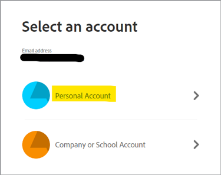
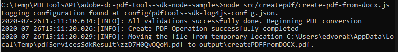

# Skapa en PDF från HTML eller MS Office på några minuter med PDF Services API och Node.js


Det har aldrig varit enklare att digitalisera dokumentarbetsflöden med nya Adobe PDF Services API, som ger utvecklare fritt fram att välja mellan flera kraftfulla PDF-manipuleringstjänster för att tillgodose behoven i komplexa affärsarbetsflöden. Komplicerade arkitekturer, implementeringsstrategier och teknikuppgång kan effektiviseras med dessa molnbaserade webbtjänster som är lättillgängliga.

I PDF Services API finns det flera tillgängliga tjänster för att skapa och manipulera PDF eller exportera från PDF till MS Office och andra format.

* Skapa en PDF-fil från statiska eller dynamiska HTML-, MS Word-, PowerPoint- och Excel-filer med mera
* Export PDF till MS Word, PowerPoint, Excel med mera
* OCR för att identifiera PDF-filer och aktivera dokumentsökning
* Protect PDF med lösenord när dokument öppnas
* Kombinera PDF- eller PDF-dokument till ett enda PDF
* Komprimera PDF för att minska storleken på delning via e-post eller online
* Linjär för att optimera en PDF för snabb visning på webben
* Ordna PDF-sidor med tjänster för att infoga, ersätta, ordna om, ta bort och rotera

Utvecklare kan komma igång på bara några minuter med de färdiga exempelfilerna för att komma åt alla tillgängliga webbtjänster. Så här börjar du.

## Hämta autentiseringsuppgifter och hämta exempelfiler

Det första steget är att hämta en autentiseringsuppgift (API-nyckel) för att låsa upp användningen. [Registrera dig för den kostnadsfria provperioden här](https://www.adobe.com/go/dcsdks_credentials) och klicka på Kom igång för att skapa dina nya inloggningsuppgifter.


Det är viktigt att välja ett personligt konto för att registrera dig för den kostnadsfria provperioden:



I nästa steg väljer du API-tjänsten för PDF-tjänster och lägger sedan till ett namn och en beskrivning för dina inloggningsuppgifter.

Det finns en kryssruta för att &quot;Skapa personligt kodexempel&quot;. Välj det här alternativet om du vill att dina nya inloggningsuppgifter ska läggas till automatiskt i exempelfilerna och hoppa över det manuella steget.

Välj sedan Node.js som språk för att ta emot de Node.js-specifika exemplen och klicka på knappen Skapa autentiseringsuppgifter.


Du får en .zip-fil att hämta som heter PDFToolsSDK-Node.jsSamples.zip och som kan sparas i det lokala filsystemet.

## Lägga till dina inloggningsuppgifter i kodexemplen

Om du valde alternativet Skapa personligt kodexempel behöver du inte lägga till ditt klient-ID manuellt i kodexempelfilerna och du kan hoppa över nästa steg och gå direkt till avsnittet Exempel på kod som körs nedan.

Om du inte valde alternativet Skapa personligt kodexempel måste du kopiera klient-ID:t (API-nyckeln) från Adobe.io-konsolen:


Packa upp innehållet i PDFToolsSDK-Node.jsSamples.zip.

Gå till rotkatalogen under mappen adobe-dc-pdf-tools-sdk-node-samples .

Öppna pdftools-api-credentials.json med valfri textredigerare eller IDE.

Klistra in autentiseringsuppgifterna i fältet för klient-ID i koden:

```javascript
{
 "client_credentials": {
  "client_id": "abcdefghijklmnopqrstuvwxyz",
```

Spara filen och fortsätt till nästa steg för att köra kodexemplen.

## Köra ditt första kodexempel

Gå till rotkatalogen under mappen adobe-dc-pdf-tools-sdk-node-samples med kommandotolken.

Skriv npm install:

C:\Temp\PDFToolsAPI\adobe-dc-pdf-tools-sdk-node-samples>npm install

Nu kan du köra exempelfilerna!

Skapa en PDF för ditt första exempel:

Medan du fortfarande är i kommandotolken, kör exemplet skapa PDF med följande kommando:

C:\Temp\PDFToolsAPI\adobe-dc-pdf-tools-sdk-node-samples>nod src/createpdf/create-pdf-from-docx.js

Exempel på utdata:



PDF skapas på den plats som anges i utdata, som är standardkatalogen pdfServicesSdkResult.

## Resurser och nästa steg

* Mer hjälp och support finns på Adobe [[!DNL Acrobat Services] API:er](https://community.adobe.com/t5/document-cloud-sdk/bd-p/Document-Cloud-SDK?page=1&amp;sort=latest_replies&amp;filter=all) användarforum

PDF Services API [Dokumentation](https://www.adobe.com/go/pdftoolsapi_doc)

* [Vanliga frågor](https://community.adobe.com/t5/document-cloud-sdk/faq-for-document-services-pdf-tools-api/m-p/10726197) för PDF Services API-frågor

* [Kontakta oss](https://www.adobe.com/go/pdftoolsapi_requestform) frågor om licenser och priser

* Relaterade artiklar:
  [Nya PDF Services API har ännu fler funktioner för dokumentarbetsflöden](https://community.adobe.com/t5/document-services-apis/new-pdf-tools-api-brings-more-capabilities-for-document-services/m-p/11294170)

  [Juli Offentliggörande av [!DNL Adobe Acrobat Services]: PDF Embed and PDF Services](https://medium.com/adobetech/july-release-of-adobe-document-services-pdf-embed-and-pdf-tools-17211bf7776d)
