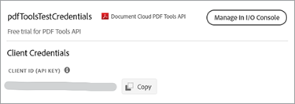

# Skapa en PDF från HTML eller MS Office på några minuter med PDF Services API och Node.js


Det har aldrig varit enklare att digitalisera dokumentarbetsflöden med det nya API:t för Adobe PDF-tjänster som ger utvecklare tillgång till fritt omfång och möjlighet att välja mellan flera kraftfulla PDF-manipuleringstjänster för att tillgodose behoven hos komplicerade affärsarbetsflöden. Komplicerade arkitekturer, implementeringsstrategier och teknikupptrappning kan effektiviseras med dessa lättillgängliga molnbaserade webbtjänster.

Inom PDF Services API finns flera tillgängliga tjänster för att skapa och manipulera PDF, eller exportera från PDF till MS Office och andra format.

* Skapa en PDF-fil från statiska eller dynamiska HTML, MS Word, PowerPoint, Excel med mera
* Export PDF till MS Word, PowerPoint, Excel med mera
* OCR för att identifiera text i PDF-filer och aktivera dokumentsökning
* Protect PDF med ett lösenord när dokument öppnas
* Kombinera PDF- eller PDF-dokument till ett enda PDF
* Komprimera PDF för att minska storleken för delning via e-post eller online
* Linjär för att optimera en PDF för snabb visning på webben
* Ordna PDF-sidor med hjälp av infoga, ersätta, ordna om, ta bort och rotera

Utvecklare kan komma igång på bara några minuter med att köra exempelfiler som finns för att komma åt alla tillgängliga webbtjänster. Så här börjar du.

## Inhämta autentiseringsuppgifter och hämta exempelfiler

Det första steget är att hämta en autentiseringsuppgift (API-nyckel) för att låsa upp användning. [Registrera dig för en kostnadsfri provperiod här](https://www.adobe.com/go/dcsdks_credentials) och klicka på Kom igång för att skapa dina nya inloggningsuppgifter.


Det är viktigt att välja ett personligt konto för att registrera dig för den kostnadsfria provperioden:


I nästa steg väljer du API-tjänsten för PDF-tjänster och lägger sedan till ett namn och en beskrivning för dina inloggningsuppgifter.

Det finns en kryssruta för att &quot;Skapa personligt kodexempel&quot;. Välj det här alternativet om du vill att dina nya inloggningsuppgifter ska läggas till automatiskt i exempelfilerna och hoppa över det manuella steget.

Välj sedan Node.js som språk för att ta emot Node.js-specifika exempel och klicka på knappen Skapa autentiseringsuppgifter.


Du får en .zip-fil att hämta som heter PDFToolsSDK-Node.jsSamples.zip och som kan sparas i ditt lokala filsystem.

## Lägga till dina inloggningsuppgifter i kodexemplen

Om du väljer alternativet för Skapa personligt kodexempel behöver du inte lägga till ditt klient-ID manuellt i kodexempelfilerna och kan hoppa över nästa steg och gå direkt till avsnittet Exempel på kod som körs nedan.

Om du inte har valt alternativet Skapa personligt kodexempel måste du kopiera klient-ID:t (API-nyckeln) från Adobe.io Console:



Zippa upp innehållet i PDFToolsSDK-Node.jsSamples.zip.

Gå till rotkatalogen under mappen adobe-dc-pdf-tools-sdk-node-samples.

Öppna pdftools-api-credentials.json med valfri textredigerare eller IDE.

Klistra in autentiseringsuppgifterna i fältet för klient-ID i koden:

```javascript
{
 "client_credentials": {
  "client_id": "abcdefghijklmnopqrstuvwxyz",
```

Spara filen och fortsätt till nästa steg för att köra kodexemplen.

## Köra ditt första kodexempel

Gå till rotkatalogen under mappen adobe-dc-pdf-tools-sdk-node-samples med hjälp av kommandotolken.

Skriv npm install:

C:\Temp\PDFToolsAPI\adobe-dc-pdf-tools-sdk-node-samples>npm install

Nu är du redo att köra exempelfilerna!

Skapa en PDF för det första exemplet:

När du fortfarande är i kommandotolken kör du exemplet skapa PDF med följande kommando:

C:\Temp\PDFToolsAPI\adobe-dc-pdf-tools-sdk-node-samples>nod src/createpdf/create-pdf-from-docx.js

Exempel på utdata:


Din PDF skapas på den plats som anges i utdata, vilket som standard är katalogen pdfServicesSdkResult.

## Resurser och nästa steg

* För ytterligare hjälp och support, gå till Adobe [[!DNL Acrobat Services] API:er](https://community.adobe.com/t5/document-cloud-sdk/bd-p/Document-Cloud-SDK?page=1&amp;sort=latest_replies&amp;filter=all) community-forum

PDF Services API [Dokumentation](https://www.adobe.com/go/pdftoolsapi_doc)

* [VANLIGA FRÅGOR](https://community.adobe.com/t5/document-cloud-sdk/faq-for-document-services-pdf-tools-api/m-p/10726197) för PDF Services API-frågor

* [Kontakta oss](https://www.adobe.com/go/pdftoolsapi_requestform) för frågor om licenser och priser

* Relaterade artiklar:
  [Det nya PDF Services API har ännu fler funktioner för dokumentarbetsflöden](https://community.adobe.com/t5/document-services-apis/new-pdf-tools-api-brings-more-capabilities-for-document-services/m-p/11294170)

  [Juli-utgåvan av [!DNL Adobe Acrobat Services]Angående: PDF Embed och PDF Services](https://medium.com/adobetech/july-release-of-adobe-document-services-pdf-embed-and-pdf-tools-17211bf7776d)
