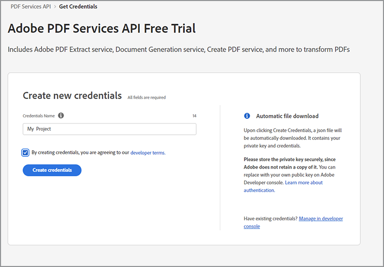

# Hämta autentiseringsuppgifter för Microsoft Power Automate

[Microsoft Power Automate](https://powerautomate.microsoft.com/sv-se/) är ett kraftfullt sätt för utvecklare och utvecklare att skapa kraftfulla automatiserade processer för att förbättra sin verksamhet utan att behöva skriva kod. [Adobe PDF-tjänster](https://us.flow.microsoft.com/sv-se/connectors/shared_adobepdftools/adobe-pdf-services/) som en del av [[!DNL Adobe Acrobat Services]](https://developer.adobe.com/document-services)tillåter användare att utföra någon av de åtgärder som är tillgängliga i Adobe PDF Services API i Microsoft Power Automate.

I den här självstudiekursen lär du dig hur du får inloggningsuppgifter för att börja använda eller testa Adobe PDF-tjänster. Beroende på om du är testanvändare eller befintlig kund går den här självstudiekursen igenom de rätta stegen för att få inloggningsuppgifter.

## Hur kan Microsoft Power Automate-användare börja använda Adobe PDF Services-kopplingen?

Befintliga användare av Microsoft Power Automate kan [hämta autentiseringsuppgifter för testversion](https://www.adobe.com/go/powerautomate_getstarted) för Adobe PDF-tjänster. Länken ovan är en särskild registreringslänk som kan vara till hjälp i den här processen för användare av Microsoft Power Automate.


>[!IMPORTANT]
> Om du loggar in för en testversion måste du använda ett Adobe ID och inte ett Enterprise ID. Om du inte prenumererar på Adobe PDF Services API och försöker logga in med ditt Enterprise ID kan du få ett behörighetsfel eftersom ditt företag inte har rätt att använda Adobe PDF Services API. Därför rekommenderar vi att du använder ett kostnadsfritt Adobe ID.
>

1. När du har loggat in uppmanas du att välja ett namn för dina nya inloggningsuppgifter. Ange ditt *Autentiseringsuppgiftsnamn*.
1. Markera kryssrutan för att godkänna utvecklarvillkoren.
1. Välj **[!UICONTROL Skapa autentiseringsuppgifter]**.

   

Dessa referenser täcker fem olika värden:

* Klient-ID (API-nyckel)
* Klienthemlighet
* Organisations-ID
* ID för tekniskt konto
* Base64 (kodad privat nyckel)


En JSON-fil som innehåller alla dessa värden hämtas också automatiskt till systemet. Den här filen har ett namn `pdfservices-api-pa-credentials.json` och ser ut så här:

```json
{
 "client_id": "client id value",
 "client_secret": "client secret value",
 "organization_id": "organized id value",
 "account_id": "account id value",
 "base64_encoded_private_key": "base64 version of the private key"
}
```

Lagra filen på en säker plats eftersom det inte går att hämta en kopia av den privata nyckeln igen.

### Lägg till anslutning i Microsoft Power Automate

Nu när du har dina inloggningsuppgifter kan du börja använda dem i Microsoft Power Automate-flöden.

1. I menyn på sidopanelen öppnar du **[!UICONTROL Data]** och väljer **Anslutningar**:

   

1. Välj **+ [!UICONTROL Ny anslutning]**.

1. Nästa skärm visar en lista med möjliga anslutningstyper. I det övre högra hörnet anger du &quot;adobe&quot; för att filtrera alternativen:

   

1. Välj **[!UICONTROL Adobe PDF Services (förhandsversion)]**.
1. Ange alla fem värden som du genererade tidigare i det modala fönstret. Välj **[!UICONTROL Skapa]** när du är klar.

   

Nu kan du börja använda Adobe PDF-tjänster i Microsoft Power Automate.

### Åtkomst till autentiseringsuppgifter efter att de har skapats

Om du redan har skapat inloggningsuppgifter och har förlorat de hämtade inloggningsuppgifterna kan du hämta dem igen i [Adobe Developer Console](https://developer.adobe.com/console).

1. Efter inloggning på [Adobe Developer Console](https://developer.adobe.com/console)letar du först reda på projektet och väljer det.
1. I menyn till vänster under *Autentiseringsuppgifter* väljer du **Tjänstkonto (JWT)**:

   

1. Observera de fem värden som presenteras här: *Klient-ID*, *klienthemlighet*, *ID för tekniskt konto*, *E-postadress för tekniskt konto* och *Organisations-ID*.

Tyvärr kan du inte hämta den tidigare privata nyckeln, men du kan använda knappen &quot;Generera ett offentligt/privat nyckelpar&quot; för att skapa en ny.

## Använda befintliga autentiseringsuppgifter för Adobe PDF Services

Om du har befintliga API-uppgifter för Adobe PDF Services som genererats från [!DNL Adobe Acrobat Services] kan du använda dem med Microsoft Power Automate. Om du hämtade ett SDK när du registrerade dig kom dina befintliga inloggningsuppgifter i form av en JSON-fil, med det troligaste namnet `pdfservices-api-credentials.json`. JSON-filen innehåller de fem tangenter som behövs för att skapa anslutningsreferenserna. Kopiera varje värde från JSON-filen till motsvarande anslutningsfält.

Värdet för din privata nyckel kommer från en andra fil med namnet `private.key`.

Du kan också hämta värdena från Adobe Developer Console enligt beskrivningen ovan.

## Hur kan [!DNL Adobe Acrobat Services] kan användare börja arbeta med Microsoft Power Automate?

För att komma igång med Power Automate går du först till <https://powerautomate.microsoft.com> och använd knappen &quot;Starta gratis&quot;. Om du inte har något Microsoft-konto måste du skapa ett. När du har loggat in visas Power Automate-kontrollpanelen.


Skapa ett nytt flöde, lägg till ett steg och sök efter Adobe PDF-tjänsterna, som beskrivs i början av självstudiekursen. Välj en åtgärd så kan ett varningsmeddelande om att ett premiumkonto krävs visas.


Som skärmbilden ovan visar kan du antingen växla till ett arbetskonto eller konfigurera ett nytt organisationskonto. När du har gjort det kan du lägga till Adobe PDF Services-åtgärden.

För en närmare titt på hur du skapar ditt första Microsoft Power Automate-flöde med [!DNL Adobe Acrobat Services]se [Skapa ditt första arbetsflöde i Microsoft Power Automate](https://experienceleague.adobe.com/docs/document-services/tutorials/pdfservices/create-workflow-power-automate.html).

## Ytterligare resurser

Här är en lista med ytterligare resurser som kan hjälpa dig mer:

* Först ut är Adobe PDF Services Power Automate-dokumenten: <https://docs.microsoft.com/en-us/connectors/adobepdftools/>. Dessa resurser kompletterar det du lärt dig här.
* Behöver du exempel? Du kan hitta många [Power Automate-mallar](https://powerautomate.microsoft.com/en-us/connectors/details/shared_adobepdftools/adobe-pdf-services/) PDF.
* Vårt livevideoinnehåll, [Pappersklipp](https://www.youtube.com/playlist?list=PLcVEYUqU7VRe4sT-Bf8flvRz1XXUyGmtF), innehåller även videor som visar hur Power Automate används.
* Den [Adobe Tech Blog](https://medium.com/adobetech/tagged/microsoft-power-automate) har många artiklar om hur du arbetar med Power Automate.
* Slutligen, se till att konsultera kärnan [PDF Services](https://developer.adobe.com/document-services/docs/overview/) dokumentation.
