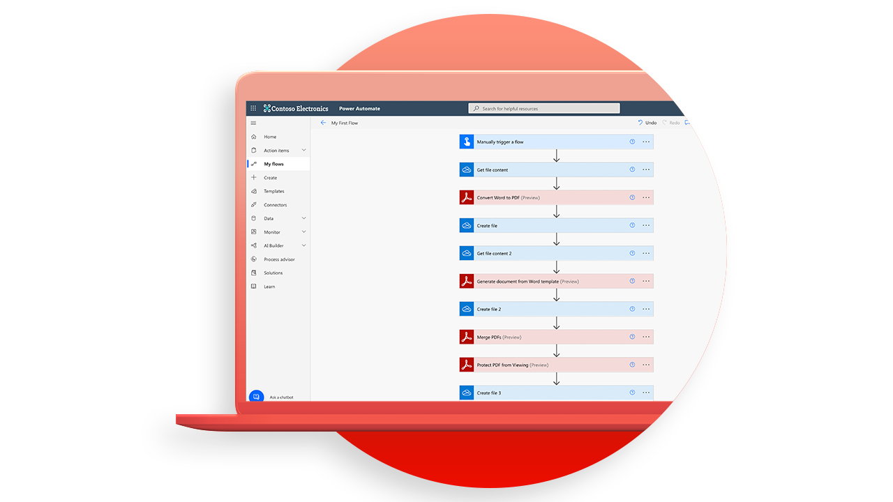

# Självstudiekurser för Adobe PDF Services API

<table style="table-layout:fixed">
<tr>
 <td>
   
    

   <a href="https://experienceleague.adobe.com/docs/adobe-developers-live-events/events/2021/oct2021/pdf-services-api.html"><strong>Introduktion till PDF Services API</strong></a>
    

    <em>Med Adobe PDF Services API kan utvecklare skapa, kombinera, exportera och extrahera data från PDF med kraftfulla och flexibla molnbaserade API:er</em>
     
  </td>
  <td>
   
    

   <a href="getting-credentials-power-automate.md"><strong>Hämtar autentiseringsuppgifter för [!DNL Microsoft Power Automate]</strong></a>
    

    <em>Lär dig få inloggningsuppgifter för att börja använda eller testa [!DNL Adobe PDF Services]</em>
     
  </td>
  <td>
   
    

   <a href="create-workflow-power-automate.md"><strong>Skapa ditt första arbetsflöde i [!DNL Microsoft Power Automate]</strong></a>
    

    <em>Läs om hur du använder [!DNL Adobe PDF Services] anslutaringång [!DNL Microsoft Power Automate]</em>
     
  </td>
  <td>
   
    

   <a href="createpdffromhtml.md"><strong>Skapa en PDF från HTML eller [!DNL MS Office] om några minuter med PDF Services API och Node.js</strong></a>
    

    <em>[!DNL Adobe PDF Services API] som ger utvecklare fritt omfång att välja mellan flera kraftfulla PDF-manipuleringstjänster för att uppfylla behoven av komplicerade affärsarbetsflöden</em>
     
  </td>
</tr>
<tr>
  <td>
   
    

   <a href="exportpdf.md"><strong>Anpassning [!DNL PDF Services API] för att exportera PDF till [!DNL Word], [!DNL PowerPoint], och mer</strong></a>
    

    <em>Lär dig hur du kör [!DNL PDF Services API] exportåtgärd med hjälp av exempelfiler för språk av typen Node.js, Java och .Net</em>
     
  </td>
   <td>
   
    

   <a href="gettingstartedjava.md"><strong>Komma igång med Adobe PDF Services API och Java</strong></a>
    

    <em>Utvecklare kan komma igång på bara några minuter med att köra exempelfiler som finns för att komma åt alla tillgängliga webbtjänster</em>
     
  </td>
   <td>
   
    

   <a href="ocr.md"><strong>Använder [!DNL Adobe PDF Services API] till OCR PDF-filer</strong></a>
    

    <em>Med OCR (Optical Character Recognition) kan du låsa upp skannade PDF för att extrahera text och skapa sökbara filer</em>
     
  </td>
  <td>
   
    

   <a href="gettingstartednet.md"><strong>Komma igång med [!DNL Adobe PDF Services API] och .Net</strong></a>
    

    <em>[!DNL Adobe PDF Services API] som ger utvecklare fritt omfång att välja mellan flera kraftfulla PDF-manipuleringstjänster för att uppfylla behoven av komplicerade affärsarbetsflöden</em>
     
  </td>
</tr>
</table>
