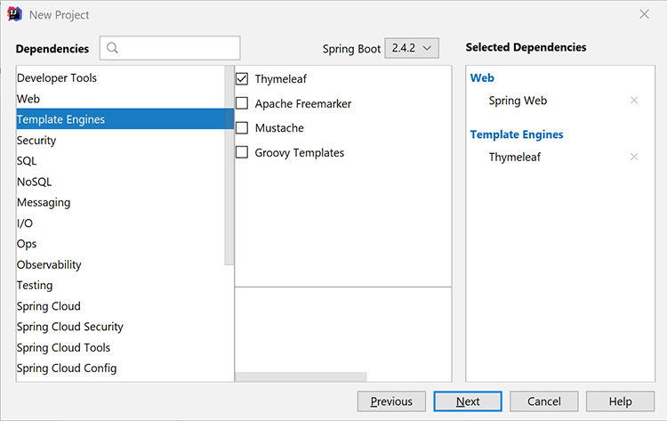

# Arbetsflöden för HR-dokument i Java


Många företag behöver dokumentation om nyanställda, till exempel arbetsplatsavtal för hemarbetande. Traditionellt har företag hanterat dessa dokument fysiskt i formulär som är svåra att hantera och lagra. När du byter till elektroniska dokument är PDF-filer ett idealiskt val eftersom de är säkrare och mindre ändringsbara än andra filtyper. Dessutom har de stöd för digitala signaturer.

## Vad du kan lära dig

I den här praktiska självstudiekursen får du lära dig hur du implementerar ett webbaserat HR-formulär som sparar ett arbetsplatsavtal till PDF med en sign-off i en enkel Java Spring MVC-applikation.

## Relevanta API:er och resurser

* [PDF Services API](https://opensource.adobe.com/pdftools-sdk-docs/release/latest/index.html)

* [Adobe Sign API](https://www.adobe.io/apis/documentcloud/sign.html)

* [Projektkod](https://github.com/dawidborycki/adobe-sign)

## Genererar API-uppgifter

Börja med att registrera dig för den kostnadsfria testversionen av Adobe PDF Services API. Gå till [Adobe](https://www.adobe.io/apis/documentcloud/dcsdk/gettingstarted.html?ref=getStartedWithServicesSDK) [webbplats](https://www.adobe.io/apis/documentcloud/dcsdk/gettingstarted.html?ref=getStartedWithServicesSDK) och klicka på *Kom igång* knapp under *Skapa nya autentiseringsuppgifter*. Den kostnadsfria demoversionen innehåller 1 000 dokumenttransaktioner som kan användas under sex månader. På nästa sida (se nedan) väljer du tjänsten (PDF Services API), anger autentiseringsuppgifterna (till exempel HRDocumentWFCredentials) och anger en beskrivning.

Välj språk (Java i det här exemplet) och kontrollera *Skapa personliga kodexempel*. Det sista steget är att kodexemplen redan innehåller den redan ifyllda filen pdftools-api-credentials.json som du använder tillsammans med den privata nyckeln för att autentisera appen i API:t.

Klicka slutligen på *Skapa autentiseringsuppgifter* -knappen. Detta skapar inloggningsuppgifterna och exemplen börjar automatiskt hämtas.


För att säkerställa att inloggningsuppgifterna fungerar, öppna de hämtade exemplen. Här använder du IntelliJ IDEA. När du öppnar källkoden frågar den integrerade utvecklingsmiljön efter byggmotorn. Maven används i det här exemplet, men du kan också arbeta med Gradle, beroende på dina inställningar.

Kör sedan `mvn clean install` Maven mål att bygga burkar filer.

Slutligen kör du exemplet CombinePDF som visas nedan. PDF genereras i utdatamappen.


## Skapa vårens MVC-program

Med de autentiseringsuppgifter som du sedan skapar programmet. I det här exemplet används Fjäderinitierare.

Konfigurera först projektinställningarna för att använda Java 8-språket och JAR-paketering (se skärmbild nedan).


För det andra, lägg till Spring Web (från webben) och Thymeleaf (från mallmotorer):



När du har skapat projektet går du till filen pom.xml och kompletterar avsnittet Beroenden med pdftools-sdk och log4j-slf4j-impl:

```
<dependencies>
    <dependency>
        <groupId>org.springframework.boot</groupId>
        <artifactId>spring-boot-starter-thymeleaf</artifactId>
    </dependency>
    <dependency>
        <groupId>org.springframework.boot</groupId>
        <artifactId>spring-boot-starter-web</artifactId>
    </dependency>

    <dependency>
        <groupId>org.springframework.boot</groupId>
        <artifactId>spring-boot-starter-test</artifactId>
        <scope>test</scope>
    </dependency>

</dependencies>
```

Komplettera sedan projektets rotmapp med två filer som du hämtade med exempelkoden:

* pdftools-api-credentials.json

* private.key

## Återge ett webbformulär

Om du vill återge webbformuläret ändrar du programmet med den personuppgiftsansvarige som återger personuppgiftsformuläret och hanterar publiceringen av formuläret. Ändra alltså först programmet med modellklassen PersonForm:

```
package com.hr.docsigning;
import javax.validation.constraints.NotNull;
import javax.validation.constraints.Size;

public class PersonForm {
    @NotNull
    @Size(min=2, max=30)
    private String firstName;

    @NotNull
    @Size(min=2, max=30)
    private String lastName;

    public String getFirstName() {
            return this.firstName;
    }


    public void setFirstName(String firstName) {
            this.firstName = firstName;
    }

    public String getLastName() {
           return this.lastName;
    }

    public void setLastName(String lastName) {
            this.lastName = lastName;
    }

    public String GetFullName() {
           return this.firstName + " " + this.lastName;
    }
}
```

Den här klassen innehåller två egenskaper: `firstName` och `lastName`. Använd också denna enkla validering för att kontrollera om de är mellan två och 30 tecken.

Utifrån klassen model kan du skapa kontrollanten (se PersonController.java från tillhörande kod):

```
package com.hr.docsigning;
import org.springframework.stereotype.Controller;
import org.springframework.validation.BindingResult;
import org.springframework.web.bind.annotation.GetMapping;
import org.springframework.web.bind.annotation.PostMapping;
import javax.validation.Valid;


@Controller
public class PersonController {
    @GetMapping("/")
    public String showForm(PersonForm personForm) {
        return "form";
    }
}
```

Kontrollenheten har bara en metod: showForm. Den ansvarar för att återge formuläret med hjälp av HTML-mallen som finns i resources/templates/form.html:

```
<html>
<head>
    <link rel="stylesheet" href="https://www.w3schools.com/w3css/4/w3.css">
</head>
 
<body>
<div class="w3-container">
    <h1>HR Department</h1>
</div>
 
<form class="w3-panel w3-card-4" action="#" th:action="@{/}"
        th:object="${personForm}" method="post">
    <h2>Personal data</h2>
    <table>
        <tr>
            <td>First Name:</td>
            <td><input type="text" class="w3-input"
                placeholder="First name" th:field="*{firstName}" /></td>
            <td class="w3-text-red" th:if="${#fields.hasErrors('firstName')}"
                th:errors="*{firstName}"></td>
        </tr>
        <tr>
            <td>Last Name:</td>
            <td><input type="text" class="w3-input"
                placeholder="Last name" th:field="*{lastName}" /></td>
            <td class="w3-text-red" th:if="${#fields.hasErrors('lastName')}"
                th:errors="*{lastName}"></td>
        </tr>
        <tr>
            <td><button class="w3-button w3-black" type="submit">Submit</button></td>
        </tr>
    </table>
</form>
</body>
</html>
```

För att återge dynamiskt innehåll används Thymeleaf-mallåtergivningsmotorn. När du har kört programmet bör du se följande:


## Generera PDF med dynamiskt innehåll

Generera nu PDF-dokumentet som innehåller det virtuella kontraktet genom att dynamiskt fylla i markerade fält efter att persondataformuläret har återgetts. Du måste fylla i personuppgifterna i det redan skapade avtalet.

För enkelhetens skull har du bara ett sidhuvud, en underrubrik och en strängkonstant läsning: &quot;Det här kontraktet förbereddes för \&lt;full name=&quot;&quot; of=&quot;&quot; the=&quot;&quot; person=&quot;&quot;>&quot;.

För att uppnå detta mål, börja med Adobe [Skapa en PDF från Dynamic HTML](https://opensource.adobe.com/pdftools-sdk-docs/release/latest/howtos.html#create-a-pdf-from-dynamic-html) exempel. Genom att analysera exempelkoden ser du att den dynamiska HTML-fältpopulationen fungerar på följande sätt.

Först måste du förbereda HTML-sidan, som har statiskt och dynamiskt innehåll. Den dynamiska delen uppdateras med JavaScript. PDF Services API injicerar JSON-objektet i HTML.

Sedan hämtar du JSON-egenskaperna med JavaScript-funktionen som anropas när HTML-dokumentet läses in. Den här JavaScript-funktionen uppdaterar de markerade DOM-elementen. Här är exemplet som fyller i span-elementet, som innehåller personens data (se src\\main\\resources\\contract\\index.html för tillhörande kod):

```
<html>
<head>
    <link rel="stylesheet" href="https://www.w3schools.com/w3css/4/w3.css">
</head>
 
<body onload="updateFullName()">
    <script src="./json.js"></script>
    <script type="text/javascript">
        function updateFullName()
        {
            var document = window.document;
            document.getElementById("personFullName").innerHTML = String(
                window.json.personFullName);
        }
    </script>
 
    <div class="w3-container ">
        <h1>HR Department</h1>
 
        <h2>Contract details</h2>
 
        <p>This contract was prepared for:
            <strong><span id="personFullName"></span></strong>
        </p>
    </div>
</body>
</html>
```

Sedan måste du zippa HTML med alla beroende JavaScript- och CSS-filer. PDF Services API tar inte emot HTML-filer. I stället krävs en zip-fil som indata. I så fall sparar du den zippade filen i src\\main\\resources\\contract\\index.zip.

Efteråt kan du komplettera `PersonController` med en annan metod som hanterar begäranden om POSTER:

```
@PostMapping("/")
public String checkPersonInfo(@Valid PersonForm personForm,
    BindingResult bindingResult) {
    if (bindingResult.hasErrors()) {
        return "form";
    }
 
    CreateContract(personForm);
 
    return "contract-actions";
}
```

Med ovanstående metod skapas ett PDF-kontrakt med de angivna personuppgifterna och vyn Contract-Actions återges. Det sistnämnda skapar länkar till det genererade PDF och för undertecknandet av PDF.

Nu ska vi se hur `CreateContract` metoden fungerar (den fullständiga listan finns nedan). Metoden bygger på två fält:

* `LOGGER`, från log4j, för att felsöka information om eventuella undantag

* `contractFilePath`, som innehåller filsökvägen till det genererade PDF

Den `CreateContract` -metoden anger autentiseringsuppgifterna och skapar PDF från HTML. Om du vill överföra och fylla i personuppgifterna i avtalet använder du `setCustomOptionsAndPersonData` hjälpare. Med den här metoden hämtas personens data från formuläret och sedan skickas de till den genererade PDF via JSON-objektet som beskrivs ovan.

Dessutom `setCustomOptionsAndPersonData` I visas hur du styr PDF genom att inaktivera sidhuvudet och sidfoten. När dessa steg är klara sparar du PDF-filen på output/contract.pdf och tar så småningom bort den tidigare genererade filen.

```
private static final Logger LOGGER = LoggerFactory.getLogger(PersonController.class);
private String contractFilePath = "output/contract.pdf"; 
private void CreateContract(PersonForm personForm) {
    try {
        // Initial setup, create credentials instance.
        Credentials credentials = Credentials.serviceAccountCredentialsBuilder()
                .fromFile("pdftools-api-credentials.json")
                .build();

        //Create an ExecutionContext using credentials 
       //and create a new operation instance.
        ExecutionContext executionContext = ExecutionContext.create(credentials);
        CreatePDFOperation htmlToPDFOperation = CreatePDFOperation.createNew();

        // Set operation input from a source file.
        FileRef source = FileRef.createFromLocalFile(
           "src/main/resources/contract/index.zip");
       htmlToPDFOperation.setInput(source);

        // Provide any custom configuration options for the operation
        // You pass person data here to dynamically fill out the HTML
        setCustomOptionsAndPersonData(htmlToPDFOperation, personForm);

        // Execute the operation.
        FileRef result = htmlToPDFOperation.execute(executionContext);

        // Save the result to the specified location. Delete previous file if exists
        File file = new File(contractFilePath);
        Files.deleteIfExists(file.toPath());

        result.saveAs(file.getPath());

    } catch (ServiceApiException | IOException | 
             SdkException | ServiceUsageException ex) {
        LOGGER.error("Exception encountered while executing operation", ex);
    }
}
 
private static void setCustomOptionsAndPersonData(
    CreatePDFOperation htmlToPDFOperation, PersonForm personForm) {
    //Set the dataToMerge field that needs to be populated 
    //in the HTML before its conversion
    JSONObject dataToMerge = new JSONObject();
    dataToMerge.put("personFullName", personForm.GetFullName());
 
    // Set the desired HTML-to-PDF conversion options.
    CreatePDFOptions htmlToPdfOptions = CreatePDFOptions.htmlOptionsBuilder()
        .includeHeaderFooter(false)
        .withDataToMerge(dataToMerge)
        .build();
    htmlToPDFOperation.setOptions(htmlToPdfOptions);
}
```

När du skapar avtalet kan du också slå samman dynamiska, personspecifika data med fasta avtalsvillkor. Om du vill göra det följer du [Skapa en PDF från statiskt HTML](https://opensource.adobe.com/pdftools-sdk-docs/release/latest/howtos.html#create-a-pdf-from-dynamic-html) exempel. Alternativt kan du [slå samman två PDF](https://opensource.adobe.com/pdftools-sdk-docs/release/latest/howtos.html#create-a-pdf-from-static-html).

## Visa PDF-filen för hämtning

Nu kan du visa länken till det genererade PDF som användaren kan hämta. Om du vill göra det skapar du först filen contract-actions.html (se resurser/mallar, contract-actions.html i tillhörande kod):

```
<html>
<head>
    <link rel="stylesheet" href="https://www.w3schools.com/w3css/4/w3.css">
</head>
 
<div class="w3-container ">
    <h1>HR Department</h1>
 
    <h2>Contract file</h2>
 
    <p>Click <a href="/pdf">here</a> to download your contract</p>
</div>
</body>
</html>
```

Sedan implementerar du `downloadContract` metoden inom `PersonController` enligt följande:

```
@RequestMapping("/pdf")
public void downloadContract(HttpServletResponse response)
{
    Path file = Paths.get(contractFilePath);
 
    response.setContentType("application/pdf");
    response.addHeader(
        "Content-Disposition", "attachment; filename=contract.pdf");

    try
    {
        Files.copy(file, response.getOutputStream());
        response.getOutputStream().flush();
    }
    catch (IOException ex) 
    {
        ex.printStackTrace();
    }
}
```

När du har kört programmet får du följande flöde. Den första skärmen visar personuppgiftsformuläret. Testa genom att fylla den med värden mellan 2 och 30 tecken:


När du har klickat på *Skicka* validerar formuläret och PDF genereras baserat på HTML (resources/contract/index.html). I programmet visas en annan vy (avtalsinformation) där du kan hämta PDF:


PDF efter återgivning i webbläsaren ser ut så här. De personuppgifter du har angett sprids nämligen till PDF:


## Aktivera signaturer och säkerhet

När avtalet är klart kan Adobe Sign lägga till digitala signaturer som representerar godkännande. Adobe Sign-autentisering fungerar lite annorlunda än OAuth. Nu ska vi se hur vi integrerar programmet med Adobe Sign. För att göra det måste du förbereda åtkomsttoken för programmet. Sedan skriver du klientkoden med Adobe Sign Java SDK.

För att få en auktoriseringstoken måste du utföra flera steg:

Registrera först [utvecklarkonto](https://acrobat.adobe.com/se/sv/sign/developer-form.html).

Skapa CLIENT-programmet i [Adobe Sign-portal](https://www.adobe.io/apis/documentcloud/sign/docs.html#!adobedocs/adobe-sign/master/gstarted/create_app.md).

Konfigurera OAuth för programmet enligt beskrivningen [här](https://www.adobe.io/apis/documentcloud/sign/docs.html#!adobedocs/adobe-sign/master/gstarted/configure_oauth.md) och [här](https://secure.eu1.adobesign.com/public/static/oauthDoc.jsp). Anteckna din klient-ID och klienthemlighet. Sedan kan du använda `https://www.google.com` som omdirigerings-URI och följande omfång:

* user_login: self

* agreement_read: konto

* agreement_write: konto

* agreement_send: konto

Förbered en URL enligt följande med ditt klient-ID i stället för \&lt;client_id>:

```
https://secure.eu1.adobesign.com/public/oauth?redirect_uri=https://www.google.com
&response_type=code
&client_id=<CLIENT_ID>
&scope=user_login:self+agreement_read:account+agreement_write:account+agreement_send:account
```

Skriv URL:en ovan i webbläsaren. Du omdirigeras till google.com och koden visas i adressfältet som code=\&lt;your_code>till exempel:

```
https://www.google.com/?code=<YOUR_CODE>&api_access_point=https://api.eu1.adobesign.com/&web_access_point=https://secure.eu1.adobesign.com%2F
```

Observera de värden som anges för \&lt;your_code> och api_access_point.

Om du vill skicka en begäran om HTTP-POST som ger dig åtkomsttoken använder du klient-ID:t \&lt;your_code>och api_access_point-värden. Du kan använda [Postman](https://helpx.adobe.com/sign/kb/how-to-create-access-token-using-postman-adobe-sign.html) eller cURL:

```
curl --location --request POST "https://**api.eu1.adobesign.com**/oauth/token"
\\

\--data-urlencode "client_secret=**\<CLIENT_SECRET\>**" \\

\--data-urlencode "client_id=**\<CLIENT_ID\>**" \\

\--data-urlencode "code=**\<YOUR_CODE\>**" \\

\--data-urlencode "redirect_uri=**https://www.google.com**" \\

\--data-urlencode "grant_type=authorization_code"
```

Provsvaret ser ut så här:

```
{
    "access_token":"3AAABLblqZhByhLuqlb-…",
    "refresh_token":"3AAABLblqZhC_nJCT7n…",
    "token_type":"Bearer",
    "expires_in":3600
}
```

Anteckna din access_token. Du behöver den för att godkänna din klientkod.

## Använda Adobe Sign Java SDK

När du har åtkomsttoken kan du skicka REST API-anrop till Adobe Sign. Du kan förenkla detta genom att använda Adobe Sign Java SDK. Källkoden finns på [Adobe GitHub-databas](https://github.com/adobe-sign/AdobeSignJavaSdk).

Om du vill integrera paketet med ditt program måste du klona koden. Skapa sedan Maven-paketet (mvn-paketet) och installera följande filer i projektet (du hittar dem i tillhörande kod i mappen adobe-sign-sdk):

* target/swagger-java-client-1.0.0.jar

* target/lib/gson-2.8.1.jar

* target/lib/gson-fire-1.8.0.jar

* target/lib/hamcrest-core-1.3.jar

* target/lib/junit-4.12.jar

* target/lib/logging-interceptor-2.7.5.jar

* target/lib/okhttp-2.7.5.jar

* target/lib/okio-1.6.0.jar

* target/lib/swagger-annotations-1.5.15.jar

I IntelliJ IDEA kan du lägga till dessa filer som beroenden med *Projektstruktur* (fil-/projektstruktur).

## Skicka PDF för signering

Du är nu redo att skicka avtalet för signering. Gör det genom att först komplettera contract-details.html med en annan hyperlänk till sändningsbegäran:

```
<html>
<head>
    <link rel="stylesheet" href="https://www.w3schools.com/w3css/4/w3.css">
</head>
 
<div class="w3-container ">
    <h1>HR Department</h1>
 
    <h2>Contract file</h2>
 
    <p>Click <a href="/pdf"> here</a> to download your contract</p>
 
    
</div>
</body>
</html>
```

Sedan lägger du till en annan kontrollenhet, `AdobeSignController`, där du implementerar `sendContractMethod` (se tillhörande kod). Metoden fungerar på följande sätt:

För det första används `ApiClient` för att hämta API-slutpunkten.

```
ApiClient apiClient = new ApiClient();

//Default baseUrl to make GET /baseUris API call.
String baseUrl = "https://api.echosign.com/";
String endpointUrl = "/api/rest/v6";
apiClient.setBasePath(baseUrl + endpointUrl);

// Provide an OAuth Access Token as "Bearer access token" in authorization
String authorization = "Bearer ";

// Get the baseUris for the user and set it in apiClient.
BaseUrisApi baseUrisApi = new BaseUrisApi(apiClient);
BaseUriInfo baseUriInfo = baseUrisApi.getBaseUris(authorization);
apiClient.setBasePath(baseUriInfo.getApiAccessPoint() + endpointUrl);
```

Sedan använder metoden filen contract.pdf för att skapa det övergående dokumentet:

```
// Get PDF file
String filePath = "output/";
String fileName = "contract.pdf";
File file = new File(filePath + fileName);
String mimeType = "application/pdf";
 
//Get the id of the transient document.
TransientDocumentsApi transientDocumentsApi =
    new TransientDocumentsApi(apiClient);
TransientDocumentResponse response = transientDocumentsApi.createTransientDocument(authorization,
    file, null, null, fileName, mimeType);
String transientDocumentId = response.getTransientDocumentId();
```

Sedan måste du skapa ett avtal. Det gör du genom att använda filen contract.pdf och ställa in avtalstillståndet till IN_PROCESS för att skicka filen omedelbart. Du väljer också elektronisk signatur:

```
// Create AgreementCreationInfo
AgreementCreationInfo agreementCreationInfo = new AgreementCreationInfo();
 
// Add file
FileInfo fileInfo = new FileInfo();
fileInfo.setTransientDocumentId(transientDocumentId);
agreementCreationInfo.addFileInfosItem(fileInfo);
 
// Set state to IN_PROCESS, so the agreement is be sent immediately
agreementCreationInfo.setState(AgreementCreationInfo.StateEnum.IN_PROCESS);
agreementCreationInfo.setName("Contract");
agreementCreationInfo.setSignatureType(AgreementCreationInfo.SignatureTypeEnum.ESIGN);
```

Sedan lägger du till avtalsmottagare på följande sätt. Här lägger du till två mottagare (se avsnitten Anställda och Chef):

```
// Provide emails of recipients to whom agreement is be sent
// Employee
ParticipantSetInfo participantSetInfo = new ParticipantSetInfo();
ParticipantSetMemberInfo participantSetMemberInfo = new ParticipantSetMemberInfo();
participantSetMemberInfo.setEmail("");
participantSetInfo.addMemberInfosItem(participantSetMemberInfo);
participantSetInfo.setOrder(1);
participantSetInfo.setRole(ParticipantSetInfo.RoleEnum.SIGNER);
agreementCreationInfo.addParticipantSetsInfoItem(participantSetInfo);
 
// Manager
participantSetInfo = new ParticipantSetInfo();
participantSetMemberInfo = new ParticipantSetMemberInfo();
participantSetMemberInfo.setEmail("");
participantSetInfo.addMemberInfosItem(participantSetMemberInfo);
participantSetInfo.setOrder(2);
participantSetInfo.setRole(ParticipantSetInfo.RoleEnum.SIGNER);
agreementCreationInfo.addParticipantSetsInfoItem(participantSetInfo);
```

Skicka slutligen avtalet med hjälp av `createAgreement` från Adobe Sign Java SDK:

```
// Create agreement using the transient document.
AgreementsApi agreementsApi = new AgreementsApi(apiClient);
AgreementCreationResponse agreementCreationResponse = agreementsApi.createAgreement(
    authorization, agreementCreationInfo, null, null);
 
System.out.println("Agreement sent, ID: " + agreementCreationResponse.getId());
```

När du har kört den här koden får du ett e-postmeddelande (till adressen som anges i koden som `<email_address>)` med begäran om avtalssignatur. E-postmeddelandet innehåller hyperlänken som dirigerar mottagare till Adobe Sign-portalen för att signera. Dokumentet visas på din Adobe Sign Developer Portal (se bilden nedan) och du kan även spåra signeringsprocessen programmatiskt med [getAgreementInfo](https://github.com/adobe-sign/AdobeSignJavaSdk/blob/master/docs/AgreementsApi.md#getAgreementInfo) metoden.

Slutligen kan du även lösenordsskydda PDF med PDF Services API som visas i dessa [exempel](https://github.com/adobe/pdfservices-java-sdk-samples/tree/master/src/main/java/com/adobe/pdfservices/operation/samples/protectpdf).


## Nästa steg

Som du ser kan du använda snabbstarterna för att implementera ett enkelt webbformulär och skapa en godkänd PDF i Java med Adobe PDF Services API. Adobe PDF API:er integreras smidigt i dina befintliga klientprogram.

Om du tar exemplet längre kan du skapa formulär som mottagarna kan signera på distans och på ett säkert sätt. När du behöver flera signaturer kan du till och med automatiskt skicka formulär till en rad personer i ett arbetsflöde. Introduktionen av dina anställda förbättras och personalavdelningen kommer att älska dig.

Checka ut [[!DNL Adobe Acrobat Services]](https://www.adobe.io/apis/documentcloud/dcsdk/) för att lägga till en mängd PDF-funktioner till dina program idag.
