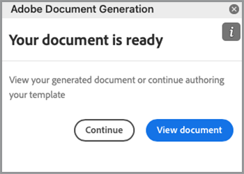

# Påskynda din försäljningsprocess


Från informationsdokument till kontrakt och avtal - många dokument behövs under en inköpsresa. I den här självstudiekursen får du lära dig hur [[!DNL Adobe Acrobat Services]](https://developer.adobe.com/document-services/) kan integrera dokumentupplevelser under hela den här resan för att öka försäljningen.

## Generera avtal och försäljningsorder från data

Försäljningsavtal, kontrakt och andra dokument kan variera mycket beroende på specifika kriterier. Ett försäljningsavtal kan till exempel bara innehålla vissa villkor som bygger på unika kriterier, till exempel att avtalet gäller i ett visst land eller en viss stat, eller inkludera vissa produkter som en del av avtalet. Om du skapar dessa dokument manuellt eller behåller många olika mallvariationer kan det leda till avsevärt ökade juridiska kostnader i samband med manuell granskning av ändringar.

Med [Adobe Document Generation API](https://developer.adobe.com/document-services/apis/doc-generation/) kan du hämta data från CRM eller andra datasystem för att dynamiskt generera försäljningsdokument som baseras på dessa data.

## Hämta autentiseringsuppgifter

Börja med att registrera dig för kostnadsfria autentiseringsuppgifter för Adobe PDF-tjänster:

1. Gå [hit](https://documentcloud.adobe.com/dc-integration-creation-app-cdn/main.html) om du vill registrera dina inloggningsuppgifter.
1. Logga in med ditt Adobe ID.
1. Ange ditt inloggningsnamn (t.ex. demo för försäljningsavtal).

   

1. Välj ett språk för att hämta exempelkoden (t.ex. Node.js).
1. Markera för att godkänna **[!UICONTROL utvecklarvillkor]**.
1. Välj **[!UICONTROL Skapa autentiseringsuppgifter]**.
En fil hämtas till datorn med en ZIP-fil som innehåller exempelfilerna, pdfservices-api-credentials.json och private.key för autentisering.

   

1. Markera **[!UICONTROL Hämta Microsoft Word-tillägg]** eller gå till [AppSource](https://appsource.microsoft.com/en-cy/product/office/WA200002654) för att installera.

   >[!NOTE]
   >
   >För att installera Word-tillägget måste du ha behörighet att installera tillägg i Microsoft 365. Kontakta Microsoft 365-administratören om du inte har behörighet.

## Dina data

Om du hämtar data från ett specifikt datasystem måste du mata ut dessa data som JSON-data eller generera ditt eget schema. I det här scenariot används följande färdiga exempeldatauppsättning:

```
{
    "salesOrder": {
        "comment": "Make sure to call 555-555-1234 when you arrive. The front door is broken."
    },
    "company": {
        "name":"Home Services Co.",
        "address": {
            "city": "Homestead",
            "state": "NY",
            "zip": "14623",
            "streetAddress": "123 Demohome Street"
        }
    },
    "customer": {
        "address": {
            "city": "Seattle",
            "state": "WA",
            "zip": "98052",
            "streetAddress": "20341 Whitworth Institute 405 N. Whitworth"
        },
        "email": "mailto:jane-doe@xyz.edu",
        "jobTitle": "Professor",
        "name": "Jane Doe",
        "telephone": "(425) 123-4567",
        "url": "http://www.janedoe.com"
    },
    "tax": {
        "state":"WA",
        "rate": 0.08
    },
    "referencesOrder": [
        {
            "description": "Carpet Cleaning Service - 3BR 2BA",
            "totalPaymentDue": {
                "price": 359.54
            },
            "orderedItem": {
                "description": "Carpet Cleaning Service"
            }
        },
        {
            "description": "Home Cleaning Service - 3BR 2BA",
            "totalPaymentDue": {
                "price": 299.99
            },
            "orderedItem": {
                "description": "House Cleaning Service"
            }
        }
    ]
}
```

## Lägg till grundläggande taggar i dokumentet

Det här scenariot använder ett försäljningsorderdokument som kan hämtas [här](https://github.com/benvanderberg/adobe-document-generation-samples/blob/main/SalesOrder/Exercise/SalesOrder_Base.docx?raw=true).


1. Öppna exempeldokumentet *SalesOrder.docx* i Microsoft Word.
1. Om plugin-programmet för dokumentgenerering är installerat väljer du **[!UICONTROL Dokumentgenerering]** i menyfliksområdet. Om du inte ser Dokumentgenerering i menyfliksområdet följer du dessa instruktioner.
1. Välj **[!UICONTROL Kom igång]**.
1. Kopiera JSON-exempeldata som skrivits ovan till fältet *JSON-data*.

   

Gå sedan till panelen Dokumentgenereringstagg för att placera taggarna i dokumentet.

1. Markera texten som du vill ersätta (t.ex. *FÖRETAGSNAMN*).
1. Sök efter &quot;namn&quot; i panelen *Dokumentgenereringstagg*.
1. Välj namn under Företag i listan med taggar.
1. Välj **[!UICONTROL Infoga text]**.

   

   Den här processen placerar en tagg med namnet {{company.name}} eftersom taggen finns under sökvägen i JSON.

   ```
   {
   …
   "company": {
       "name":"Home Services Co.",
       …
   },
   …
   }
   ```

Upprepa de här åtgärderna för några av de andra taggarna i dokumentet, till exempel GATUADRESS, ORT, STAT, POSTNUMMER o.s.v.

## Förhandsvisa det genererade dokumentet

Direkt i Microsoft Word kan du förhandsgranska ditt genererade dokument utifrån JSON-exempeldata.

1. Välj **[!UICONTROL Generera dokument]** i panelen *Dokumentgenereringstagg*. Första gången kan du uppmanas att logga in med ditt Adobe ID. Välj **[!UICONTROL Logga in]** och slutför uppmaningarna för att logga in med dina inloggningsuppgifter.

   

1. Välj **[!UICONTROL Visa dokument]**.

   

1. Ett webbläsarfönster öppnas där du kan förhandsgranska dokumentresultaten.

   

Du kan se de taggar i dokumentet som ersattes med data från de ursprungliga exempeldata.


## Lägga till en tabell i mallen

I nästa scenario lägger du till en produktlista i en tabell i dokumentet.

1. Placera markören där tabellen ska placeras.
1. Välj **[!UICONTROL Avancerat]** i panelen *Dokumentgenereringstagg*.
1. Expandera **[!UICONTROL tabeller och listor]**.
1. I fältet *Tabellposter* väljer du *ReferencesOrder*, som är en matris som visar alla produktobjekt.
1. I fältet Välj kolumnposter skriver du för att inkludera fältet *Beskrivning* och fältet *totalPaymentDue.price*.
1. Välj **[!UICONTROL Infoga tabell]**.

   

Redigera tabellen om du vill justera format, storlekar och andra parametrar på samma sätt som du gör med andra tabeller i Microsoft Word.

## Lägg till numerisk beräkning

Med numeriska beräkningar kan du beräkna summor och andra beräkningar baserade på en datainsamling, till exempel en matris. I det här scenariot lägger du till ett fält för att beräkna delsumman.

1. Välj *$0.00* bredvid delresultatstiteln.
1. Utöka **[!UICONTROL numeriska beräkningar]** i panelen *[!UICONTROL Dokumentgenereringstagg]*.
1. Under *[!UICONTROL Välj beräkningstyp]* väljer du **[!UICONTROL Aggregering]**.
1. Välj **[!UICONTROL Summa]** under *[!UICONTROL Välj typ]*.
1. Under *[!UICONTROL Välj poster]* väljer du **[!UICONTROL ReferencesOrder]**.
1. Välj **[!UICONTROL totalPaymentsDue.price]** under *[!UICONTROL Markera objekt som ska aggregeras]**.
1. Välj **[!UICONTROL Infoga beräkning]**.

Den här processen infogar en beräkningstagg som anger summan av värdena. Mer avancerade beräkningar kan göras med hjälp av JSONata-beräkningar. Till exempel:

* Delsumma: `${{expr($sum(referencesOrder.totalPaymentDue.price))}}`
Beräknar summan av ReferencesOrder.totalPaymentDue.price.

* Moms: `${{expr($sum(referencesOrder.totalPaymentDue.price)*0.08)}}`
Beräknar priset och multiplicerar med 8 % för att beräkna moms.

* Netto att betala: `${{expr($sum(referencesOrder.totalPaymentDue.price)*1.08)}}`
Beräknar priset och multiplicerar med 1,08 för att beräkna delsumman + moms.

## Lägg till villkorliga villkor

I villkorliga områden kan du bara infoga en mening eller ett stycke om ett visst villkor uppfylls. I det här scenariot inkluderas endast ett avsnitt om det matchar ett visst läge.

1. I dokumentet hittar du avsnittet *SEKRETESSPOLICY FÖR CALIFORNIA*.
1. Markera området med markören.

   

1. I taggen *[!UICONTROL Dokumentgenerering]* väljer du **[!UICONTROL Avancerat]**.
1. Expandera **[!UICONTROL Villkorligt innehåll]**.
1. I fältet *[!UICONTROL Välj poster]* söker du efter och väljer **[!UICONTROL customer.address.state]**.
1. I fältet *[!UICONTROL Välj operator]* väljer du **=**.
1. Skriv *CA* i fältet *[!UICONTROL Värde]*.
1. Välj **[!UICONTROL Infoga villkor]**.

Avsnittet Kalifornien visas bara i det genererade dokumentet om customer.address.state = CA.

Därefter väljer du avsnittet för WASHINGTON PRIVACY STATEMENTS och upprepar stegen ovan och ersätter värdet CA med WA.

## Lägga till en dynamisk bild

Med API:et för dokumentgenerering kan du infoga bilder dynamiskt från data. Detta är användbart när du har olika undervarumärken och vill ändra logotyper, porträttbilder eller bilder för att göra dem mer relevanta för en viss bransch.

Bilder kan skickas med en URL i data- eller base64-innehållet. I det här exemplet används en URL.

1. Placera markören där du vill infoga en bild.
1. Välj **[!UICONTROL Avancerat]** i panelen *[!UICONTROL Dokumentgenereringstagg]*.
1. Expandera **[!UICONTROL Bilder]**.
1. I fältet *[!UICONTROL Välj taggar]* väljer du **[!UICONTROL logotyp]**.
1. Ange en beskrivning (dvs. logotyp) i fältet *[!UICONTROL Alternativ text]*. Den här processen infogar en bildplatshållare som ser ut så här:

   

Du vill dock ställa in bilden dynamiskt på en bild som redan finns i layouten, vilket du kan göra genom att:

1. Högerklicka på den infogade platshållarbilden.

   

1. Välj **[!UICONTROL Redigera alt-text]**.
1. Kopiera texten som ser ut så här på panelen:
   `{ "location-path": "logo", "image-props": { "alt-text": "Logo" }}`
1. Välj en annan bild i dokumentet som ska vara dynamisk.

   

1. Högerklicka på bilden och välj **[!UICONTROL Redigera Alt-text]**.
1. Klistra in värdet i panelen.

Den här processen ersätter bilden med en bild som finns i logotypvariabeln i data.

## Lägga till taggar för Acrobat Sign

Med Adobe Acrobat Sign kan du samla in elektroniska signaturer i dina dokument. Acrobat Sign är ett enkelt sätt att dra och släppa fält i webbgränssnittet. Du kan också styra placering av signaturer och andra fält med hjälp av en texttagg. Med taggen för dokumentgenerering i Adobe kan du enkelt montera dessa texttaggfält.

1. Gå till den plats där en signatur krävs i exempeldokumentet.
1. Infoga markören där signaturen behövs.
1. I panelen *[!UICONTROL Adobe-dokumentgenereringstagg]* väljer du **[!UICONTROL Adobe Sign]**.
1. Ange antalet mottagare i fältet *[!UICONTROL Ange antalet mottagare]* (i det här exemplet är det en).
1. I fältet *[!UICONTROL Mottagare]* väljer du **[!UICONTROL Signerare-1]**.
1. Välj **[!UICONTROL Signatur]** i typen *[!UICONTROL Fält]*.
1. Markera **[!UICONTROL Infoga Adobe Sign-texttagg]**.

En tagg infogas i dokumentet.


I Acrobat Sign finns flera andra fälttyper som du kan placera ut, till exempel datumfält.
1. Välj **[!UICONTROL Datum]** i typen *Fält*.
1. Flytta markören ovanför datumplatsen i dokumentet.
1. Markera **[!UICONTROL Infoga Adobe Sign-texttagg]**.


## Generera ett avtal

Du har nu taggat dokumentet och är klar att använda. I det här nästa avsnitt går vi igenom hur du genererar ett dokument med API-exempel för dokumentgenerering för Node.js, men dessa fungerar på alla språk.

Öppna pdfservices-node-sdk-samples-master som hämtades när du registrerade dina inloggningsuppgifter. Filerna pdfservices-api-credentials.json och private.key bör inkluderas i dessa filer.

1. Öppna en terminal för att installera beroenden med npm install.
1. Kopiera exemplet data.json till resursmappen.
1. Kopiera Word-mallen till resursmappen.
1. Skapa en ny fil i rotkatalogen i exempelmappen med namnet generate-salesOrder.js.

```
const PDFServicesSdk = require('@adobe/pdfservices-node-sdk');
const fs = require('fs');
const path = require('path');

var dataFileName = path.join('resources', '<INSERT JSON FILE');
var outputFileName = path.join('output', 'salesOrder_'+Date.now()+".pdf");
var inputFileName = path.join('resources', '<INSERT DOCX>');

//Loads credentials from the file that you created.
const credentials =  PDFServicesSdk.Credentials
    .serviceAccountCredentialsBuilder()
    .fromFile("pdfservices-api-credentials.json")
    .build();

// Setup input data for the document merge process
const jsonString = fs.readFileSync(dataFileName),
jsonDataForMerge = JSON.parse(jsonString);

// Create an ExecutionContext using credentials
const executionContext = PDFServicesSdk.ExecutionContext.create(credentials);

// Create a new DocumentMerge options instance
const documentMerge = PDFServicesSdk.DocumentMerge,
documentMergeOptions = documentMerge.options,
options = new documentMergeOptions.DocumentMergeOptions(jsonDataForMerge, documentMergeOptions.OutputFormat.PDF);

// Create a new operation instance using the options instance
const documentMergeOperation = documentMerge.Operation.createNew(options)

// Set operation input document template from a source file.
const input = PDFServicesSdk.FileRef.createFromLocalFile(inputFileName);
documentMergeOperation.setInput(input);

// Execute the operation and Save the result to the specified location.
documentMergeOperation.execute(executionContext)
.then(result => result.saveAsFile(outputFileName))
.catch(err => {
    if(err instanceof PDFServicesSdk.Error.ServiceApiError
        || err instanceof PDFServicesSdk.Error.ServiceUsageError) {
        console.log('Exception encountered while executing operation', err);
    } else {
        console.log('Exception encountered while executing operation', err);
    }
});
```

1. Ersätt `<INSERT JSON FILE>` med namnet på JSON-filen i /resources.
1. Ersätt `<INSERT DOCX>` med namnet på DOCX-filen.
1. Använd Terminal för att köra noden generate-salesOrder.js om du vill köra.

Utdatafilen ska vara i mappen /output med dokumentet korrekt genererat.

## Fler alternativ

När dokumentet har skapats kan du vidta ytterligare åtgärder som:

* Skydda dokumentet med ett lösenord
* Komprimera PDF om det finns stora bilder
* Samla in elektroniska signaturer i dokumentet

Om du vill veta mer om några av de andra åtgärderna som är tillgängliga tittar du på skripten i mappen /src i exempelfilerna. Du kan också läsa mer i dokumentationen för de olika åtgärderna.

## Ytterligare användningsfall

[!DNL Adobe Acrobat Services] kan effektivisera många delar av en försäljningscykel med arbetsflöden för digitala dokument:

* Använd Adobe PDF Embed API för att bädda in informationsdokument och annat innehåll på webbplatser samtidigt som du mäter och samlar in analyser om tittandet
* Använd Acrobat Sign när du vill läsa in e-signaturer i genererade avtal
* Extrahera avtalsdata från dina PDF-dokument med API:et Adobe PDF Extract

## Ytterligare utbildning

Vill du veta mer? Titta närmare på ytterligare sätt att använda [!DNL Adobe Acrobat Services]:

* Läs mer i [dokumentationen](https://developer.adobe.com/document-services/docs/overview/)
* Se fler självstudiekurser om Adobe Experience League
* Använd exempelskripten i mappen /src för att se hur du kan utnyttja PDF
* Följ [Adobe Tech-bloggen](https://medium.com/adobetech/tagged/adobe-document-cloud) om du vill ha de senaste tipsen och knepen
* Prenumerera på [videoklipp på papper (den månatliga liveströmmen)](https://www.youtube.com/playlist?list=PLcVEYUqU7VRe4sT-Bf8flvRz1XXUyGmtF) för att lära dig mer om att automatisera med [!DNL Adobe Acrobat Services].
=======
* Läs mer i [dokumentationen](https://developer.adobe.com/document-services/docs/overview/)
* Se fler självstudiekurser om Adobe Experience League
* Använd exempelskripten i mappen /src för att se hur du kan utnyttja PDF
* Följ [Adobe Tech-bloggen](https://medium.com/adobetech/tagged/adobe-document-cloud) om du vill ha de senaste tipsen och knepen
* Prenumerera på [videoklipp på papper (den månatliga liveströmmen)](https://www.youtube.com/playlist?list=PLcVEYUqU7VRe4sT-Bf8flvRz1XXUyGmtF) för att lära dig mer om att automatisera med [!DNL Adobe Acrobat Services]
