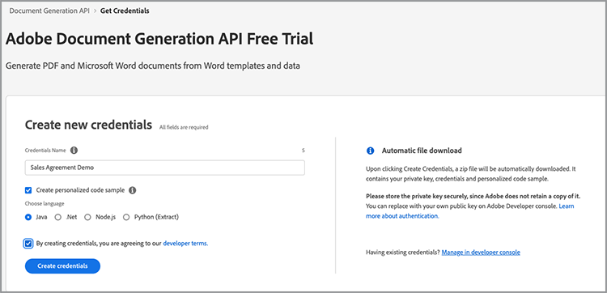
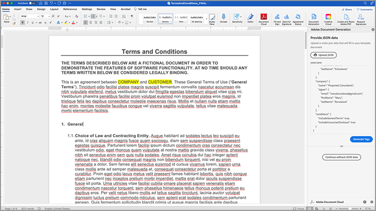
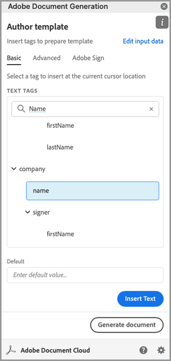
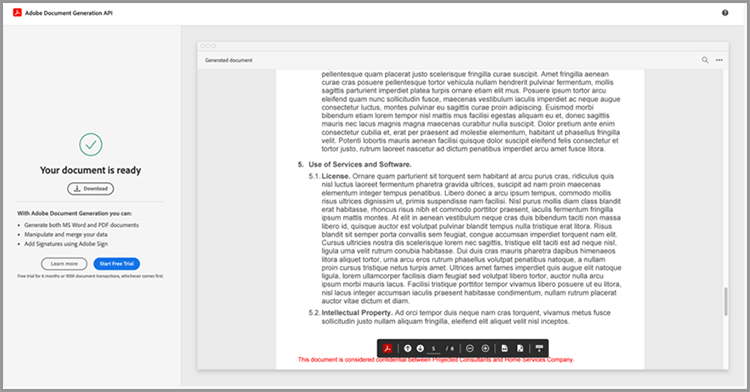
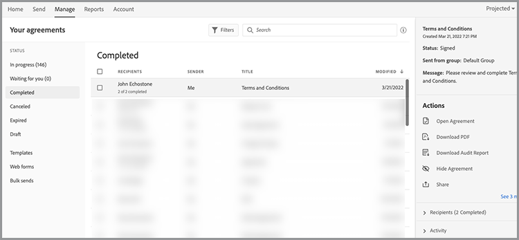

# Automatisera juridiska arbetsflöden


I ett idealiskt scenario accepteras avtalsvillkor utan ändringar. Ofta måste dock avtal anpassas, vilket sedan kräver rättslig granskning. Juridiska granskningar skapar betydande kostnader och saktar ned processen att leverera avtalsvillkor. Genom att använda fördefinierade mallar som ändras baserat på godkänt språk kan juridiska team hantera och använda avtalsvillkor på ett säkrare sätt.

I den här självstudiekursen används ett juridiskt avtal som varierar från stat till stat. För att åtgärda dessa variationer skapas en avtalsmall med villkorliga avsnitt, som endast inkluderas när vissa kriterier är uppfyllda. Det genererade dokumentet kan vara ett Word- eller PDF-dokument. Du kan också lära dig några sätt att skydda dokument med Adobe PDF Services API eller Acrobat Sign.

## Hämta autentiseringsuppgifter

Börja med att registrera dig för kostnadsfria autentiseringsuppgifter för Adobe PDF-tjänster:

1. Navigera [här](https://documentcloud.adobe.com/dc-integration-creation-app-cdn/main.html) för att registrera dina inloggningsuppgifter.
1. Logga in med ditt Adobe ID.
1. Ange ditt inloggningsuppgiftsnamn.

   

1. Välj ett språk för att hämta exempelkoden (till exempel Node.js).
1. Markera för att godkänna **[!UICONTROL utvecklarvillkor]**.
1. Välj **[!UICONTROL Skapa autentiseringsuppgifter]**.
En fil hämtas till datorn med en ZIP-fil som innehåller exempelfilerna, pdfservices-api-credentials.json och private.key för autentisering.

   

1. Välj **[!UICONTROL Skaffa Microsoft Word-tillägget]** eller gå till [AppSource](https://appsource.microsoft.com/en-cy/product/office/WA200002654) för att installera.

   >[!NOTE]
   >
   >För att installera Word-tillägget måste du ha behörighet att installera tillägg i Microsoft 365. Kontakta Microsoft 365-administratören om du inte har behörighet.

## Dina data

I det här scenariot skickas information för att hjälpa till att generera dokumentet och informera om vissa avsnitt ska inkluderas eller inte:

```
{
    "customer": {
        "name": "Home Services Company",
        "street": "123 Any Street",
        "city": "Anywhere",
        "state": "CA",
        "zip": "12345",
        "country":"USA",
        "signer": {
            "email": "johnnyechostone@gmail.com",
            "firstName": "John",
            "lastName": "Echostone"
        }
    },
    "company": {
        "name": "Projected Consultants",
        "signer": {
            "email": "maryburostone@gmail.com",
            "firstName": "Mary",
            "lastName": "Burostone"
        }
    },
    "conditions": {
        "includeGeneralTerms": true,
        "includeConsumerDiscloure": true
    }
}
```

I informationen finns information om kunden, namnet, vem som undertecknar, i vilket tillstånd kunden befinner sig och så vidare. Dessutom finns avsnitt med information om det företag som genererar avtalet och villkorsflaggor som används för att inkludera vissa avsnitt i avtalet.

## Lägg till grundläggande taggar i dokumentet

I det här scenariot används ett dokument med villkor som kan hämtas [här](https://github.com/benvanderberg/adobe-document-generation-samples/blob/main/Agreement/exercise/TermsAndConditions_Sample.docx?raw=true).


1. Öppna fönstret *TermsAndConditions.docx* Exempeldokument i Microsoft Word.
1. Om [Dokumentgenerering](https://appsource.microsoft.com/en-cy/product/office/WA200002654) plugin-programmet är installerat, välj **[!UICONTROL Dokumentgenerering]** i menyfliksområdet. Om du inte ser Dokumentgenerering i menyfliksområdet följer du dessa instruktioner.
1. Välj **[!UICONTROL Kom igång]**.
1. Kopiera JSON-exempeldata som skrivits ovan till JSON-datafältet.

   

Gå till *Tagg för dokumentgenerering* för att placera märkord i dokumentet.

## Infoga företagsnamnet

1. Markera den text som du vill ersätta. I det här scenariot ersätter du FÖRETAGET i dokumentets första avsnitt.
1. in *Tagg för dokumentgenerering* söker du efter &quot;namn&quot;.
1. Välj under Företag *namn*.

   

1. Välj **[!UICONTROL Infoga text]**.

En tagg med namnet läggs till `{{company.name}}` eftersom taggen finns under den sökvägen i JSON-filen.

```
{
    "company": {
        "name": "Projected Consultants",
        ...
    }
    ...
}
```

Upprepa sedan detta steg i avsnittet som öppnar för TEXTEN CUSTOMER. Upprepa **steg 1-4** och ersätter KUND med &quot;namn&quot; under kund. Utdata bör vara `{{customer.name}}`, vilket visar att texten kommer från kundobjektet under.

Med Adobe dokumentgenererings-API:t kan du också inkludera taggar i sidhuvuden och sidfötter och i precis den ände där rubrikerna för signaturerna ska gå.

Upprepa processen igen med **steg 1-4** för texten FÖRETAG och KUND i sidfoten.


Slutligen måste du **upprepa steg 1-4** för att ersätta FÖRNAMN och EFTERNAMN under avsnittet Kund på signatursidan med taggarna för `{{customer.signer.firstName}}` och `{{customer.signer.lastName}}` respektive. Oroa dig inte om taggen är lång och flödar om till nästa rad eftersom taggen ersätts när dokumentet skapas.

Början av dokumentet och sidfoten ska se ut ungefär så här:

* Avsnittet Början:


* Sidfot:


* Signatursida:


Nu när dina taggar är placerade i dokumentet är du redo att förhandsgranska det genererade avtalet.

## Förhandsvisa det genererade dokumentet

Direkt i Microsoft Word kan du förhandsgranska ditt genererade dokument utifrån JSON-exempeldata.

1. in *Tagg för dokumentgenerering*, välj **[!UICONTROL Generera dokument]**.
1. Första gången kan du uppmanas att logga in med ditt Adobe ID. Välj **[!UICONTROL Logga in]** och slutför uppmaningarna att logga in med dina inloggningsuppgifter.

   

1. Välj **[!UICONTROL Visa dokument]**.

   

1. Ett webbläsarfönster öppnas där du kan förhandsgranska dokumentresultaten.

   

## Lägg till villkorliga villkor för varje läge

I nästa område definierar du bara vissa områden som ska infogas baserat på vissa inmatningsvillkor. I exempeldokumentet gäller avsnitten 4 och 5 endast ett visst läge. I detta scenario ska endast de statsspecifika villkoren inkluderas när en kund är bosatt i det läget. Dessutom bör inte numreringen i Microsoft Word inkludera det avsnittet om det tas bort. Använd funktionen Villkorligt innehåll i dokumentgenererings-API:t för att tagga detta.


1. I dokumentet väljer du avsnittet California Disclosure (Kalifornien) och alla underpunkter.

   

1. in *[!UICONTROL Tagg för dokumentgenerering]*, välj **[!UICONTROL Avancerat]**.
1. Expandera **[!UICONTROL Villkorligt innehåll]**.
1. in *[!UICONTROL Välj poster]* fält, sök och välj **[!UICONTROL customer.state]**.
1. in *[!UICONTROL Välj operator]* fält, välj **=**.
1. in *[!UICONTROL Värde]* fält, typ *CA*.
1. Välj **[!UICONTROL Infoga villkor]**.

Avsnittet omsluts nu med en del taggar som kallas villkorstaggar. När du lade till märkorden kan de ha lagt till märkordet conditional-section som en numrerad linje. Du kan ta bort det genom att hoppa över mellanrum före märkordet, annars numreras objekten som om märkordet inte fanns där när dokumentet skapades. Det villkorliga avsnittet avslutas med `` tagg.


**Upprepa steg 1-7** för *Washington Disclosure* avsnitt, ersätta *CA* värde med *WA* för att visa att avsnittet endast visas om kundens delstat är Washington.


## Testning med villkorliga sektioner

När de villkorliga avsnitten är på plats kan du förhandsgranska dokumentet genom att välja **Generera dokument**.

När du genererar ett dokument ser du att det avsnitt som ingår bara är det som uppfyller datakriterierna. I exemplet nedan, eftersom delstaten var lika med CA, är endast avsnittet Kalifornien inkluderat.


En annan anmärkningsvärd förändring är att numreringen för det efterföljande avsnittet, Användning av Tjänster och Programvara, har nummer 5. Detta innebär att när Washingtonavsnittet utelämnas fortsätter numreringen.



Ändra exempeldata för mallen för att testa om mallen fungerar korrekt när kunden är i delstaten Washington och inte i Kalifornien:

1. in *Tagg för dokumentgenerering*, välj **[!UICONTROL Redigera indata]**.

   

1. Välj **[!UICONTROL Redigera]**.

1. I JSON-data ändrar du *CA* till *WA*.

   

1. Välj **[!UICONTROL Generera taggar]**.
1. Välj **[!UICONTROL Generera dokument]** för att generera om dokumentet.

Observera att dokumentet bara innehåller delstatssektionen i Washington.


## Lägga till en villkorlig mening

Precis som villkorliga avsnitt kan du också ha specifika meningar som ingår när vissa villkor är uppfyllda. I det här exemplet skiljer sig politiken för återvändande mellan Kalifornien och Washington.

1. I avsnitt 3.1 väljer du den första meningen &quot;Vid köp i delstaten Washington måste en returneras via MAIL inom 30 dagar efter den ursprungliga transaktionen för en full återbetalning.&quot;
1. in *[!UICONTROL Tagg för dokumentgenerering]*, välj **[!UICONTROL Avancerat]**.
1. Expandera **[!UICONTROL Villkorligt innehåll]**.
1. Under *[!UICONTROL Innehållstyp]*, välj **[!UICONTROL Fras]**.
1. in *[!UICONTROL Välj poster]* fält, sök och välj **[!UICONTROL customer.state]**.
1. in *[!UICONTROL Välj operator]* fält, välj **=**.
1. in *[!UICONTROL Värde]* fält, typ *CA*.
1. Välj **[!UICONTROL Infoga villkor]**.

Även om namnet på taggen är detsamma, är den största skillnaden mellan fras och avsnitt att en fras har avsnittet inte innehålla nya rader. Villkorsmärkordet och -end-section-märkordet måste finnas i samma stycke.


## Lägga till taggar för Acrobat Sign

Med Acrobat Sign kan du skicka avtal för signering eller bädda in dem på webben så att någon enkelt kan visa och signera dem. Med taggen Adobe-dokumentgenerering i Microsoft Word kan du enkelt förtagga dokument innan de skickas med Acrobat Sign, så att signaturer alltid placeras på rätt plats. I det här scenariot finns det två signerare som behöver en plats för att signera och datera dokumentet.

1. Navigera till den plats där kunden måste signera.
1. Placera markören där signaturen ska placeras.

   

1. in *[!UICONTROL Tagg för dokumentgenerering]*, välj **[!UICONTROL Adobe Sign]**.
1. in *[!UICONTROL Ange antal mottagare]* anger du antalet mottagare (i det här exemplet används 2).
1. in *[!UICONTROL Mottagare]* fält, välj **[!UICONTROL signer-1]**.
1. in *[!UICONTROL Fält]* text, välj **[!UICONTROL Signatur]**.
1. Välj **[!UICONTROL Infoga Adobe Sign-texttagg]**.

   

>[!NOTE]
>
>Om **Infoga Adobe Sign-texttagg** knappen verkar saknas, bläddra nedåt.

Detta placerar ett signaturfält där den första signeraren måste signera.


Placera sedan ett datafält för den signerare som automatiskt fylls i vid signering.

1. Flytta markören till det ställe där datumet ska placeras.

   

1. Ställ in Fälttyp på Datum.
1. Välj **[!UICONTROL Infoga Adobe Sign-texttagg]**.

Den placerade datumtaggen är ganska lång: `{{Date 3_es_:signer1:date:format(mm/dd/yyyy):font(size=Auto)}}`. Acrobat Sign-texttaggen måste finnas på samma rad, vilket skiljer sig från taggarna för dokumentgenerering. Inställningen `:format()` och `font()` parametrar är valfria, så i det här scenariot kan vi förkorta taggen till `{{Date 3_es_:signer1:date}}`.

Upprepa stegen ovanför *Företagets signatur* -sektionen. När du gör det måste du ändra fältet Mottagare till **signer-2**, annars tilldelas alla signaturfält samma person.

## Generera ett avtal

Du har nu taggat dokumentet och är klar att använda. I det här nästa avsnitt får du lära dig hur du genererar ett dokument med API-exempel för dokumentgenerering för Node.js. Dessa exempel fungerar på alla språk.

Öppna filen pdfservices-node-sdk-samples-master som du hämtade när du registrerade dina inloggningsuppgifter. Bland dessa filer finns filerna pdfservices-api-credentials.json och private.key.

1. Öppna ditt **[!UICONTROL Avslutning]** installera beroenden med `npm install`.
1. Kopiera ditt prov *data.json* in i *resources* -mappen.
1. Kopiera Word-mallen som du skapade till *resources* -mappen.
1. Skapa en ny fil i rotkatalogen i exempelmappen som heter *generate-salesOrder.js*.

   ```
   const PDFServicesSdk = require('@adobe/pdfservices-node-sdk').
   const fs = require('fs');
   const path = require('path');
   
   var dataFileName = path.join('resources', '<INSERT JSON FILE');
   var outputFileName = path.join('output', 'salesOrder_'+Date.now()+".pdf");
   var inputFileName = path.join('resources', '<INSERT DOCX>');
   
   //Loads credentials from the file that you created.
   const credentials =  PDFServicesSdk.Credentials
      .serviceAccountCredentialsBuilder()
      .fromFile("pdfservices-api-credentials.json")
      .build();
   
   // Setup input data for the document merge process
   const jsonString = fs.readFileSync(dataFileName),
   jsonDataForMerge = JSON.parse(jsonString);
   
   // Create an ExecutionContext using credentials
   const executionContext = PDFServicesSdk.ExecutionContext.create(credentials);
   
   // Create a new DocumentMerge options instance
   const documentMerge = PDFServicesSdk.DocumentMerge,
   documentMergeOptions = documentMerge.options,
   options = new documentMergeOptions.DocumentMergeOptions(jsonDataForMerge, documentMergeOptions.OutputFormat.PDF);
   
   // Create a new operation instance using the options instance
   const documentMergeOperation = documentMerge.Operation.createNew(options)
   
   // Set operation input document template from a source file.
   const input = PDFServicesSdk.FileRef.createFromLocalFile(inputFileName);
   documentMergeOperation.setInput(input);
   
   // Execute the operation and Save the result to the specified location.
   documentMergeOperation.execute(executionContext)
   .then(result => result.saveAsFile(outputFileName))
   .catch(err => {
      if(err instanceof PDFServicesSdk.Error.ServiceApiError
         || err instanceof PDFServicesSdk.Error.ServiceUsageError) {
         console.log('Exception encountered while executing operation', err);
      } else {
         console.log('Exception encountered while executing operation', err);
      }
   });
   ```

1. Ersätt `<JSON FILE>` med namnet på JSON-filen i /resources.
1. Ersätt `<INSERT DOCX>` med namnet på DOCX-filen.
1. Om du vill köra använder du **[!UICONTROL Avslutning]** för att köra nod `generate-salesOrder.js`.

Utdatafilen finns i mappen /output och dokumentet har genererats på rätt sätt.

Du kan ändra formatet genom att ändra raden nedan. DOCX-format är användbart om dokumentet ska skickas för redigering i Word eller för granskning av kontrakt.

PDF:

```
options = new documentMergeOptions.DocumentMergeOptions(jsonDataForMerge,
documentMergeOptions.OutputFormat.PDF);
```

Word:

```
options = new documentMergeOptions.DocumentMergeOptions(jsonDataForMerge, documentMergeOptions.OutputFormat.DOCX);
```

Du måste också ändra namnet på utdatafilen till .pdf eller .docx för utdataformatet PDF eller DOCX:

```
var outputFileName = path.join('output', 'salesOrder_'+Date.now()+".docx");
```

## Skicka avtal för signering

[Adobe Acrobat Sign](https://www.adobe.com/se/sign.html) låter dig skicka avtal till en eller flera mottagare så att de kan visa och signera dokument. Tillsammans med en lättanvänd användarupplevelse att skicka ett dokument för signering, finns REST API:er tillgängliga som låter dig ta Word, PDF, HTML och andra format och skicka dem för signering.

Exemplet nedan visar hur du använder REST API-dokumentationssidan för att ta det tidigare genererade dokumentet och skicka det för signering. Börja med att lära dig hur du gör det via webbgränssnittet i Acrobat Sign och sedan hur du gör det med REST API.

## Skaffa ett Acrobat Sign-konto

Om du inte har något Acrobat Sign-konto registrerar du dig för ett utvecklarkonto och granskar dokumentationen [här](https://developer.adobe.com/adobesign-api/)och välj **Registrera dig för ett utvecklarkonto**. Du uppmanas att fylla i ett formulär och få en bekräftelse via e-post. När du har gjort det dirigeras du till en webbplats där du kan ange ditt lösenord och konto och sedan logga in på Acrobat Sign.

## Skicka ett avtal från webbgränssnittet

1. Välj **[!UICONTROL Skicka]** från navigeringsfältet.

   

1. in *Mottagare* anger du två e-postadresser. Det är bästa praxis att använda en e-postadress som inte är kopplad till ditt Acrobat Sign-konto.

   

1. Ange ett **[!UICONTROL Avtalsnamn]** och **[!UICONTROL Meddelande]**.
1. Välj **[!UICONTROL Lägg till filer]** och överför den genererade filen från datorn.
1. Välj **[!UICONTROL Förhandsvisa och lägg till signaturfält]**.
1. Välj **[!UICONTROL Nästa]**.
1. När du bläddrar nedåt till signatursidan kan du se de placerade signaturfälten utifrån taggarna.

   

1. Välj **[!UICONTROL Skicka]**.
1. I ditt e-postmeddelande visas ett meddelande med en länk för att visa och signera.

   

1. Välj **[!UICONTROL Granska och signera]**.
1. Välj **[!UICONTROL Fortsätt]** för att godkänna användningsvillkoren.
1. Välj **[!UICONTROL Start]** för att komma till den plats där du måste signera.

   

1. Välj **[!UICONTROL Klicka här för att signera]**.

   

1. Skriv din signatur.

   

1. Välj **[!UICONTROL Tillämpa]**.
1. Välj **[!UICONTROL Klicka för att signera]**.

Ett e-postmeddelande skickas till nästa signerare. Upprepa steg 9-16 för att visa och signera för den andra signeraren.

När avtalet har slutförts skickas en signerad kopia av avtalet via e-post till var och en av parterna. Dessutom kan ett signerat avtal hämtas från Acrobat Sign-webbgränssnittet i **Hantera** sidan.



Lär dig sedan hur du gör samma scenario via REST API-dokumentation.

## Hämta autentiseringsuppgifter

1. Gå till [Acrobat Sign REST-dokumentation](https://secure.na1.adobesign.com/public/docs/restapi/v6).
1. Expandera *transientDocuments* och [POST /transientDocuments](https://benprojecteddemo.na1.adobesign.com/public/docs/restapi/v6#!/transientDocuments/createTransientDocument).
1. Välj **[!UICONTROL OAUTH-ÅTKOMSTTOKEN]**.

   

1. Kontrollera OAUTH-behörigheterna för *agreement_write*, *agreement_sign*, *widget_write* och *library_write*.
1. Välj **[!UICONTROL Auktorisera]**.
1. Du uppmanas att logga in med ditt Acrobat Sign-konto via ett popup-fönster. Logga in användare Administratörens användarnamn och lösenord.
1. Du uppmanas att tillåta åtkomst till REST-dokumentationen. Välj **[!UICONTROL Tillåt åtkomst]**.

En ägartoken läggs sedan till i **Auktorisering** område.

Du kan läsa mer om hur du skapar en auktoriseringstoken för Acrobat Sign genom att följa stegen som beskrivs [här](https://opensource.adobe.com/acrobat-sign/developer_guide/helloworld.html).

## Ladda upp ett tillfälligt dokument

Eftersom auktoriseringstoken läggs till från föregående steg måste du överföra ett dokument för att göra API-anropet:

1. in *Fil* -fältet, överför du PDF-dokumentet som skapades i tidigare steg.

   

1. Välj **[!UICONTROL Testa!]**.
1. in **[!UICONTROL Svarstext]**, kopiera *transientDocumentId* värde.

Inställningen *transientDocumentId* används för att referera till ett dokument som lagras tillfälligt i Acrobat Sign så att det kan refereras i efterföljande API-anrop.

## Skicka för signering

När ett dokument har överförts måste du skicka avtalet för signering.

1. Expandera avsnittet Avtal och avsnittet POST avtal.
1. I dialogrutan *AgreementInfo* -fältet, fyll i det med följande JSON:

   ```
   {
   "fileInfos": [
      {
         "transientDocumentId": "3AAABLblqZhAJeoswpyslef8_toTGT1WgBLk3TlhfJXy_uSLlKyre2hjF0-J1meBDn0PlShk0uQy6JghlqEoqXNnskq7YawteF6QWtHefP9wN2CW_Xbt0O9kq1tkpznG0a5-mEm4bYAV1FGOnD1mt_ooYdzKxm7KzTB11DLX2-81Zbe2Z1suy7oXiWNR3VSb-zMfIb5D4oIxF8BiNfN0q08RwT108FcB1bx4lekkATGld3nRbf8ApVPhB72VNrAIF0F1rAFBWTtfgvBKZaxrYSyZq73R_neMdvZEtxWTk5fii_bLVe7VdNZMcO55sofH61eQC_QIIsoYswZP4rw6dsTa68ZRgKUNs"
      }
   ],
   "name": "Terms and Conditions",
   "participantSetsInfo": [
      {
         "memberInfos": [
         {
            "email": "adobesigndemo+customer@outlook.com"
         }
         ],
         "order": 1,
         "role": "SIGNER"
      },
      {
         "memberInfos": [
            {
               "email": "adobesigndemo+company@outlook.com"
            }
         ],
         "order": 1,
         "role": "SIGNER"
         }
   ],
   "signatureType": "ESIGN",
   "state": "IN_PROCESS"
   }
   ```

1. Välj **[!UICONTROL Testa!]**.

**POST avtals-API** returnerar ett ID för avtalet. Om du vill hämta en mall för JSON-modellschemat väljer du **Minimalt modellschema**. En fullständig förteckning över parametrar finns i **Fullständigt modellschema** -sektionen.

## Kontrollera avtalets status

När du har ett avtal-ID kan du skicka en avtalsstatus.

1. Expandera **[!UICONTROL GET /agreements/{agreementId}]**.
1. Eftersom du kan behöva ytterligare OAUTH-omfång ska du välja **[!UICONTROL OAUTH-ACCESS-TOKEN]** igen.
1. Kopiera agreementId från det tidigare API-anropssvaret till fältet agreementId.
1. Välj **[!UICONTROL Testa!]**.

Nu har du information om det avtalet.

```
{
    "id": "CBJCHBCAABAAc6LyP4SVuKXP_pNstzIzyripanRdz4IB",
    "name": "Terms and Conditions",
    "groupId": "CBJCHBCAABAAoyMb1yIgczAGhBuJeHf99mglPtM7ElEu",
    "type": "AGREEMENT",
    "participantSetsInfo": [
      {
        "id": "CBJCHBCAABAAzZE-IcHHkt05-AVbxas4Jz7DUl3oEBO6",
        "memberInfos": [
          {
            "email": "adobesigndemo+customer@outlook.com",
            "id": "CBJCHBCAABAAyWgMMReqbxUFM7ctI5xz16c2kOmEy-IQ",
            "securityOption": {
              "authenticationMethod": "NONE"
            }
          }
        ],
        "role": "SIGNER",
        "order": 1
      },
      {
        "id": "CBJCHBCAABAAaRHz3gY2W0w5n_6pj1GMMuZAfhBihc1j",
        "memberInfos": [
          {
            "email": "adobesigndemo+company@outlook.com",
            "id": "CBJCHBCAABAAOZQwjPwJXFiX8YDKPYtzMpftsmxYrIo9",
            "securityOption": {
              "authenticationMethod": "NONE"
            }
          }
        ],
        "role": "SIGNER",
        "order": 1
      }
    ],
    "senderEmail": "adobesigndemo+new@outlook.com",
    "createdDate": "2022-03-22T02:59:36Z",
    "lastEventDate": "2022-03-22T02:59:41Z",
    "signatureType": "ESIGN",
    "locale": "en_US",
    "status": "OUT_FOR_SIGNATURE",
    "documentVisibilityEnabled": true,
    "hasFormFieldData": false,
    "hasSignerIdentityReport": false,
    "documentRetentionApplied": false
  }
```

Den effektivare metoden för att få aviseringar när uppdateringar ändras är via Webhooks, som du kan lära dig mer om [här](https://opensource.adobe.com/acrobat-sign/developer_guide/webhookapis.html.

## Lagra ett signerat dokument

När dokumentet har signerats kan det hämtas med hjälp av filen GET /agreements/combinedDocument.

1. Expandera **[!UICONTROL GET /agreements/{agreementId}/combinedDocument]**.
1. Uppsättning **[!UICONTROL agreementId]** till *agreementId* från det tidigare API-anropet.
1. Välj **[!UICONTROL Testa!]**.

Ytterligare parametrar för att bifoga en granskningsrapport eller stöddokument kan anges med parametrarna attachSupportingDocuments och attachAuditReport.

I dialogrutan **Svarstext**, den kan sedan hämtas till din dator och lagras där du vill.

## Fler alternativ

Förutom att skapa ett dokument och skicka det för signering, finns det ytterligare åtgärder att tillgå.

Om dokumentet till exempel inte har en signatur kan du med Adobe PDF Services API omforma dokument efter att avtalet har skapats, till exempel:

* Skydda dokumentet med ett lösenord
* Komprimera PDF om det finns stora bilder
* Mer information om andra tillgängliga åtgärder finns i skripten i mappen /src i exempelfilerna för Adobe PDF Services API. Du kan också läsa mer i dokumentationen för de olika åtgärderna som kan användas.

Dessutom har Acrobat Sign flera tilläggsfunktioner, till exempel:

* Bädda in en signeringsupplevelse i ett program
* Lägg till metoder för identitetsverifiering för signerare
* Konfigurera inställningar för e-postmeddelanden
* Hämta enskilda separata dokument som en del av ett avtal

## Ytterligare utbildning

Vill du veta mer? Ta en titt på några andra sätt att använda [!DNL Adobe Acrobat Services]:

* Läs mer från [dokumentation](https://developer.adobe.com/document-services/docs/overview/)
* Se fler självstudiekurser om Adobe Experience League
* Använd exempelskripten i mappen /src för att se hur du kan använda PDF
* Följ [Adobe Tech Blog](https://medium.com/adobetech/tagged/adobe-document-cloud) för senaste tips och råd
* Prenumerera på [Pappersklipp (den månatliga direktströmmen)](https://www.youtube.com/playlist?list=PLcVEYUqU7VRe4sT-Bf8flvRz1XXUyGmtF) för att lära dig mer om automatisering med [!DNL Adobe Acrobat Services].
