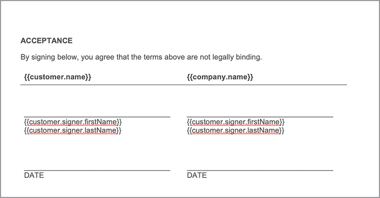

# Automatisera juridiska arbetsflöden


I ett idealiskt scenario accepteras avtalsvillkor utan ändringar. Ofta behöver dock avtal anpassas, vilket sedan kräver rättslig granskning. Juridiska granskningar skapar betydande kostnader och gör att processen med att leverera avtalsvillkor går långsammare. Med hjälp av fördefinierade mallar som ändras baserat på godkänt språk hjälper juridiska team att hantera och säkrare verkställa avtalsvillkor.

I den här självstudiekursen används ett juridiskt avtal som varierar från land till land. För att hantera dessa variationer skapas en avtalsmall med villkorliga avsnitt, som bara tas med när vissa villkor är uppfyllda. Det genererade dokumentet kan antingen vara ett Word- eller PDF-dokument. Du kan också lära dig några sätt att skydda dokument med Adobe PDF Services API eller Acrobat Sign.

## Hämta autentiseringsuppgifter

Börja med att registrera dig för kostnadsfria autentiseringsuppgifter för Adobe PDF-tjänster:

1. Navigera [här](https://documentcloud.adobe.com/dc-integration-creation-app-cdn/main.html) för att registrera dina inloggningsuppgifter.
1. Logga in med ditt Adobe ID.
1. Ange ditt inloggningsnamn.

   

1. Välj ett språk för att hämta exempelkoden (till exempel Node.js).
1. Markera för att godkänna **[!UICONTROL utvecklarvillkor]**.
1. Välj **[!UICONTROL Skapa autentiseringsuppgifter]**.
En fil hämtas till datorn med en ZIP-fil som innehåller exempelfilerna, pdfservices-api-credentials.json och private.key för autentisering.

   

1. Välj **[!UICONTROL Hämta Microsoft Word-tillägg]** eller gå till [AppSource](https://appsource.microsoft.com/en-cy/product/office/WA200002654) för att installera.

   >[!NOTE]
   >
   >Du måste ha behörighet att installera tillägg i Microsoft 365 för att kunna installera Word-tillägget. Kontakta Microsoft 365-administratören om du inte har behörighet.

## Dina data

I det här scenariot skickas information för att hjälpa till att generera dokumentet och informera om vissa avsnitt ska inkluderas eller inte:

```
{
    "customer": {
        "name": "Home Services Company",
        "street": "123 Any Street",
        "city": "Anywhere",
        "state": "CA",
        "zip": "12345",
        "country":"USA",
        "signer": {
            "email": "johnnyechostone@gmail.com",
            "firstName": "John",
            "lastName": "Echostone"
        }
    },
    "company": {
        "name": "Projected Consultants",
        "signer": {
            "email": "maryburostone@gmail.com",
            "firstName": "Mary",
            "lastName": "Burostone"
        }
    },
    "conditions": {
        "includeGeneralTerms": true,
        "includeConsumerDiscloure": true
    }
}
```

I data finns information om kunden, deras namn, vem som undertecknar, i vilket tillstånd de befinner sig och så vidare. Dessutom finns det avsnitt för information om företaget som genererar avtalet och villkorsflaggor som används för att inkludera vissa avsnitt i avtalet.

## Lägga till grundläggande taggar i dokumentet

I det här scenariot används ett villkorsdokument som kan hämtas [här](https://github.com/benvanderberg/adobe-document-generation-samples/blob/main/Agreement/exercise/TermsAndConditions_Sample.docx?raw=true).


1. Öppna *TermsAndConditions.docx* exempeldokument i Microsoft Word.
1. Om [Dokumentgenerering](https://appsource.microsoft.com/en-cy/product/office/WA200002654) om plugin-programmet är installerat väljer du **[!UICONTROL Dokumentgenerering]** i menyfliksområdet. Om du inte ser Dokumentgenerering i menyfliksområdet följer du dessa instruktioner.
1. Välj **[!UICONTROL Kom igång]**.
1. Kopiera JSON-exempeldata som skrivits ovan till JSON-datafältet.

   

Gå till *Dokumentgenereringstagg* för att placera märkord i dokumentet.

## Infoga företagsnamnet

1. Markera den text som du vill ersätta. I det här scenariot ersätter du FÖRETAGET i dokumentets öppningsavsnitt.
1. I *Dokumentgenereringstagg* söker du efter &quot;namn&quot;.
1. Välj under företag *name*.

   

1. Välj **[!UICONTROL Infoga text]**.

Då placeras en tagg med namnet `{{company.name}}` eftersom taggen finns under den sökvägen i JSON-filen.

```
{
    "company": {
        "name": "Projected Consultants",
        ...
    }
    ...
}
```

Upprepa sedan det här steget i öppningsavsnittet för TEXTEN CUSTOMER. Upprepa **steg 1-4** och ersätter CUSTOMER med &quot;name&quot; under Customer. Utdata bör `{{customer.name}}`, vilket visar att texten kommer från undersidan av kundobjektet.

Med Adobe Document Generation API kan du också inkludera taggar i sidhuvuden och sidfötter och i slutet där rubrikerna för signaturerna ska placeras.

Upprepa denna process igen med **steg 1-4** för texten FÖRETAG och KUND i sidfoten.


Slutligen måste du **upprepa steg 1-4** om du vill ersätta FÖRNAMN och EFTERNAMN under avsnittet Kund på signatursidan med taggarna för `{{customer.signer.firstName}}` och `{{customer.signer.lastName}}` respektive. Oroa dig inte om taggen är lång och flödar om till nästa rad eftersom taggen ersätts när dokumentet skapas.

Början av dokumentet och sidfoten ska se ut ungefär så här:

* Inledande avsnitt:


* Sidfot:


* Signatursida:



Nu när taggarna har placerats i dokumentet kan du förhandsgranska det genererade avtalet.

## Förhandsvisa det genererade dokumentet

I Microsoft Word kan du förhandsgranska det genererade dokumentet baserat på JSON-exempeldata.

1. I *Dokumentgenereringstagg* väljer du **[!UICONTROL Generera dokument]**.
1. Första gången kan du uppmanas att logga in med ditt Adobe ID. Välj **[!UICONTROL Logga in]** och slutför instruktionerna för att logga in med dina inloggningsuppgifter.

   

1. Välj **[!UICONTROL Visa dokument]**.

   

1. Ett webbläsarfönster öppnas där du kan förhandsgranska dokumentresultatet.

   

## Lägga till villkorliga villkor för varje läge

I nästa område definierar du bara vissa områden som ska infogas enligt vissa inmatningsvillkor. Avsnitten 4 och 5 i exempeldokumentet gäller bara ett visst läge. I det här scenariot ska endast de statsspecifika villkoren inkluderas när en kund är bosatt i det läget. Numreringen i Microsoft Word bör inte heller innehålla det avsnittet om det tas bort. Använd funktionen Villkorligt innehåll i API:et för dokumentgenerering för att tagga detta.


1. I dokumentet väljer du avsnittet California Disclosure (Kaliforniens avslöjande) och alla underpunkter.

   

1. I *[!UICONTROL Dokumentgenereringstagg]* väljer du **[!UICONTROL Avancerat]**.
1. Expandera **[!UICONTROL Villkorligt innehåll]**.
1. I *[!UICONTROL Välj poster]* fält, sök och välj **[!UICONTROL customer.state]**.
1. I *[!UICONTROL Välj operator]* fält väljer du **=**.
1. I *[!UICONTROL Värde]* fält, typ *certifikatutfärdare*.
1. Välj **[!UICONTROL Infoga villkor]**.

Avsnittet har nu en del taggar som kallas villkorstaggar. När du lade till märkorden kan det hända att märkordet conditional-section lades till som en numrerad rad. Du kan ta bort detta genom att använda backstegsavstånd före -taggen, annars numreras objekten som om taggen inte fanns där när dokumentet genereras. Det villkorliga avsnittet avslutas med `` tagg.


**Upprepa steg 1-7** för *Washington Disclosure* avsnitt, ersätta *certifikatutfärdare* värde med *WA* för att visa att avsnittet endast visas om kundens delstat är Washington.


## Testning med villkorliga avsnitt

När de villkorliga avsnitten är på plats kan du förhandsgranska dokumentet genom att välja **Generera dokument**.

När du genererar dokumentet bör du tänka på att det avsnitt som ingår bara är det som uppfyller datakriterierna. I exemplet nedan, eftersom delstaten var lika med CA, inkluderas endast avsnittet i Kalifornien.


En annan anmärkningsvärd förändring är att numreringen för efterföljande avsnitt, Användning av tjänster och programvara, har nummer 5. Detta innebär att när Washingtonavsnittet utelämnas fortsätter numreringen.


Om du vill testa om mallen fungerar korrekt när kunden är i delstaten Washington och inte i Kalifornien ändrar du exempeldata för mallen:

1. I *Dokumentgenereringstagg* väljer du **[!UICONTROL Redigera indata]**.

   

1. Välj **[!UICONTROL Redigera]**.

1. I JSON-data ändrar du *certifikatutfärdare* till *WA*.

   

1. Välj **[!UICONTROL Generera taggar]**.
1. Välj **[!UICONTROL Generera dokument]** för att generera om dokumentet.

Observera att dokumentet endast innehåller delstatssektionen i Washington.


## Lägga till en villkorlig mening

Precis som villkorliga avsnitt kan du också ha specifika meningar som inkluderas när vissa villkor uppfylls. I det här exemplet skiljer sig returpolitiken mellan Kalifornien och Washington.

1. I avsnitt 3.1 väljer du den första meningen &quot;Vid köp i delstaten Washington måste man returneras via MAIL inom 30 dagar efter den ursprungliga transaktionen för en full återbetalning.&quot;
1. I *[!UICONTROL Dokumentgenereringstagg]* väljer du **[!UICONTROL Avancerat]**.
1. Expandera **[!UICONTROL Villkorligt innehåll]**.
1. Under *[!UICONTROL Innehållstyp]* väljer du **[!UICONTROL fras]**.
1. I *[!UICONTROL Välj poster]* fält, sök och välj **[!UICONTROL customer.state]**.
1. I *[!UICONTROL Välj operator]* fält väljer du **=**.
1. I *[!UICONTROL Värde]* fält, typ *certifikatutfärdare*.
1. Välj **[!UICONTROL Infoga villkor]**.

Även om namnet på taggen är detsamma, är den största skillnaden mellan Fras och Avsnitt att en fras har avsnittet inte innehålla nya rader. Villkorstaggen och -end-section-taggen måste finnas i samma stycke.


## Lägga till taggar för Acrobat Sign

Med Acrobat Sign kan du skicka avtal för signering eller bädda in på webben så att någon enkelt kan visa och signera dem. Med taggen Adobe Document Generation i Microsoft Word kan du enkelt förtagga dokument innan de skickas med Acrobat Sign, så att signaturer alltid placeras på rätt plats. I det här scenariot finns det två signerare som behöver en plats för att signera och datera dokumentet.

1. Navigera till den plats där kunden måste signera.
1. Placera markören där signaturen ska placeras.

   

1. I *[!UICONTROL Dokumentgenereringstagg]* väljer du **[!UICONTROL Adobe Sign]**.
1. I *[!UICONTROL Ange antal mottagare]* anger du antalet mottagare (i det här exemplet används 2).
1. I *[!UICONTROL Mottagare]* fält väljer du **[!UICONTROL signer-1]**.
1. I *[!UICONTROL Fält]* text väljer du **[!UICONTROL Underskrift]**.
1. Välj **[!UICONTROL Infoga Adobe Sign-texttagg]**.

   

>[!NOTE]
>
>Om **Infoga Adobe Sign-texttagg** knappen verkar saknas, bläddra nedåt.

Detta placerar ett signaturfält där den första signeraren måste signera.


Därefter placerar du ett datafält för signeraren som automatiskt fylls i när denne signerar.

1. Placera markören där datumet ska stå.

   

1. Ange fälttypen till Datum.
1. Välj **[!UICONTROL Infoga Adobe Sign-texttagg]**.

Datumtaggen som placeras är ganska lång: `{{Date 3_es_:signer1:date:format(mm/dd/yyyy):font(size=Auto)}}`. Acrobat Sign-texttaggen måste finnas kvar på samma rad, vilket skiljer sig från taggarna Dokumentgenerering . Den `:format()` och `font()` parametrar är valfria, så för detta scenario kan vi förkorta taggen till `{{Date 3_es_:signer1:date}}`.

Upprepa stegen ovanför *Företagssignatur* avsnitt. När du gör det måste du ändra fältet Mottagare till **signer-2**, annars tilldelas alla signaturfält samma person.

## Generera ditt avtal

Du har nu taggat dokumentet och är klar att använda. I nästa avsnitt lär du dig hur du skapar ett dokument med hjälp av API-exemplen för dokumentgenerering för Node.js. Dessa exempel fungerar på alla språk.

Öppna filen pdfservices-node-sdk-samples-master som du hämtade när du registrerade dina inloggningsuppgifter. Dessa filer omfattar filerna pdfservices-api-credentials.json och private.key.

1. Öppna **[!UICONTROL Terminal]** installera beroenden med `npm install`.
1. Kopiera ditt exempel *data.json* till *tillgångar* -mappen.
1. Kopiera Word-mallen som du skapade till *tillgångar* -mappen.
1. Skapa en ny fil i rotkatalogen i mappen samples med namnet *generate-salesOrder.js*.

   ```
   const PDFServicesSdk = require('@adobe/pdfservices-node-sdk').
   const fs = require('fs');
   const path = require('path');
   
   var dataFileName = path.join('resources', '<INSERT JSON FILE');
   var outputFileName = path.join('output', 'salesOrder_'+Date.now()+".pdf");
   var inputFileName = path.join('resources', '<INSERT DOCX>');
   
   //Loads credentials from the file that you created.
   const credentials =  PDFServicesSdk.Credentials
      .serviceAccountCredentialsBuilder()
      .fromFile("pdfservices-api-credentials.json")
      .build();
   
   // Setup input data for the document merge process
   const jsonString = fs.readFileSync(dataFileName),
   jsonDataForMerge = JSON.parse(jsonString);
   
   // Create an ExecutionContext using credentials
   const executionContext = PDFServicesSdk.ExecutionContext.create(credentials);
   
   // Create a new DocumentMerge options instance
   const documentMerge = PDFServicesSdk.DocumentMerge,
   documentMergeOptions = documentMerge.options,
   options = new documentMergeOptions.DocumentMergeOptions(jsonDataForMerge, documentMergeOptions.OutputFormat.PDF);
   
   // Create a new operation instance using the options instance
   const documentMergeOperation = documentMerge.Operation.createNew(options)
   
   // Set operation input document template from a source file.
   const input = PDFServicesSdk.FileRef.createFromLocalFile(inputFileName);
   documentMergeOperation.setInput(input);
   
   // Execute the operation and Save the result to the specified location.
   documentMergeOperation.execute(executionContext)
   .then(result => result.saveAsFile(outputFileName))
   .catch(err => {
      if(err instanceof PDFServicesSdk.Error.ServiceApiError
         || err instanceof PDFServicesSdk.Error.ServiceUsageError) {
         console.log('Exception encountered while executing operation', err);
      } else {
         console.log('Exception encountered while executing operation', err);
      }
   });
   ```

1. Ersätt `<JSON FILE>` med namnet på JSON-filen i /resources.
1. Ersätt `<INSERT DOCX>` med namnet på DOCX-filen.
1. Om du vill köra använder du **[!UICONTROL Terminal]** för att köra nod `generate-salesOrder.js`.

Utdatafilen finns i mappen /output och dokumentet har genererats korrekt.

Du kan ändra format genom att ändra raden nedan. DOCX-formatet är användbart om dokumentet ska skickas för redigering i Word eller för granskning av kontrakt.

PDF:

```
options = new documentMergeOptions.DocumentMergeOptions(jsonDataForMerge,
documentMergeOptions.OutputFormat.PDF);
```

Word:

```
options = new documentMergeOptions.DocumentMergeOptions(jsonDataForMerge, documentMergeOptions.OutputFormat.DOCX);
```

Du måste också ändra namnet på utdatafilen till .pdf eller .docx för utdataformatet PDF eller DOCX:

```
var outputFileName = path.join('output', 'salesOrder_'+Date.now()+".docx");
```

## Skicka avtal för signering

[Adobe Acrobat Sign](https://www.adobe.com/se/sign.html) Med kan du skicka avtal till en eller flera mottagare så att de kan visa och signera dokument. Förutom en lättanvänd användarupplevelse för att skicka ett dokument för signering finns REST API:er som gör att du kan ta Word, PDF, HTML och andra format och skicka dem för signering.

Exemplet nedan visar hur du använder dokumentationssidan för REST API för att ta det tidigare genererade dokumentet och skicka det för signering. Lär dig först hur du gör det via webbgränssnittet i Acrobat Sign och sedan hur du gör det med REST API.

## Skaffa ett Acrobat Sign-konto

Om du inte har något Acrobat Sign-konto kan du registrera dig för ett utvecklarkonto och läsa dokumentationen [här](https://developer.adobe.com/adobesign-api/)och väljer **Anmäl dig till utvecklarkonto**. Du uppmanas att fylla i ett formulär och få ett bekräftelsemeddelande. När du har gjort det dirigeras du till en webbplats där du kan ange ditt lösenord och konto och sedan logga in på Acrobat Sign.

## Skicka ett avtal från webbgränssnittet

1. Välj **[!UICONTROL Skicka]** från navigeringsfältet.

   

1. I *Mottagare* anger du två e-postadresser. Det är bästa praxis att använda en e-postadress som inte är kopplad till ditt Acrobat Sign-konto.

   

1. Ange en **[!UICONTROL Avtalsnamn]** och **[!UICONTROL Meddelande]**.
1. Välj **[!UICONTROL Lägg till filer]** och överför den genererade filen från datorn.
1. Välj **[!UICONTROL Förhandsvisa och lägg till signaturfält]**.
1. Välj **[!UICONTROL Nästa]**.
1. När du bläddrar ner till signatursidan kan du se de placerade signaturfälten baserat på taggarna.

   

1. Välj **[!UICONTROL Skicka]**.
1. I e-postmeddelandet visas ett meddelande med en länk för att visa och signera.

   

1. Välj **[!UICONTROL Granska och signera]**.
1. Välj **[!UICONTROL Fortsätt]** för att acceptera användningsvillkoren.
1. Välj **[!UICONTROL Start]** för att hoppa till den plats där du behöver signera.

   

1. Välj **[!UICONTROL Klicka här för att signera]**.

   

1. Skriv din signatur.

   

1. Välj **[!UICONTROL Använd]**.
1. Välj **[!UICONTROL Klicka för att signera]**.

Ett e-postmeddelande skickas till nästa signerare. Upprepa steg 9-16 för att visa och signera för den andra signeraren.

När avtalet har slutförts skickas en signerad kopia av avtalet via e-post till var och en av parterna. Dessutom kan ett signerat avtal hämtas från Acrobat Sign-webbgränssnittet i **Hantera** sidan.


Lär dig sedan hur du gör samma scenario via dokumentationen för REST API.

## Hämta autentiseringsuppgifter

1. Gå till [Acrobat Sign REST-dokumentation](https://secure.na1.adobesign.com/public/docs/restapi/v6).
1. Expandera *transientDocuments* och [POST /transientDocuments](https://benprojecteddemo.na1.adobesign.com/public/docs/restapi/v6#!/transientDocuments/createTransientDocument).
1. Välj **[!UICONTROL OAUTH ACCESS-TOKEN]**.

   

1. Kontrollera OAUTH-behörigheterna för *agreement_write*, *agreement_sign*, *widget_write* och *library_write*.
1. Välj **[!UICONTROL Auktorisera]**.
1. Du uppmanas att logga in med ditt Acrobat Sign-konto via ett popup-fönster. Logga in användare Användarnamn och lösenord för administratören.
1. Du uppmanas att ge åtkomst till REST-dokumentationen. Välj **[!UICONTROL Tillåt åtkomst]**.

En bärartoken läggs sedan till i **Auktorisering** fält.

Om du vill veta mer om hur du skapar en auktoriseringstoken för Acrobat Sign kan du följa stegen som beskrivs [här](https://opensource.adobe.com/acrobat-sign/developer_guide/helloworld.html).

## Ladda upp ett tillfälligt dokument

Eftersom auktoriseringstoken läggs till från föregående steg måste du ladda upp ett dokument för att göra API-anropet:

1. I *Fil* överför PDF-dokumentet som genererades i tidigare steg.

   

1. Välj **[!UICONTROL Prova!]**.
1. I **[!UICONTROL Svarstext]**, kopiera *transientDocumentId* värde.

Den *transientDocumentId* används för att referera till ett dokument som lagras tillfälligt i Acrobat Sign så att det kan refereras i efterföljande API-anrop.

## Skicka för signering

När ett dokument har överförts måste du skicka avtalet för signering.

1. Expandera avtalsavsnittet och POST avtalsavsnitten.
1. I dialogrutan *AgreementInfo* fylla i fältet med följande JSON:

   ```
   {
   "fileInfos": [
      {
         "transientDocumentId": "3AAABLblqZhAJeoswpyslef8_toTGT1WgBLk3TlhfJXy_uSLlKyre2hjF0-J1meBDn0PlShk0uQy6JghlqEoqXNnskq7YawteF6QWtHefP9wN2CW_Xbt0O9kq1tkpznG0a5-mEm4bYAV1FGOnD1mt_ooYdzKxm7KzTB11DLX2-81Zbe2Z1suy7oXiWNR3VSb-zMfIb5D4oIxF8BiNfN0q08RwT108FcB1bx4lekkATGld3nRbf8ApVPhB72VNrAIF0F1rAFBWTtfgvBKZaxrYSyZq73R_neMdvZEtxWTk5fii_bLVe7VdNZMcO55sofH61eQC_QIIsoYswZP4rw6dsTa68ZRgKUNs"
      }
   ],
   "name": "Terms and Conditions",
   "participantSetsInfo": [
      {
         "memberInfos": [
         {
            "email": "adobesigndemo+customer@outlook.com"
         }
         ],
         "order": 1,
         "role": "SIGNER"
      },
      {
         "memberInfos": [
            {
               "email": "adobesigndemo+company@outlook.com"
            }
         ],
         "order": 1,
         "role": "SIGNER"
         }
   ],
   "signatureType": "ESIGN",
   "state": "IN_PROCESS"
   }
   ```

1. Välj **[!UICONTROL Prova!]**.

**API för POST av avtal** returnerar ett ID för avtalet. Om du vill hämta en mall för JSON-modellschemat väljer du **Minimalt modellschema**. En fullständig lista över parametrar finns i **Fullständigt modellschema** avsnitt.

## Kontrollera avtalsstatus

När du har ett avtals-ID kan du skicka avtalsstatus.

1. Expandera **[!UICONTROL GET /agreements/{agreementId}]**.
1. Eftersom du kan behöva ytterligare OAUTH-omfång väljer du **[!UICONTROL OAUTH-ACCESS-TOKEN]** igen.
1. Kopiera agreementId från det tidigare API-anropssvaret till fältet agreementId.
1. Välj **[!UICONTROL Prova!]**.

Nu har du information om avtalet.

```
{
    "id": "CBJCHBCAABAAc6LyP4SVuKXP_pNstzIzyripanRdz4IB",
    "name": "Terms and Conditions",
    "groupId": "CBJCHBCAABAAoyMb1yIgczAGhBuJeHf99mglPtM7ElEu",
    "type": "AGREEMENT",
    "participantSetsInfo": [
      {
        "id": "CBJCHBCAABAAzZE-IcHHkt05-AVbxas4Jz7DUl3oEBO6",
        "memberInfos": [
          {
            "email": "adobesigndemo+customer@outlook.com",
            "id": "CBJCHBCAABAAyWgMMReqbxUFM7ctI5xz16c2kOmEy-IQ",
            "securityOption": {
              "authenticationMethod": "NONE"
            }
          }
        ],
        "role": "SIGNER",
        "order": 1
      },
      {
        "id": "CBJCHBCAABAAaRHz3gY2W0w5n_6pj1GMMuZAfhBihc1j",
        "memberInfos": [
          {
            "email": "adobesigndemo+company@outlook.com",
            "id": "CBJCHBCAABAAOZQwjPwJXFiX8YDKPYtzMpftsmxYrIo9",
            "securityOption": {
              "authenticationMethod": "NONE"
            }
          }
        ],
        "role": "SIGNER",
        "order": 1
      }
    ],
    "senderEmail": "adobesigndemo+new@outlook.com",
    "createdDate": "2022-03-22T02:59:36Z",
    "lastEventDate": "2022-03-22T02:59:41Z",
    "signatureType": "ESIGN",
    "locale": "en_US",
    "status": "OUT_FOR_SIGNATURE",
    "documentVisibilityEnabled": true,
    "hasFormFieldData": false,
    "hasSignerIdentityReport": false,
    "documentRetentionApplied": false
  }
```

Den effektivare metoden för att få meddelanden när uppdateringar ändras är via Webhooks, som du kan lära dig mer om [här](https://opensource.adobe.com/acrobat-sign/developer_guide/webhookapis.html.

## Lagra ett signerat dokument

När dokumentet har signerats kan det hämtas med hjälp av filen GET /agreements/combinedDocument.

1. Expandera **[!UICONTROL GET /agreements/{agreementId}/combinedDocument]**.
1. Uppsättning **[!UICONTROL agreementId]** till *agreementId* tillhandahålls från föregående API-anrop.
1. Välj **[!UICONTROL Prova!]**.

Ytterligare parametrar för att bifoga en granskningsrapport eller stöddokument kan ställas in med hjälp av parametrarna attachSupportingDocuments och attachAuditReport.

I dialogrutan **Svarstext** kan den sedan hämtas till datorn och lagras där du vill.

## Fler alternativ

Förutom att skapa ett dokument och skicka det för signering finns det ytterligare åtgärder.

Om dokumentet till exempel inte har någon signatur finns det många sätt att omvandla dokument i Adobe PDF Services API när avtalet har skapats, till exempel:

* Skydda dokument med lösenord
* Komprimera PDF om det finns stora bilder
* Mer information om andra åtgärder som är tillgängliga finns i skripten i mappen /src i exempelfilerna för API:et för Adobe PDF-tjänster. Du kan också läsa mer i dokumentationen om de olika åtgärder som kan användas.

Dessutom har Acrobat Sign flera tilläggsfunktioner:

* Bädda in signeringsfunktionen i ett program
* Lägga till metoder för identitetsverifiering för signerare
* Konfigurera inställningar för e-postmeddelanden
* Ladda ned separata dokument som en del av ett avtal

## Ytterligare lärande

Vill du veta mer? Ta en titt på några andra sätt att använda [!DNL Adobe Acrobat Services]:

* Läs mer från [dokumentation](https://developer.adobe.com/document-services/docs/overview/)
* Se fler självstudiekurser om Adobe Experience League
* Använd exempelskripten i mappen /src för att se hur du kan använda PDF
* Följ [Adobe Tech Blog](https://medium.com/adobetech/tagged/adobe-document-cloud) för de senaste tipsen och knepen
* Prenumerera på [Pappersklipp (den månatliga liveströmmen)](https://www.youtube.com/playlist?list=PLcVEYUqU7VRe4sT-Bf8flvRz1XXUyGmtF) för att lära dig mer om automatisering med [!DNL Adobe Acrobat Services].
