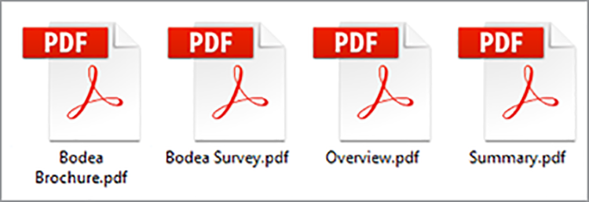
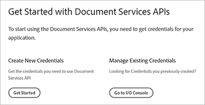
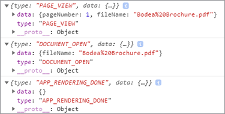

# Digital dokumentpublicering


Elektroniska dokument finns överallt - i själva verket finns det förmodligen [biljoner PDF](https://itextpdf.com/en/blog/technical-notes/do-you-know-how-many-pdf-documents-exist-world) globalt, och antalet ökar varje dag. Genom att bädda in ett PDF-visningsprogram på dina webbsidor kan du visa dokument utan att behöva designa om HTML och CSS eller hindra åtkomsten till webbplatsen.

Låt oss utforska ett populärt scenario. Ett företagstjänster [informationsdokument på deras webbplats](https://www.adobe.io/apis/documentcloud/dcsdk/digital-content-publishing.html)
för att ge sammanhang åt deras program och tjänster. Webbplatsens marknadsförare vill få en bättre förståelse för hur användare interagerar med sitt PDF-baserade innehåll och införlivar det med sin webbsida och sitt varumärke. De har beslutat att offentliggöra rapporterna som [skyddat innehåll](https://whatis.techtarget.com/definition/gated-content-ungated-content#:~:text=Gated%20content%20is%20online%20materials,about%20their%20jobs%20and%20organizations.), som styr vem som kan hämta dem.

## Vad du kan lära dig

I den här praktiska självstudiekursen lär du dig hur du visar inbäddade PDF-dokument på webbsidor med [Adobe PDF Embed API](https://www.adobe.io/apis/documentcloud/dcsdk/pdf-embed.html), som är gratis och lätt att använda. I dessa exempel används JavaScript, Node.js, Express.js, HTML och CSS. Du kan visa den fullständiga projektkoden på [GitHub](https://www.google.com/url?q=https://github.com/marcelooliveira/EmbedPDF/tree/main/pdf-app&amp;sa=D&amp;source=editors&amp;ust=1617129543031000&amp;usg=AOvVaw2rzSwYuJ_JI7biVIgbNMw1).

## Relevanta API:er och resurser

* [PDF Embed API](https://www.adobe.com/devnet-docs/dcsdk_io/viewSDK/index.html)

* [PDF Services API](https://opensource.adobe.com/pdftools-sdk-docs/release/latest/index.html)

* [Projektkod](https://www.google.com/url?q=https://github.com/marcelooliveira/EmbedPDF/tree/main/pdf-app&amp;sa=D&amp;source=editors&amp;ust=1617129543031000&amp;usg=AOvVaw2rzSwYuJ_JI7biVIgbNMw1)

## Skapa en Node Web App

Låt oss börja med att skapa en webbplats med Node.js och Express som använder en snygg mall och erbjuder flera PDF för nedladdning.

För det första [hämta och installera Node.js](https://nodejs.org/en/download/).

För att enkelt skapa ett Node.js-projekt med en minimal webbprogramstruktur installerar du verktyget för programgenerering `` `express-generator` ``.

```
npm install express-generator -g
```

Skapa sedan den nya Express-appen med namnet pdf-app och välj som visningsmotor.

```
express pdf-app --view=ejs
```

Gå nu till katalogen \\pdf-app och installera alla projektberoenden.

```
cd pdf-app
npm install
```

Starta sedan den lokala webbservern och kör programmet.

```
npm start
```

Öppna slutligen webbplatsen på <http://localhost:3000>.


Du har nu en grundläggande webbplats.

## Renderar vitboksdata

För att lägga upp rapporter på webbplatsen definieras och förbereds informationen i vitboken på webbplatsen för att visa dessa dokument. Skapa först en ny \\data-mapp i projektets rot. Informationen om tillgängliga rapporter kommer från en ny fil med namnet [data.json](https://github.com/marcelooliveira/EmbedPDF/blob/main/pdf-app/data/data.json)som läggs i datamappen.

Om du vill ge webbappen ett snyggt och prydligt utseende installerar du [Bootstrap](https://getbootstrap.com/) och [Font Awesome](https://fontawesome.com/) klientbibliotek.

```
npm install bootstrap
npm install font-awesome
```

Öppna filen app.js och inkludera dessa kataloger som källor för statiska filer, placera dem efter den befintliga `` `express.static` `` linje.

```
app.use(express.static(path.join(__dirname, '/node_modules/bootstrap/dist')));
app.use(express.static(path.join(__dirname, '/node_modules/font-awesome')));
```

Om du vill ta med PDF-dokumenten skapar du en mapp med namnet \\pdfs under projektets \\gemensamma mapp. Istället för att skapa PDF och miniatyrbilderna själv kan du kopiera dem från den här [GitHub-databasmapp](https://github.com/marcelooliveira/EmbedPDF/tree/main/pdf-app/public) till mapparna \\pdfs och \\image.

Mappen \\public\\pdfs innehåller nu PDF-dokument:



Mappen \\public\\images bör innehålla miniatyrbilder för vart och ett av PDF-dokumenten:


Öppna filen \\routningar\\index.js som innehåller logiken för dirigering av startsidan. Om du vill använda vitboksdata från filen data.json måste du läsa in modulen Node.js som ansvarar för åtkomst till och interaktion med filsystemet. Deklarera sedan `fs` på första raden i filen \\routningar\\index.js, enligt följande:

```
const fs = require('fs');
```

Läs och analysera sedan filen data.json och lagra dem i pappersvariabeln:

```
let rawdata = fs.readFileSync('data/data.json');
let papers = JSON.parse(rawdata);
```

Nu kan du ändra raden för att anropa återgivningsmetoden för indexvyn och skicka papperssamlingen som modell för indexvyn.

```
res.render('index', { title: 'Embedding PDF', papers: papers });
```

Om du vill återge samlingen med informationsdokument på startsidan öppnar du filen \\views\\index.ejs och ersätter den befintliga koden med koden från projektets [indexfil](https://github.com/marcelooliveira/EmbedPDF/blob/main/pdf-app/views/index.ejs).

Kör om npm starta och öppna <http://localhost:3000> för att visa din samling med tillgängliga rapporter.


I nästa avsnitt handlar det om att förbättra webbplatsen och använda [PDF Embed API](https://www.adobe.io/apis/documentcloud/dcsdk/pdf-embed.html) för att visa PDF-dokument på webbsidan. PDF Embed API är kostnadsfritt att använda - du behöver bara skaffa en API-uppgift.

## Hämta en PDF Embed API-uppgift

Om du vill få en kostnadsfri inloggnings-API för PDF går du till [Kom igång](https://www.adobe.io/apis/documentcloud/dcsdk/gettingstarted.html) när du har registrerat dig för ett nytt konto eller loggat in på ditt befintliga konto.

Klicka **Skapa nya autentiseringsuppgifter** och därefter **Kom igång:**



Nu uppmanas du att registrera dig för ett kostnadsfritt konto om du inte har ett.

Välj **PDF Embed API** och ange sedan ditt inloggningsnamn och din programdomän. Använd kommandot **localhost** på grund av att webbprogrammet testas lokalt.


Klicka på **Skapa autentiseringsuppgifter** för att komma åt dina PDF-uppgifter och få klient-ID (API-NYCKEL).


Skapa en fil med namnet .ENV i programmets rotmapp i Node.js-projektet och deklarera miljövariabeln för ditt PDF Embed Client ID med API KEY-autentiseringsuppgiften från föregående steg.

```
PDF_EMBED_CLIENT_ID=**********************************************
```

Du använder sedan detta klient-ID för att komma åt PDF Embed API. Installera dotenv-paketet för att komma åt den här miljövariabeln med koden Node.js.

```
npm install dotenv
```

Öppna sedan filen app.js och lägg till följande rad högst upp i filen så att Node.js kan läsa in modulen dotenv:

```
require('dotenv').config();
```

## Visa PDF i webbappen

Nu kan du använda PDF Embed API för att visa PDF på webbplatsen. Öppna livefilen [Demo av inbäddat API i PDF](https://documentcloud.adobe.com/view-sdk-demo/index.html#/view/FULL_WINDOW/Bodea%20Brochure.pdf).


På den vänstra panelen kan du välja det inbäddningsläge som bäst passar webbplatsens behov:

* **Fullständigt fönster**: PDF täcker hela webbsidans utrymme

* **Storleksanpassad behållare**: PDF visas inuti webbsidan, en sida i taget, i en div med begränsad storlek

* **In-line**: hela PDF visas i en div på webbsidan

* **Ljuslåda**: PDF visas som ett lager ovanpå webbsidan

Vi rekommenderar att du använder det inbyggda inbäddningsläget för rapporter och kodgeneratorn för att bädda in en PDF i programmet.

## Skapa en sida för inbäddat infogat läge

Om du vill bädda in ett PDF-visningsprogram på webbsidan och visa alla sidor samtidigt, skapar du en ny sida med det inbyggda inbäddningsläget.

Skapa en ny vy i filen \\views\\in-line.ejs med EJS-visningsmotorn.

```
<! html DOCTYPE >
<html>
<head>
<title>
<%= title %>
</title>
<link rel='stylesheet' href='/stylesheets/style.css' />
<link rel='stylesheet' href='/css/bootstrap.min.css'/>
<link rel='stylesheet' href='/css/font-awesome.min.css' />
<style type="text/css">
p {
font-family: 'Gill Sans', 'Gill Sans MT', Calibri, 'Trebuchet MS', sans-serif
}
</style>
</head>
<body class="m-0">
<div>
<main>
<div class="row">
<div class="col-sm-3"></div>
<div class="col-sm-6">
<h3>
<p class="text-center">Grow your business, establish your brand,<br
/>
```

Och sätta kunderna i första rummet.

```
</p>
</h3>
<div>
<p class="text-center">Lorem ipsum dolor sit amet, consectetur adipiscing elit, sed do<br />
eiusmod tempor incididunt ut labore et dolore</p>
</div>
</div>
</main>
<footer>
<div class="row">
<div class="col-sm-3"></div>
<div class="col-sm-6">
<p class="text-center">Bodea Inc. Your trusted partner since 2008</p>
</div>
</div>
</footer>
</div>
</div>
</body>
</html>
```

Skapa sedan en knapp för att öppna den infogade vyn genom att ändra \\views\\index.ejs.

```
<div class="card-body">
<h5 class="card-title">
<span>
<%= paper.title %>
</span>
</h5>
<p>
<a class="btn btn-sm btn btn-danger" href="/in-line/<%=
paper.id %>">
<span type="button"></span>
<span class="fa fa-file-pdf-o"></span>&nbsp;View Document</button>
</a>
</p>
</div>
```

Öppna filen app.js och deklarera en ny router efter indexRouter-deklarationen:

```
var indexRouter = require('./routes/index');
var inLineRouter = require('./routes/in-line');
```

Lägg sedan till koden efter app.use(&#39;/&#39;, indexRouter); så här associerar du vyn för infogat inbäddningsläge med routern:

```
app.use('/', indexRouter);
app.use('/in-line', inLineRouter);
```

Skapa nu en ny in-line.js -fil under \\routrar för att skapa ny routerlogik. Inkludera Express, en nodmodul som möjliggör en webbprogramserver.

```
var express = require('express');
const fs = require('fs');
var router = express.Router();
```

Skapa sedan en slutpunkt som hanterar GET-begäranden för ett specifikt whitepaper-ID och återger vyn in-line.ejs.

```
router.all('/:id', function(req, res, next) {
let rawdata = fs.readFileSync('data/data.json');
let papers = JSON.parse(rawdata);
let paper = papers.filter(p => p.id == parseInt(req.params.id))[0];
res.render('in-line', { title: paper.title, paper: paper });
});
module.exports = router;
```

Titta på [live-demo](https://documentcloud.adobe.com/view-sdk-demo/index.html#/view/FULL_WINDOW/Bodea%20Brochure.pdf) för att automatiskt generera PDF Embed API-kod. Klicka **In-line** från den vänstra panelen:


Klicka **Generera kod** om du vill se HTML-koden som krävs för att visa ett visningsprogram för PDF i behållarstorlek.


Klicka **Kopiera kod** och klistra in koden i filen in-line.ejs.

```
<div>
<p class="text-center">Lorem ipsum dolor sit amet, consectetur adipiscing elit, sed do<br />
eiusmod tempor incididunt ut labore et dolore</p>
</div>
<div class="row align-items-center border border-primary">
<div id="adobe-dc-view" style="width: 800px;"></div>
<script src="https://documentcloud.adobe.com/view-sdk/main.js"></script>
<script type="text/javascript">
document.addEventListener("adobe_dc_view_sdk.ready", function(){
var adobeDCView = new AdobeDC.View({clientId: "<YOUR_CLIENT_ID>", divId: "adobe-dc-view"});
adobeDCView.previewFile({
content:{location: {url: "https://documentcloud.adobe.com/view-sdk-demo/PDFs/Bodea Brochure.pdf"}},
metaData:{fileName: "Bodea Brochure.pdf"}
}, {embedMode: "IN_LINE"});
});
</script>
</div>
```

Dokumentparametrarna är dock fortfarande hårdkodade. Låt oss ersätta dem med EJS-gafflingens syntax (\&lt;%= someValue %\>) för att återge sidan enligt modelldata i rapporten.

```
<div id="adobe-dc-view" style="width: 800px;"></div>
<script src="https://documentcloud.adobe.com/view-sdk/main.js"></script>
<script type="text/javascript">
document.addEventListener("adobe_dc_view_sdk.ready", function () {
var adobeDCView = new AdobeDC.View({ clientId: "<%=process.env.PDF_EMBED_CLIENT_ID %>", divId: "adobe-dc-view" });
adobeDCView.previewFile({
content: { location: { url: "<%= paper.pdf %>" } },
metaData: { fileName: "<%= paper.fileName %>" }
}, {
embedMode: "IN_LINE"
});
});
</script>
```

Kör nu programmet med npm start kommando och öppna webbplatsen på <http://localhost:3000>.


Välj slutligen ett vitt papper och klicka på **Visa dokument** så här öppnar du en ny sida med det inbäddade PDF:


Observera att alternativen Hämta PDF och Skriv ut PDF nu finns.


Du vill kontrollera flaggorna i backend. Senare kan du implementera behörighetskontroller baserat på användaridentitet och begränsa åtkomsten enligt dina affärsregler. Komplexiteten behövs inte här, så vi kan ändra \\routningar\\in-line.js för att inkludera de autentiserade egenskaperna och behörighetsegenskaperna i modellobjektet.

```
let authenticated = false;
res.render('in-line', {
title: paper.title,
paper: paper,
authenticated: authenticated,
permissions: {
showDownloadPDF: true,
showPrintPDF: true,
showFullScreen: true
}
});
```

Ändra sedan \\views\\in-line.ejs så att webbsidan kan återge flaggvärdena som kommer från serverdelen.

```
embedMode: "IN_LINE",
showDownloadPDF: <%= permissions.showDownloadPDF %>,
showPrintPDF: <%= permissions.showPrintPDF %>,
showFullScreen: <%= permissions.showFullScreen %>
Now, open the in-line.js route file and modify it to disallow the printing, downloading, and full-screen controls.
permissions: {
showDownloadPDF: false,
showPrintPDF: false,
showFullScreen: false
}
```

Kör sedan programmet igen för att se hur ändringen visas i PDF.


## Skapa spärrat innehåll

Enligt slutanvändarscenariot vill marknadsföraren för företagets webbplats förstå hur användare interagerar med sitt innehåll baserat på PDF och införliva detta med övriga delar av deras webbplats och varumärke.

Vi fokuserar på PDF-inbäddning, så du skapar inte någon användarautentiseringsfunktion. Använd istället en enkel betalvägg med ett webbformulär som godkänner användarinformation och sedan visas PDF-dokumentet när användaren skickar in formuläret.

Ersätt filen \\routningar\\in-line.js med innehållet nedan för att ge visningsmodellen användarinformation:

```
var express = require('express');
const fs = require('fs');
var router = express.Router();
router.all('/:id', function(req, res, next) {
let rawdata = fs.readFileSync('data/data.json');
let papers = JSON.parse(rawdata);
let paper = papers.filter(p => p.id == parseInt(req.params.id))[0];
let authenticated = false;
let user = {};
if (req.body.firstName) {
user = {
firstName: req.body.firstName,
lastName: req.body.lastName,
jobTitle: req.body.jobTitle,
email: req.body.email,
};
authenticated = true;
}
res.render('in-line', {
title: paper.title,
paper: paper,
user: user,
authenticated: authenticated,
permissions: {
showDownloadPDF: false,
showPrintPDF: false,
showFullScreen: false
}
});
});
module.exports = router;
```

Ersätt sedan innehållet \\views\\in-line.ejs med koden nedan. Där visas användardataformuläret eller PDF-visningsprogrammet, beroende på om det är en autentiserad användare.

```
<!DOCTYPE html>
<html>
<head>
<title>
<%= title %>
</title>
<link rel='stylesheet' href='/css/bootstrap.min.css'/>
<link rel='stylesheet' href='/css/font-awesome.min.css' />
<style type="text/css">
p {
font-family: 'Gill Sans', 'Gill Sans MT', Calibri, 'Trebuchet MS', sans-serif
}
</style>
</head>
<body class="m-0">
<% if (authenticated) { %>
<header class="bg-dark text-white">
<div class="text-right mr-4">Hello, <%= user.firstName %> <%= user.lastName%></div>
</header>
<% } %>
<div>
<main>
<div class="row">
<div class="col-sm-3"></div>
<div class="col-sm-6">
<h3>
<p class="text-center">Grow your business, establish your brand,<br
/>
```

Och sätta kunderna i första rummet.

```
</p>
</h3>
<div>
<p class="text-center">Lorem ipsum dolor sit amet, consectetur adipiscing elit, sed do<br />
eiusmod tempor incididunt ut labore et dolore</p>
</div>
<% if (!authenticated) { %>
<div class="row">
<form method="POST" class="center-panel text offset-md-3 col-md-6 border">
<fieldset class="offset-md-1">
<legend>Submit your info to<br/>access the whitepaper</legend>
<p><input name="firstName" placeholder="first name"/></p>
<p><input name="lastName" placeholder="last name"/></p>
<p><input name="jobTitle" placeholder="job title"/></p>
<p><input name="email" placeholder="email"/></p>
<p><button type="submit" class="btn btn-sm btn btn-primary">Submit</button></p>
</fieldset>
</form>
</div>
<% } %>
<% if (authenticated) { %>
<div class="row align-items-center border border-primary">
<div id="adobe-dc-view" style="width: 800px;"></div>
<script src="https://documentcloud.adobe.com/view-sdk/main.js"></script>
<script type="text/javascript">
document.addEventListener("adobe_dc_view_sdk.ready", function () {
var adobeDCView = new AdobeDC.View({ clientId: "<%=process.env.PDF_EMBED_CLIENT_ID %>", divId: "adobe-dc-view" });
adobeDCView.previewFile({
content: { location: { url: "<%= paper.pdf %>" } },
metaData: { fileName: "<%= paper.fileName %>" }
}, {
embedMode: "IN_LINE",
showDownloadPDF: <%= permissions.showDownloadPDF %>,
showPrintPDF: <%= permissions.showPrintPDF %>,
showFullScreen: <%= permissions.showFullScreen %>
});
});
</script>
<% } %>
</div>
</div>
</main>
<footer>
<div class="row">
<div class="col-sm-3"></div>
<div class="col-sm-6">
<p class="text-center">Bodea Inc. Your trusted partner since 2008</p>
</div>
</div>
</footer>
</div>
</div>
</body>
</html>
```


Besökare kan nu endast komma åt PDF efter att ha lämnat in sina uppgifter:


## Aktivera händelser

Nu ska vi se hur du enkelt kan integrera PDF Viewer Events med ditt program för att samla in analysdata för marknadsföraren. Om du vill utöka visningsprogrammet med PDF EmbedAPI lägger du till följande kodrader efter att variabeln adobeDCView har deklarerats och innan metoden previewFile anropas:

```
var adobeDCView = new AdobeDC.View({ clientId: "<%=process.env.PDF_EMBED_CLIENT_ID %>", divId: "adobe-dc-view" });
adobeDCView.registerCallback(
AdobeDC.View.Enum.CallbackType.EVENT_LISTENER,
function(event) {
console.log(event);
},
{ enablePDFAnalytics: true }
);
```

Kör nu programmet igen och öppna webbläsarens utvecklarverktyg för att se händelsedata.



Du kan skicka dessa data till [Adobe Analytics](https://www.adobe.io/apis/documentcloud/dcsdk/docs.html?view=view) eller andra analysverktyg.

## Nästa steg

[!DNL Acrobat Services] API:er hjälper utvecklare att enkelt lösa problem med digitalpublicering genom ett arbetsflöde som fokuserar på PDF. Du har sett hur du skapar en exempelnodswebbapp för att visa en samling rapporter. Skaffa sedan en [kostnadsfri API-uppgift](https://www.adobe.io/apis/documentcloud/dcsdk/gettingstarted.html) och begränsad åtkomst till informationsdokumenten, som kan visas i en av fyra [inbäddningslägen](https://documentcloud.adobe.com/view-sdk-demo/index.html#/view/FULL_WINDOW/Bodea%20Brochure.pdf).

Genom att sätta ihop det här arbetsflödet kan [hypotetisk marknadsförare](https://www.adobe.io/apis/documentcloud/dcsdk/digital-content-publishing.html) samla kontaktinformation i utbyte mot nedladdningar i informationsdokument och visa statistik om vem som interagerar med PDF. Du kan införliva dessa funktioner på webbplatsen för att öka och övervaka användarengagemanget.

Om du är Angular eller React-utvecklare kan du prova [ytterligare prover](https://github.com/adobe/pdf-embed-api-samples) med hur man integrerar PDF Embed API med React och Angular-projekt.

Med Adobe kan ni skapa en heltäckande kundupplevelse med nyskapande lösningar. Checka ut [Adobe PDF Embed API](https://www.adobe.io/apis/documentcloud/viesdk) utan kostnad. Testa Adobe PDF Services API med [pay-as-you-gopr](https://www.adobe.io/apis/documentcloud/dcsdk/pdf-pricing.html)[glasyr](https://www.adobe.io/apis/documentcloud/dcsdk/pdf-pricing.html).

[Kom igång](https://www.adobe.io/apis/documentcloud/dcsdk/gettingstarted.html) med [!DNL Adobe Acrobat Services] API:er idag.
