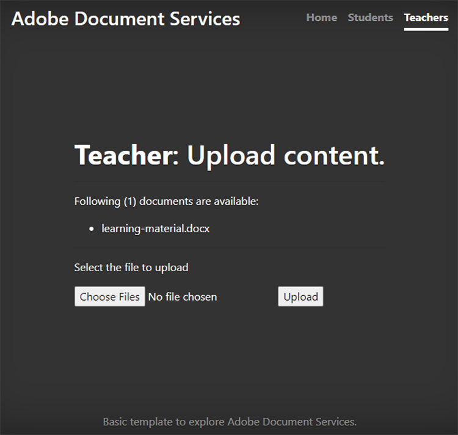

# Samarbete mellan studenter och lärare


Utbildningsinstitutioner använder PDF-dokument för att dela utbildningsmaterial med elever. PDF är ett utbytbart dokumentformat för lärare.

Integrera [Adobe PDF Services API](https://www.adobe.io/apis/documentcloud/dcsdk/pdf-tools.html) och [Adobe PDF Embed API](https://www.adobe.io/apis/documentcloud/dcsdk/pdf-embed.html) i en app ger lärare och elever en enda plattform att undervisa och lära sig. Din app kan till exempel göra det möjligt för studenter att ställa frågor på sina uppdrag och rapportkort och att samarbeta i grupptilldelningar.

Det finns en officiell SDK för Node.js-program för åtkomst till PDF Services API. Det gör att du kan konvertera dokument som Microsoft Word och Microsoft till PDF. Du kan också utföra mer avancerade åtgärder som att kombinera flera rapporter, ordna om sidor och skydda PDF. Mer information finns i [produktdokumentation](https://www.adobe.io/apis/documentcloud/dcsdk/).

## Vad du kan lära dig

I den här praktiska självstudiekursen lär du dig skapa en onlineutbildningsplattform som [gör det möjligt för lärare och elever att enkelt dela resurser](https://www.adobe.io/apis/documentcloud/dcsdk/student-teacher-collaboration.html) i PDF. I den här självstudiekursen används en [utbildningsportal](https://github.com/afzaal-ahmad-zeeshan/adobe-pdf-tools-for-teachers) som skapats med JavaScript-körningsmiljön Node.js och PDF.

Utbildningsportalen har följande funktioner:

* Gör det möjligt för lärare att ladda upp resurser

* Ger elever möjlighet att markera flera dokument som ska konverteras till PDF

* Möjliggör konvertering av dokument till PDF

* Ger eleverna en PDF-förhandsgranskning i en webbläsare och gör det möjligt för dem att kommentera i dokumenten utan ytterligare program

* Ger eleverna möjlighet att lämna kommentarer och ladda ned dem till sina datorer

Lär dig hur [!DNL Adobe Acrobat Services] ge dina elever en rik upplevelse med PDF. [!DNL Acrobat Services] API:er integreras smidigt i befintliga program så att eleverna kan ladda upp, konvertera och visa filer och sedan göra och spara kommentarer - allt i den aktuella konfigurationen.

## Relevanta API:er och resurser

* [PDF Embed API](https://www.adobe.com/devnet-docs/dcsdk_io/viewSDK/index.html)

* [PDF Services API](https://opensource.adobe.com/pdftools-sdk-docs/release/latest/index.html)

* [Projektkod](https://github.com/afzaal-ahmad-zeeshan/adobe-pdf-tools-for-teachers)

## Överför resurser till utbildningsportalen

I lärarsektionen på utbildningsportalen kan lärare ladda upp dokument som uppdrag och tester. Dokumenten kan vara i valfritt format, t.ex. Microsoft Word, Microsoft Excel, HTML, olika bildformat osv.



Överförda dokument lagras och visas för eleverna när de öppnar sin webbsida.

Mer information om hur programmet överför filerna finns i [projektkod](https://github.com/afzaal-ahmad-zeeshan/adobe-pdf-tools-for-teachers).

## Konvertera dokument till PDF

Man kan konvertera enstaka eller flera dokument av alla slag till PDF, t.ex. Microsoft Word, Excel och PowerPoint, samt andra vanliga text- och bildfilstyper. Utbildningsportalen använder PDF-tjänster för att konvertera filer till PDF.

Om du vill skapa en egen utbildningsportal måste du först skapa dina egna inloggningsuppgifter. [Registrera dig](https://www.adobe.io/apis/documentcloud/dcsdk/gettingstarted.html) använda PDF Services API utan kostnad i sex månader och upp till 1 000 dokumenttransaktioner. Efter det, [betala per användning](https://www.adobe.io/apis/documentcloud/dcsdk/pdf-pricing.html) med bara \$0,05 per dokumenttransaktion när klassen ökar sina tilldelningar.

När en elev väljer ett dokument från kontrollpanelen visas följande:


Eleven väljer helt enkelt de dokument som ska konverteras och klickar på **Hämta rapport**.

Utbildningsportalen konverterar dokumenten till PDF och visar en rapportsida samt en förhandsgranskning av PDF-filen.

Här är exempelkoden för det här steget:

```
async function createPdf(rawFile, outputPdf) {
    try {
            // configurations
            const credentials =  adobe.Credentials
            .serviceAccountCredentialsBuilder()
            .fromFile("./src/pdftools-api-credentials.json")
            .build();
 
            // Capture the credential from app and show create the context
            const executionContext = adobe.ExecutionContext.create(credentials),
            operation = adobe.CreatePDF.Operation.createNew();
 
            // Pass the content as input (stream)
            const input = adobe.FileRef.createFromLocalFile(rawFile);
            operation.setInput(input);
 
            // Async create the PDF
            let result = await operation.execute(executionContext);
            await result.saveAsFile(outputPdf);
    } catch (err) {
            console.log('Exception encountered while executing operation', err);
    }
}
```

Exempelkoden anropar `createPdf` i Express-flödeshanteraren för att generera PDF.

Mer information om hur metoden anropas finns i [projektkoden](https://github.com/afzaal-ahmad-zeeshan/adobe-pdf-tools-for-teachers/blob/master/src/helpers/pdf.js).

## Förhandsgranska utbildningsresurserna

Användargränssnittet använder PDF Embed API för att återge PDF i en webbläsare. Detta API är tillgängligt för användning kostnadsfritt.

PDF Embed API använder en annan autentiseringsuppgift än PDF Services API, så du måste [skapa en autentiseringsuppgift](https://www.adobe.io/apis/documentcloud/dcsdk/gettingstarted.html)
innan du kan använda den. Sedan kan du använda PDF Embed helt gratis.

Se till att ange rätt webbplats-URL i token. Annars kanske du inte kan återge PDF med token.

Användargränssnittet använder [Styr](https://handlebarsjs.com/) språk. PDF visas i en webbläsare.

Här är koden för det här steget:

```
<div id="adobe-dc-view" style="height: 750px; width: 700px;"></div>
<script src="https://documentcloud.adobe.com/view-sdk/main.js"></script>
<script type="text/javascript">
    document.addEventListener("adobe_dc_view_sdk.ready", function () {
        var adobeDCView = new AdobeDC.View({ clientId: "<your-credentials-here>", divId: "adobe-dc-view" });
        adobeDCView.previewFile(
            {
                content: {
                    location: { url: "<file-url>" }
                },
                    metaData: { fileName: "<file-name>" }
            },
           );
    });
</script>
 
<p>Material has been generated, <a href="/students/download/{{filename}}" target="_blank">click here</a> to download it.
</p>
```

I den här koden visas utdata från PDF och länken för att hämta PDF-rapporten, som visas i skärmbilden nedan:


Studenter ska kunna ladda ned rapporten eller arbeta med materialet här.

## Anteckna PDF-dokument

En utbildningsplattform ska stödja grundläggande anteckningar, kommentarer och diskussioner i PDF. PDF Embed API har alla dessa funktioner. Det aktiverar anteckningsstöd med `showAnnotationTools`, så att lärare och elever kan kommentera dokumenten och arkivera kommentarer som en del av PDF.

Om du vill aktivera anteckningar i PDF-dokument behöver du bara skicka argumentet `showAnnotationTools` : trogen `previewFile` metoden. Då visas verktyget Anteckningar i förhandsvisningen i PDF. Du kommer åt det här verktyget från menyn med tre punkter i förhandsvisningens övre högra hörn.


I de dokument som lärarna har överfört kan eleverna markera text, lägga till kommentarer och så vidare.


I skärmbilden ovan kallas användaren &quot;Gäst&quot;, men du kan konfigurera profiler för användare, till exempel elever och lärare.

När en elev lägger till en anteckning visas en PDF Embed API **Spara** knappen längs den övre banderollen. När du sparar läggs anteckningarna till i filen. Prova att klicka **Spara** om du vill se hur filen sparas med anteckningen inbäddad i rapporten.

Eleverna kan använda anteckningar för att ställa frågor eller dela sina kommentarer om utbildningsmaterialet.

## Spåra dokumentanvändning

Det är viktigt för lärare och skolor att se hur eleverna använder onlineplattformar. Det hjälper lärare att ge sina elever resurser som hjälper dem att utföra sina uppgifter bättre. PDF Embed API kan integreras med analyser som du kan använda för att mäta alla händelser som inträffar, till exempel när användare öppnar, läser och stänger dokument. Med PDF Services API kan lärarna också inaktivera utskrift, hämtning och filmodifiering för att upprätthålla den akademiska integriteten.

Om du har en [Adobe Analytics](https://www.adobe.io/apis/experiencecloud/analytics.html) licens kan du använda dess [färdig integrering](https://experienceleague.adobe.com/docs/document-services/tutorials/pdfembed/controlpdfexperience.html?lang=en#adobe-analytics). Annars kan du använda återanrop för att integrera PDF-tjänster med andra analysleverantörer, till exempel [Google](https://experienceleague.adobe.com/docs/document-services/tutorials/pdfembed/controlpdfexperience.html?lang=en#google-analytics).

Om du vill aktivera mätning av dokumenthändelser kopplar du händelsehanterarna med hjälp av `registerCallback` metod med Adobe DC View-instans. Du kan visa grundläggande värden, som att öppna ett dokument eller läsa en sida, på konsolen. Du kan också spara mätvärdena i en logg eller publicera dem i andra analysarkiv.

Här är exempelkoden för att bifoga händelsehanterarna:

```
adobeDCView.registerCallback(
    AdobeDC.View.Enum.CallbackType.EVENT_LISTENER,
    function(event) {
           console.log(event);
    },
    {
           enablePDFAnalytics: true
    }
);
```

Lärare kan se hur många elever som har sett uppdraget, hur många som har gått igenom alla sidor i sina anteckningar och andra värdefulla detaljer.

Här är en skärmdump av webbläsarkonsolen:


Den här bilden visar att eleven öppnade uppdragsfilen och läste den första sidan. Antingen rullade han inte vidare till ytterligare sidor eller så hade dokumentet bara en sida. Sedan laddade han ned filen. Du kan samla in dessa mätvärden för att utföra analyser och studera elevernas beteende.

Dessutom [Adobe Analytics](https://business.adobe.com/products/analytics/adobe-analytics.html) är integrerat med PDF Embed API, så om du prenumererar på Adobe Analytics Suite kan du publicera mätvärdena i prenumerationen. Om du vill publicera mätvärdena i Adobe Analytics behöver du bara skicka ditt svit-ID till PDF Embed API-konstruktorn. (Observera att du måste använda dina PDF Embed API-uppgifter, inte dina API-uppgifter för PDF Services).

Här är en exempelkod som visar hur svitens ID skickas till PDF Embed API-konstruktorn:

```
var adobeDCView = new AdobeDC.View({
    clientId: "<your-adobe-dc-credential>",
    divId: "<#element>"
    reportSuiteId: <your-id-here>,
}); 
```

## Nästa steg

Den här praktiska självstudiekursen har granskat hur du använder API:et PDF Services och API:et PDF Embed för att skapa en utbildningsportal, vilket underlättar effektiv [samarbete mellan elever och lärare](https://www.adobe.io/apis/documentcloud/dcsdk/student-teacher-collaboration.html). Med den här portalen kan lärare ladda upp utbildningsmaterial i valfritt format och konvertera det till PDF med hjälp av PDF Services API. Eleverna kan sedan förhandsgranska dessa PDF med hjälp av PDF Embed API.

Nu när du vet hur du antecknar PDF-rapporter, arkiverar anteckningarna och spårar användningen av PDF-rapporter kan du börja implementera dessa i dina egna projekt.

Du kan använda [!DNL Adobe Acrobat Services] API:er för att skapa användarvänliga, interaktiva PDF-upplevelser på din webbplats. Använd Adobe PDF Services API utan kostnad i sex månader och sedan bara [betala per användning](https://www.adobe.io/apis/documentcloud/dcsdk/pdf-pricing.html) (via AWS eller ett direktavtal) för endast 0,05 USD per dokumenttransaktion. Använd Adobe PDF Embed utan tidsbegränsning. Skapa ett kostnadsfritt konto för att [kom igång](https://www.adobe.com/go/dcsdks_credentials) idag.
