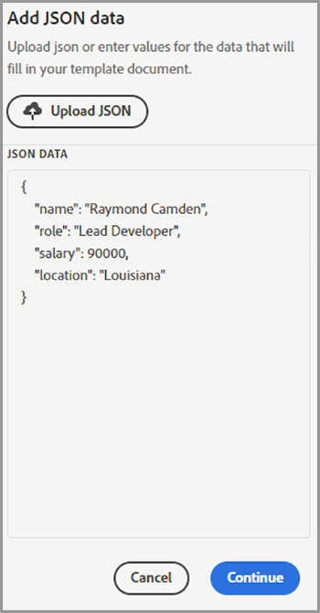

# Modernisera anställdas introduktion


I en stor organisation kan anställdas introduktion vara en stor och långsam process. Vanligtvis finns det en blandning av skräddarsydd dokumentation tillsammans med pannplåtsmaterial som måste presenteras och undertecknas av en ny anställd. Denna blandning av skräddarsytt material och kokplatta kräver flera steg - vilket tar värdefull tid från människor som är inblandade i processen. [!DNL Adobe Acrobat Services] och Acrobat Sign kan modernisera och automatisera den här metoden så att personalavdelningen kan utföra viktigare uppgifter. Låt oss titta på hur detta uppnås.

## Vad är [!DNL Adobe Acrobat Services]?

[[!DNL Adobe Acrobat Services]](https://developer.adobe.com/document-services/homepage) är en uppsättning API:er som är relaterade till att arbeta med dokument (och inte bara PDF). I stort sett kan denna uppsättning tjänster delas in i tre huvudkategorier:

* För det första [PDF Services](https://developer.adobe.com/document-services/apis/pdf-services/) uppsättning verktyg. Det här är verktygsmetoder för att arbeta med PDF och andra dokument. I tjänsterna ingår saker som att konvertera till och från PDF, utföra OCR och optimering, sammanfoga och dela PDF och så vidare. Det är verktygslådan med dokumentbearbetningsfunktioner.
* [PDF Extract API](https://developer.adobe.com/document-services/apis/pdf-extract/) använder kraftfulla AI/ML-tekniker för att analysera en PDF och returnera otroligt mycket information om innehållet. Detta inkluderar text, formatering och positionsinformation och kan även returnera tabelldata i CSV/XLS-format samt hämta bilder.
* Slutligen [API för dokumentgenerering](https://developer.adobe.com/document-services/apis/doc-generation/) Med kan utvecklare använda Microsoft Word som en &quot;mall&quot;, blanda med sina data (från vilken källa som helst) och generera dynamiska personaliserade dokument (PDF och Word).

Utvecklare kan [registrera sig](https://documentcloud.adobe.com/dc-integration-creation-app-cdn/main.html) och prova alla dessa tjänster med en kostnadsfri provversion. Den [!DNL Acrobat Services] -plattformen använder ett REST-baserat API men har även stöd för SDK:er för Node, Java, .NET och Python (endast Extract för närvarande).

Även om det inte är ett API kan utvecklare också använda det kostnadsfria [PDF Embed API](https://developer.adobe.com/document-services/apis/pdf-embed/), som ger en enhetlig och flexibel visningsupplevelse av dokument på dina webbsidor.

## Vad är Acrobat Sign?

[Acrobat Sign](https://www.adobe.com/se/sign.html) är världsledande inom tjänster för elektroniska signaturer. Du kan skicka dokument för signering med olika arbetsflöden, inklusive flera signaturer. Acrobat Sign har även stöd för arbetsflöden som kräver signaturer och ytterligare information. Alla dessa funktioner stöds av en kraftfull instrumentpanel med ett flexibelt redigeringssystem.

Som med [!DNL Acrobat Services], Acrobat Sign har en [kostnadsfri testversion](https://www.adobe.com/sign.html#sign_free_trial) som låter utvecklare testa signeringsprocessen både via kontrollpanelen och med ett lättanvänt REST-baserat API.

## Ett introduktionsscenario

Låt oss se på ett verklighetstroget scenario som visar hur Adobe tjänster kan hjälpa oss. När en ny anställd går med i ett företag behöver de skräddarsydd information. Dessutom behöver de material för hela företaget. Slutligen måste de visa att de accepterar företagets policy genom att underteckna dokumenten. Låt oss dela upp detta i konkreta steg:

* Först behövs ett anpassat följebrev som hälsar den nye medarbetaren med namn. Brevet ska innehålla information om medarbetarens namn, roll, lön och plats.
* Det anpassade brevet måste kombineras med en PDF som innehåller grundläggande information för hela företaget (tänk olika HR-policyer, förmåner etc.)
* Ett slutdokument som frågar efter den anställdes signatur och datum måste inkluderas.
* Allt ovanstående ska visas som ett dokument som skickas till medarbetaren för signering.

Låt oss gå in på detaljer om hur man gör detta.

## Generera dynamiska dokument

Adobe [Dokumentgenerering](https://developer.adobe.com/document-services/apis/doc-generation/) Med API kan utvecklare skapa dynamiska dokument med hjälp av Microsoft Word och ett enkelt mallspråk som bas för att generera PDF- och Word-dokument. Här är ett exempel på hur det fungerar.

Låt oss börja med ett Word-dokument som har hårdkodade värden. Dokumentet kan formateras som det ska, inklusive grafik, tabeller osv. Här är det ursprungliga dokumentet.


Dokumentgenerering fungerar genom att lägga till &quot;tokens&quot; i ett Word-dokument som ersätts med dina data. Även om dessa token kan anges manuellt finns det en [Microsoft Word-tillägg](https://developer.adobe.com/document-services/docs/overview/document-generation-api/wordaddin/) som gör detta enklare att göra. Om du öppnar det kan författare definiera taggar, eller datauppsättningar, som kan användas i dokumentet.


Du kan antingen överföra JSON-information från en lokal fil, kopiera i JSON-text eller välja att fortsätta med ursprungliga data. På så sätt kan du definiera taggar på ett ad hoc-sätt baserat på dina särskilda behov. I det här exemplet behövs bara en tagg för namn, roll, lön och plats. Detta görs genom att använda **Skapa tagg** knapp:


När du har definierat det första märkordet kan du fortsätta att definiera så många som du behöver:


Med definierade taggar markerar du texten i dokumentet och ersätter den med taggar, om det behövs. I det här exemplet läggs taggar till för namn, roll och lön.


Dokumentgenerering stöder inte bara enkla taggar utan även logiska uttryck. Det andra stycket i dokumentet har en text som bara gäller för personer i Louisiana. Du kan lägga till ett villkorsuttryck genom att gå till fliken Avancerat i dokumenttaggen och definiera ett villkor. Så här definierar du ett enkelt likhetsvillkor, men observera att numeriska jämförelser och andra jämförelsetyper också stöds.


Detta kan sedan infogas och figursättas runt stycket:


Om du vill testa hur det fungerar väljer du **Generera dokument**. Första gången du gör detta måste du logga in med ett Adobe ID. Efter inloggning visas standard-JSON som kan redigeras manuellt.



En PDF genereras som sedan kan visas eller hämtas.


Med Document Tagger kan du snabbt designa och testa, när det är klart och i produktion, men du kan använda en av SDK:erna för att automatisera processen. Den faktiska koden skiljer sig åt beroende på specifika behov, men här är ett exempel på hur koden ser ut i Node.js:

```js
 const PDFServicesSdk = require('@adobe/pdfservices-node-sdk');

const credentials =  PDFServicesSdk.Credentials
    .serviceAccountCredentialsBuilder()
    .fromFile("pdfservices-api-credentials.json")
    .build();

// Data would be dynamic...
let data = {
    "name":"Raymond Camden",
    "role":"Lead Developer",
    "salary":9000,
    "location":"Louisiana"
}

// Create an ExecutionContext using credentials.
const executionContext = PDFServicesSdk.ExecutionContext.create(credentials);

// Create a new DocumentMerge options instance.
const documentMerge = PDFServicesSdk.DocumentMerge,
    documentMergeOptions = documentMerge.options,
    options = new documentMergeOptions.DocumentMergeOptions(jsonDataForMerge, documentMergeOptions.OutputFormat.PDF);

// Create a new operation instance using the options instance.
const documentMergeOperation = documentMerge.Operation.createNew(options);

// Set operation input document template from a source file.
const input = PDFServicesSdk.FileRef.createFromLocalFile('documentMergeTemplate.docx');
documentMergeOperation.setInput(input);

// Execute the operation and Save the result to the specified location.
documentMergeOperation.execute(executionContext)
    .then(result => result.saveAsFile('documentOutput.pdf'))
    .catch(err => {
        if(err instanceof PDFServicesSdk.Error.ServiceApiError
            || err instanceof PDFServicesSdk.Error.ServiceUsageError) {
            console.log('Exception encountered while executing operation', err);
        } else {
            console.log('Exception encountered while executing operation', err);
        }
    });
```

Kort sagt ställer koden in autentiseringsuppgifter, skapar ett åtgärdsobjekt, anger indata och alternativ och anropar sedan åtgärden. Slutligen sparar det resultatet som en PDF. (Resultatet kan även visas som Word.)

Dokumentgenerering stöder mycket mer komplexa användningssätt, inklusive möjligheten att ha helt dynamiska tabeller och bilder. Se [dokumentation](https://developer.adobe.com/document-services/docs/overview/document-generation-api/) för mer information.

## Genomförande av PDF-åtgärder

Den [PDF Services API](https://developer.adobe.com/document-services/apis/pdf-services/) tillhandahåller en stor uppsättning &quot;verktygsoperationer&quot; för att arbeta med PDF. Dessa åtgärder omfattar följande:

* Skapa PDF från Office-dokument
* Exportera PDF till Office-dokument
* Kombinera och dela PDF
* Använda OCR på PDF
* Ställa in, ta bort och ändra skydd på PDF
* Ta bort, infoga, ordna om och rotera sidor
* Optimera PDF med komprimering eller linearisering
* Hämta egenskaper för PDF

I det här scenariot måste resultatet av dokumentgenereringsanropet sammanfogas med ett vanligt PDF. Denna åtgärd är ganska enkel med SDK:erna. Här är ett exempel på i Node.js:

```js
const PDFServicesSdk = require('@adobe/pdfservices-node-sdk');
 
// Initial setup, create credentials instance.
const credentials = PDFServicesSdk.Credentials
    .serviceAccountCredentialsBuilder()
    .fromFile("pdfservices-api-credentials.json")
    .build();
 
// Create an ExecutionContext using credentials and create a new operation instance.
const executionContext = PDFServicesSdk.ExecutionContext.create(credentials),
    combineFilesOperation = PDFServicesSdk.CombineFiles.Operation.createNew();
 
// Set operation input from a source file.
const combineSource1 = PDFServicesSdk.FileRef.createFromLocalFile('documentOutput.pdf'),
      combineSource2 = PDFServicesSdk.FileRef.createFromLocalFile('standardCorporate.pdf');

combineFilesOperation.addInput(combineSource1);
combineFilesOperation.addInput(combineSource2);
 
// Execute the operation and Save the result to the specified location.
combineFilesOperation.execute(executionContext)
    .then(result => result.saveAsFile('combineFilesOutput.pdf'))
    .catch(err => {
        if (err instanceof PDFServicesSdk.Error.ServiceApiError
            || err instanceof PDFServicesSdk.Error.ServiceUsageError) {
            console.log('Exception encountered while executing operation', err);
        } else {
            console.log('Exception encountered while executing operation', err);
        }
    });
```

Den här koden tar de två PDF, sammanfogar dem och sparar resultatet i ett nytt PDF. Enkelt och enkelt! Se [dokument](https://developer.adobe.com/document-services/docs/overview/pdf-services-api/) exempel på vad som kan göras.

## Signeringsprocessen

I slutskedet av introduktionsprocessen måste medarbetaren signera ett avtal som anger att de har läst och godkänner alla policyer som definieras i. [Acrobat Sign](https://www.adobe.com/se/sign.html) har stöd för många olika arbetsflöden och integreringar, inklusive ett automatiskt arbetsflöde via en [API](https://opensource.adobe.com/acrobat-sign/developer_guide/index.html). I stort sett kan den sista delen av scenariot kompletteras på följande sätt:

Utforma först dokumentet som innehåller det formulär som ska signeras. Det finns flera sätt att göra detta, bland annat en visuell bild som är utformad på kontrollpanelen för användare i Adobe Sign. Ett annat alternativ är att använda Word-tillägget för dokumentgenerering för att infoga taggar åt dig. I det här exemplet begärs en signatur och ett datum.


Det här dokumentet kan sparas som en PDF med samma metod som beskrivs ovan och kombineras med alla dokument. Den här processen skapar ett sammanhängande paket som innehåller en personlig hälsning, standarddokumentation och en sista sida som är lämplig för signering.

Mallen kan överföras till Acrobat Sign-kontrollpanelen och sedan användas för nya avtal. Genom att använda REST API kan det här dokumentet sedan skickas till den potentiella medarbetaren för att begära signatur.


## Upplev det själv

Allt som beskrivs i den här artikeln kan testas just nu. Den [!DNL Adobe Acrobat Services] API [kostnadsfri testversion](https://documentcloud.adobe.com/dc-integration-creation-app-cdn/main.html) ger dig för närvarande 1 000 kostnadsfria förfrågningar under en sexmånadersperiod. Acrobat Sign [kostnadsfri testversion](https://www.adobe.com/sign.html#sign_free_trial) Med kan du skicka vattenstämplade avtal i testsyfte.

Har du frågor? Den [supportforum](https://community.adobe.com/t5/document-services-apis/ct-p/ct-Document-Cloud-SDK) övervakas dagligen av Adobe-utvecklare och supporttekniker. För att få mer inspiration, se till att du hör av dig till nästa [Pappersklipp](https://www.youtube.com/playlist?list=PLcVEYUqU7VRe4sT-Bf8flvRz1XXUyGmtF) avsnitt. Det hålls regelbundna direktmöten med nyheter, demos och samtal med kunder.
