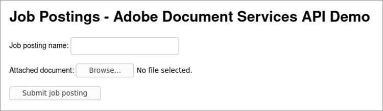

# Jobbbokföring


När du driver en webbplats med flera användare är det viktigt att utforma en upplevelse som säkerställer en smidig upplevelse för alla.

Tänk dig följande scenario: du har en webbplats där arbetsgivare kan [överför jobbbokföringar](https://www.adobe.io/apis/documentcloud/dcsdk/job-posting.html). För arbetssökande är det bekvämt att enkelt visa alla dokument som hör till ett inlägg i ett enhetligt format. Det är dock bekvämt för arbetsgivare att bifoga information i vilket filformat de än råkar ha. För att underlätta för båda användartyperna kan du automatiskt konvertera alla överförda dokument till PDF och bädda in dem i dokumentet i publiceringen.

## Vad du kan lära dig

Den här praktiska självstudiekursen går igenom ett Node.js-exempel som använder [!DNL Adobe Acrobat Services] och dess [Node.js SDK](https://www.npmjs.com/package/@adobe/documentservices-pdftools-node-sdk) för att lägga till dessa funktioner på en webbplats för jobbpublicering. Detta skapar en webbplats som är lättare att använda och mer attraktiv för både arbetsgivare och arbetssökande. Här är [fullständig](https://github.com/contentlab-io/adobe_job_posting) [projektkod](https://github.com/contentlab-io/adobe_job_posting), om du vill följa med medan du läser.

Starta genom att konfigurera ett enkelt Express-baserat Node.js -webbprogram. [Express](https://expressjs.com/) är ett minimalistiskt ramverk för webbprogram med funktioner som routning och mallar. Programkoden finns på [GitHub](https://github.com/contentlab-io/adobe_job_posting). Installera även [PostgreSQL-databas](https://www.postgresql.org/) och förvara PDF.

## Relevant [!DNL Acrobat Services] API:er

* [PDF Embed API](https://www.adobe.com/devnet-docs/dcsdk_io/viewSDK/index.html)

* [PDF Services API](https://opensource.adobe.com/pdftools-sdk-docs/release/latest/index.html)

## Skapa API-uppgifter för Adobe

Först måste du [skapa autentiseringsuppgifter](https://www.adobe.com/go/dcsdks_credentials) för Adobe PDF Embed API (kostnadsfritt att använda) och Adobe PDF Services API (kostnadsfritt i sex månader sedan) [betala per användning](https://www.adobe.io/apis/documentcloud/dcsdk/pdf-pricing.html) för endast 0,05 USD per dokumenttransaktion). När du skapar inloggningsuppgifter för PDF Services API väljer du alternativet Skapa personligt kodexempel. Spara ZIP-filen och extrahera pdftools-api-credentials.json och private.key i rotkatalogen i Node.js Express-projektet.

Du behöver också en API-nyckel för det kostnadsfria inbäddade API:t. Från [Projekt](https://console.adobe.io/projects), gå till projektet du skapade. Klicka sedan på **Lägg till i projekt** och välja **API**. Klicka slutligen på **PDF Embed API**.

Ange domänen för PDF Embed API. API-nyckeln måste vara offentlig (finns i koden som körs av webbläsaren). Genom att ange en domän ser du till att någon annan i en annan domän inte kan använda API-nyckeln.

Du kan inte använda &quot;localhost&quot; som domän. Ange en domän, till exempel &quot;testing.local&quot;, och redigera värdfilen på datorn för att omdirigera domänen till 127.0.0.1, som är din dator. I stället för att testa programmet på localhost:3000 kan du sedan testa det på testing.local:3000. När du är klar hittar du API-nyckeln för PDF Embed API på projektsidan.

## Lägga till ett överföringsformulär och en hanterare

Med ett fungerande Express-program och API-uppgifter behöver du också ett formulär som gör att användare kan överföra sina dokument till webbplatsen. Redigera index.jade-mallen för det här ändamålet.

Skapa ett inmatningsfält för namnet på den överförda jobbpubliceringen och för ett dokument som innehåller mer information.

Lägg till följande formulär i mallens innehållsblock:

```
extends layout

block content
  h1= title

  form(action="/upload", enctype="multipart/form-data", method="POST")
    label Job posting name:&nbsp;
    input(type="text", name="name", required="required")
    br
    br
    label Describing document:&nbsp;
    input(type="file", name="attachment", required="required")
    br
    br
    input(type="submit", value="Submit job posting")
```

Lägg sedan till en hanterare för POSTENS begäran till åtgärden /upload. Lägg sedan till en väg för /upload i routes/index.js. Du kan skapa en ny fil för den här vägen, men du måste uppdatera filen app.js så att den återspeglar den nya filen. I den här routningshanteraren kan du komma åt det angivna namnet och den överförda filen.

```
router.post('/upload', async function (req, res, next) {
    const name = req.body.name;
    const fileContents = req.files.attachment.data;

    // code to work with the uploaded document
  });
```

Funktionen är asynkron så att du kan använda nyckelordet await i funktionen, vilket är praktiskt när du anropar metoderna som utför API-anrop.



## Använda PDF Services API

Innan du använder PDF Services API måste du lägga till följande importer överst i vägfilen:

```
const PDFToolsSdk = require('@adobe/documentservices-pdftools-node-sdk');
  const { Readable } = require('stream');
```

Direkt under importerna kan du läsa in API-uppgifter och skapa en [körningsinnehåll](https://www.javascripttutorial.net/javascript-execution-context/). Eftersom du kan återanvända en körningskontext för olika åtgärder är det praktiskt att bara göra det en gång.

```
  const credentials = PDFToolsSdk.Credentials
  .serviceAccountCredentialsBuilder()
  .fromFile("pdftools-api-credentials.json")
  .build();

  const executionContext = PDFToolsSdk.ExecutionContext.create(credentials);
```

Gå tillbaka till att skriva kod i begärandehanteraren vid kommentaren i `router.post` block. Börja med att konvertera dokumentet till PDF.

```
  const createPdfOperation = PDFToolsSdk.CreatePDF.Operation.createNew();

  const input = PDFToolsSdk.FileRef.createFromStream(Readable.from(fileContents),
  req.files.attachment.mimetype);

  createPdfOperation.setInput(input);

  let result = await createPdfOperation.execute(executionContext);

  result.saveAsFile('output-pdf' + new Date().getTime() + '.pdf');
  return res.send('success!');
```

De flesta operationer tar samma fyra steg. Initiera först åtgärdstypen med metoden createNew för lämplig klass. Skapa sedan indata för åtgärden, som är FileRef. Efterföljande åtgärder kan hoppa över det här steget eftersom resultatet av en åtgärd också är en FileRef. För den första åtgärden skapar du en FileRef från byte i den överförda filen. För det tredje måste du tilldela åtgärden indata. Slutligen körs åtgärden med körningskontexten som en parameter i körningsmetoden. Den här metoden returnerar ett löfte så att du kan vänta på resultatet.

I koden sparas den returnerade PDF-filen i en fil och ett enkelt &quot;success&quot;-svar skickas till webbläsaren. Delen Datum i filnamnet garanterar ett unikt filnamn. SaveAsFile returnerar ett fel om målfilen finns.

## Konvertera bilder till text och komprimera PDF

Nu kan du använda optisk teckenigenkänning (OCR) för att konvertera bilder till text och sedan komprimera resultatet. Du gör detta med OCR- och CompressPDF-åtgärder som liknar åtgärden CreatePDF . Lägg till följande i vägfilen i `router.post`:

```
  const name = req.body.name;
  const fileContents = req.files.attachment.data;

  const createPdfOperation = PDFToolsSdk.CreatePDF.Operation.createNew();
  const input = PDFToolsSdk.FileRef.createFromStream(Readable.from(fileContents),
  req.files.attachment.mimetype);
  createPdfOperation.setInput(input);

  let result = await createPdfOperation.execute(executionContext);

  const ocrOperation = PDFToolsSdk.OCR.Operation.createNew();
  ocrOperation.setInput(result);
  result = await ocrOperation.execute(executionContext);

  const compressPdfOperation = PDFToolsSdk.CompressPDF.Operation.createNew();
  compressPdfOperation.setInput(result);
  result = await compressPdfOperation.execute(executionContext);

  result.saveAsFile('output-pdf' + new Date().getTime() + '.pdf');
  return res.send('success!');
```

Det är bara nödvändigt att göra denna åtgärd en gång eftersom resultatet är en FileRef, som koden kan skicka till setInput.

Det finns ett bättre alternativ än att spara filen på en hårddisk och returnera ett överförenklat HTTP-svar. Istället kan du lagra PDF i en databas och visa en webbsida som bäddar in PDF med Adobe kostnadsfria PDF Embed API. På så sätt visas arbetsgivarens jobbpublicering eller broschyr på webbplatsen för arbetssökande att hitta och visa, komplett med företagslogotyper och andra designelement.

## Lagra PDF i en databas

Lagra PDF i en PostgreSQL-databas. Be node-postgres-paketet att ansluta till Postgres i Node.js. Installera Stream-buffers-paketet eftersom du någon gång måste lagra PDF-innehållet i en buffert och FileRef fungerar bara med strömmar. Så använd paketet stream-buffers för att skriva innehållet till en buffert.

```
npm install pg stream-buffers
```

Skapa nu en databastabell för jobbbokföringar. Den behöver en kolumn för en unik identifierare, en kolumn för ett namn och en kolumn för den kopplade PDF. Du kan skapa en databastabell från kommandoradsgränssnittet i Postgres:

```
CREATE TABLE job_postings (id TEXT PRIMARY KEY, name TEXT NOT NULL, attachment
BYTEA NOT NULL);
```

Gå tillbaka till Node.js-filerna. Lägg till några importer överst i filen:

```
  const { Client } = require('pg');
  const streamBuffers = require('stream-buffers');
```

Om du vill lagra PDF i databastabellen ändrar du överföringsfunktionen. Ersätt de två sista raderna (saveAsFile och send) med följande kodfragment:

```
  const pgClient = new Client();
  pgClient.connect();

  const id = Math.random().toString(36).substr(2, 6); // not securely random at all,
  but serves the purpose for this demo

  const writableStream = new streamBuffers.WritableStreamBuffer();
  writableStream.on("finish", async () => {    
    await pgClient.query("INSERT INTO job_postings VALUES ($1, $2, $3)", [
      id,
      name,
      writableStream.getContents()
    ]);
    res.redirect(`/job/${id}`);
  })
  result.writeToStream(writableStream);
```

Om du vill skriva innehållet skapar du en WritableStreamBuffer. Med complete-händelsen är det dags att köra SQL-frågan. Paketet node-postgres konverterar automatiskt Buffer-parametern till BYTEA-format. Frågan omdirigerar användaren till /job/{id}, en slutpunkt som skapas senare.

För PDF Embed API behöver du också en slutpunkt som bara returnerar PDF-innehåll:

```
  router.get('/pdf/:id', async function (req, res, next) {
    const id = req.params.id;
 
    const pgClient = new Client();
    pgClient.connect();

  const pgResult = await pgClient.query("SELECT attachment FROM job_postings WHERE id
  = $1", [id]);
  const buffer = pgResult.rows[0].attachment;
  res.type('pdf');
    return res.send(buffer);
  });
```

## Bädda in PDF

Skapa nu /job/{id} slutpunkt, som återger en mall som innehåller namnet på den begärda jobbbokföringen och ett inbäddat PDF.

```
router.get('/job/:id', async function(req, res, next) {
    const id = req.params.id;

    const pgClient = new Client();
    pgClient.connect();

    const pgResult = await pgClient.query("SELECT name FROM job_postings WHERE id =
  $1", [id]);
    const name = pgResult.rows[0].name;

    res.render('job', { pdf_url: `/pdf/${id}`, name });
  });
```

Skapa en job.jade-fil med följande innehåll i vyer/katalogen:

```
  extends layout

  block content
    h1= name
    div(id='adobe-dc-view')
    script(src='https://documentcloud.adobe.com/view-sdk/main.js')
    script.
      window.embedUrl = "!{pdf_url}";
    script(src='/javascripts/embed-pdf.js')
```

Det första skriptet är Adobe View SDK, vilket gör det enkelt att bädda in PDF. Det andra skriptet är en infogad one-liner som anger värdet för window.embedUrl till URL:en för PDF som tillhandahålls av Express-routningshanteraren. Skapa det tredje skriptet själv så här:

```
  document.addEventListener("adobe_dc_view_sdk.ready", function () {
    var adobeDCView = new AdobeDC.View({ clientId: "YOUR API KEY HERE", divId:
   "adobe-dc-view" });
    adobeDCView.previewFile({
      content: { location: { url: '//' + window.location.host + window.embedUrl }
         },
      metaData: { fileName: "Job posting" }
    });
  });
```

Nu kan du testa hela processen med att överföra ett dokument, omdirigeras till /job/id-sidan och visa den inbäddade PDF. Användarna går igenom samma steg för att lägga till jobbpublicering eller annat dokument på webbplatsen.


Om du vill se en inbäddning på raden, se det här [live-demo](https://documentcloud.adobe.com/view-sdk-demo/index.html#/view/IN_LINE/Bodea%20Brochure.pdf).

## Nästa steg

Den här praktiska självstudiekursen visar hur du använder Node.js med [!DNL Acrobat Services] för att konvertera en överförd [jobbbokföring](https://www.adobe.io/apis/documentcloud/dcsdk/job-posting.html) i olika format till en PDF. PDF som blev resultatet bäddades sedan in på en webbsida. Nu kan du lägga till samma funktion på din webbplats, vilket gör det enklare för arbetsgivare att ladda upp arbetsbeskrivningar, broschyrer med mera för arbetssökande att hitta. Dessa funktioner hjälper alla att få den information som behövs för att hitta ett drömjobb.

[!DNL Acrobat Services] hjälper dig att lägga till viktiga dokumenthanteringsfunktioner på webbplatsen eller i appen. Om du vill gå djupare in på vad dessa API:er kan göra kan du läsa följande snabbstartdokumentation:

* [PDF Embed API](https://www.adobe.com/devnet-docs/dcsdk_io/viewSDK/index.html)

* [PDF Services API](https://opensource.adobe.com/pdftools-sdk-docs/release/latest/index.html)

Så här lägger du till användarvänliga funktioner för dokumenthantering på webbplatsen: [registrera dig för en kostnadsfri testversion](https://www.adobe.io/apis/documentcloud/dcsdk/gettingstarted.html). Adobe PDF Embed API är alltid kostnadsfritt att använda och Adobe PDF Services API är kostnadsfritt i sex månader. Sedan är det bara \$0,05 per dokumenttransaktion så att du kan [betala per användning](https://www.adobe.io/apis/documentcloud/dcsdk/pdf-pricing.html) i takt med att företaget växer.
