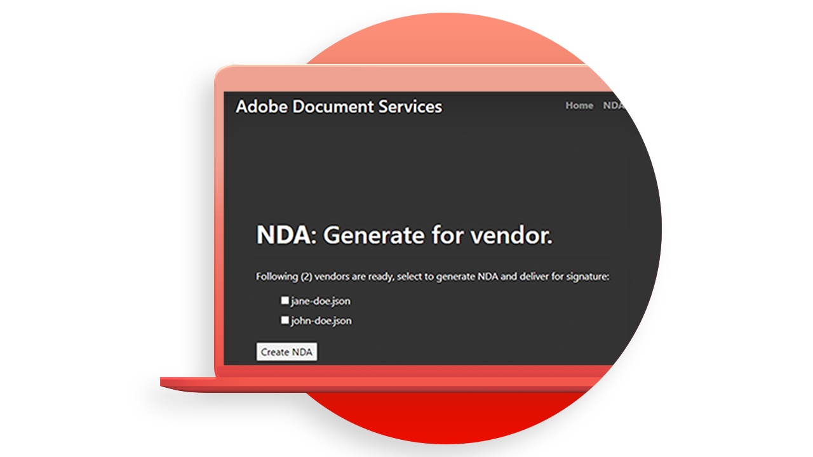

# [!DNL Adobe Acrobat Services] API-användningsfall

## Vad kan [!DNL Adobe Acrobat Services] API:er göra för mig?

Lär dig hur [!DNL Adobe Acrobat Services] API:er kan förändra ditt företag med dessa praktiska användningsfall.

### [!DNL Acrobat Services] API:er

<table style="table-layout:fixed">
<tr>
  <td>
    
    

    <a href="automatelegalworkflows.md"><strong>Automatisera juridiska arbetsflöden</strong></a>
    

    <em>Lär dig automatisera juridiska arbetsflöden med villkorligt innehåll</em>
     
  </td>
  <td>
      
      

      <a href="employeeonboarding.md"><strong>Modernisera medarbetarnas introduktion</strong></a>
      

      <em>Lär dig modernisera medarbetarnas introduktion</em>
       
  </td>
  <td>
      
      

      <a href="acceleratesales.md"><strong>Påskynda försäljningsprocessen</strong></a>
      

      <em>Lär dig att öka försäljningen genom att integrera dokumentupplevelser</em>
       
    </td>
    <td>
      
      

      <a href="sales.md"><strong>Hantera försäljningsförslag och avtal</strong></a>
      

      <em>Lär dig skapa ett effektivt arbetsflöde för att automatisera och förenkla försäljningsförslag</em>
       
    </td>
</tr>
<tr>
  <td>
    
    

    <a href="nda.md"><strong>Skapar ett sekretessavtal</strong></a>
    

    <em>Lär dig hur du skapar ett dynamiskt PDF för sekretessavtal för samarbete</em>
     
  </td>
  <td>
    
    

    <a href="legal.md"><strong>Hantera juridiska avtal</strong></a>
    

    <em>Lär dig hur du automatiskt genererar och skyddar juridiska dokument med anpassad datainmatning</em>
     
  </td>
  <td>
    
    

    <a href="offer.md"><strong>Hantera medarbetarnas erbjudandebrev</strong></a>
    

    <em>Lär dig hur du genererar ett erbjudandebrev som kan levereras till en ny anställd för signering</em>
     
  </td>
  <td>
    
    

    <a href="searching.md"><strong>Söka och indexera</strong></a>
    

    <em>Lär dig hur du skapar sökbara PDF-filer från skannade dokument</em>
     
  </td>
</tr>
<tr>
  <td>
    
    

    <a href="reviews.md"><strong>Granskningar och godkännanden</strong></a>
    

    <em>Lär dig skapa ett arbetsflöde för granskning och godkännande av dokument för samarbete mellan team</em>
     
  </td>
  <td>
    
    

    <a href="reportcreation.md"><strong>Skapa och redigera rapporter</strong></a>
    

    PDF <em>Lär dig hur du skapar kundrapporter på din webbplats</em>
     
  </td>
  <td>
    
    

    <a href="jobposting.md"><strong>Jobbannonsering</strong></a>
    

    <em>Lär dig utveckla en smidig och konsekvent webbupplevelse för arbetssökande och arbetsgivare</em>
     
  </td>
  <td>
    
    

    <a href="educationcollab.md"><strong>Samverkan mellan elever och lärare</strong></a>
    

    <em>Lär dig skapa en onlineutbildningsplattform som gör det möjligt för lärare och elever att enkelt dela resurser i PDF</em>
     
  </td>
</tr>
<tr>
  <td>
    
    

    <a href="AgreementWorkflowsNodejs.md"><strong>Avtalsarbetsflöden i Node.js</strong></a>
    

    <em>[!DNL Adobe Acrobat Services] API:er införlivar enkelt PDF-funktioner i dina webbprogram</em>
     
  </td>
  <td>
    
    

    <a href="HRAgreementWorkflowsJava.md"><strong>HR-dokumentarbetsflöden i Java</strong></a>
    

    <em>[!DNL Adobe Acrobat Services] API:er införlivar enkelt PDF-funktioner i dina HR-webbprogram</em>
     
  </td>
  <td>
    
    

    <a href="FinanceWorkflowsJava.md"><strong>Hantera arbetsflöden för ekonomiska dokument i Java</strong></a>
    

    <em>[!DNL Adobe Acrobat Services] tillhandahåller alla verktyg, tjänster och funktioner som behövs för att bearbeta och extrahera data från finansdokument från PDF</em>
     
  </td>
  <td>
    
    

     
  </td>
</tr>
</table>

### API:er för dokumentgenerering

<table style="table-layout:fixed">
<tr>
  <td>
    
    

    <a href="invoices.md"><strong>Hantera fakturor</strong></a>
    

    <em>Lär dig skapa, lösenordsskydda och leverera kundfakturor automatiskt</em>
     
  </td>
  <td>
    
    

     
  </td>
  <td>
    
    

     
  </td>
  <td>
    
    

     
  </td>
</tr>
</table>

### PDF Embed API

<table style="table-layout:fixed">
<tr>
   <td>
    
    

    <a href="ddppdfembedapi.md"><strong>Publicering av digitala dokument</strong></a>
    

    <em>Lär dig hur du visar inbäddade PDF-dokument på webbsidor med Adobe PDF Embed API</em>
     
  </td>
  <td>
    
    

     
  </td>
  <td>
    
    

     
  </td>
  <td>
    
    

     
  </td>
</tr>
</table>