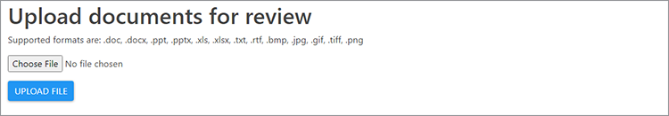
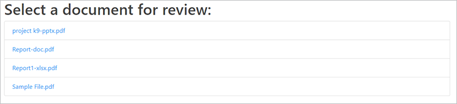

# Granskningar och godkännanden


Samarbete mellan team på distans blev nödvändigt för många företag under covid-19-pandemin. [Att dela och granska digitala dokument](https://www.adobe.io/apis/documentcloud/dcsdk/review-and-approval.html) innebär en rad utmaningar för team och resurser med flera funktioner.

Utmaningarna omfattar delning av dokument i olika filformat, effektiv granskning och kommentarer av innehållet samt synkronisering med de senaste redigeringarna. [!DNL Adobe Acrobat Services] API:er har utformats för att programutvecklare ska kunna lösa dessa utmaningar för sina användare.

## Vad du kan lära dig

Den här praktiska självstudiekursen visar hur du skapar ett arbetsflöde för dokumentgranskning och godkännande i webbprogrammen Node.js och Express. Om du vill följa den här självstudiekursen behöver du lite erfarenhet av Node.js.

Programmet har följande funktioner:

* Konvertera olika filtyper till PDF

* Aktivera filöverföringar

* Ge användarna möjlighet att lägga till kommentarer och anteckningar

* Visa PDF tillsammans med dessa kommentarer

* Aktivera användarprofiler för att identifiera kommentarsförfattare

* Kombinera filer till en slutlig PDF som användare kan ladda ner

## Relevanta API:er och resurser

* [PDF Services API](https://opensource.adobe.com/pdftools-sdk-docs/release/latest/index.html)

* [PDF Embed API](https://www.adobe.com/devnet-docs/dcsdk_io/viewSDK/index.html)

* [Projektkod](https://github.com/contentlab-io/adobe_reviews_and_approvals)

## Skapa API-inloggningsuppgifter för Adobe

Innan du startar koden måste du [skapa autentiseringsuppgifter](https://www.adobe.com/go/dcsdks_credentials) för Adobe PDF Embed API och Adobe PDF Services API. PDF Embed API är gratis att använda. PDF Services API kan användas kostnadsfritt i sex månader. Sedan kan du växla till en [förskottsbetalningsplan](https://www.adobe.io/apis/documentcloud/dcsdk/pdf-pricing.html) med bara \$0,05 per dokumenttransaktion.

När du skapar autentiseringsuppgifter för PDF Services API väljer du alternativet **Skapa personligt kodexempel** och väljer Node.js för språket. Spara ZIP-filen och extrahera pdftools-api-credentials.json och private.key i rotkatalogen i Node.js Express-projektet.

## Konfigurera ett projekt och beroenden

Konfigurera Node.js och Express Project för att visa statiska filer från mappen public. Du kan ställa in dina projektsätt, beroende på dina preferenser. Om du vill komma igång snabbt kan du använda [Express-appgeneratorn](https://expressjs.com/en/starter/generator.html). Eller om du vill hålla det enkelt kan du [börja om från början](https://expressjs.com/en/starter/hello-world.html) och behålla koden i en enda JavaScript-fil. I exempelprojektet som är länkat ovan använder du enfilsmetoden och behåller all kod i index.js.

Kopiera `pdftools-api-credentials.json`- och `private.key`-filerna från det personliga kodexemplet till rotkatalogen i projektet. Lägg till dem i .gitignore-filen om du har en sådan, så att dina inloggningsuppgifter inte oavsiktligt skickas till en databas.

Kör sedan `npm install @adobe/documentservices-pdftools-node-sdk` för att installera Node.js SDK för PDF Services. Importera den här modulen och skapa API-inloggningsobjektet i din kod (index.js i ditt exempelprojekt), efter att resten av ditt beroende har importerats så här:

```
  const PDFToolsSdk = require( "@adobe/documentservices-pdftools-node-sdk" );

  // Create Credentials
  const credentials =  PDFToolsSdk.Credentials
      .serviceAccountCredentialsBuilder()
      .fromFile( "pdftools-api-credentials.json" )
      .build();
```

Startkoden ska se ut så här:

```
  
  const express = require( "express" );
  const PDFToolsSdk = require( "@adobe/documentservices-pdftools-node-sdk" );

  // Create Credentials
  const credentials =  PDFToolsSdk.Credentials
      .serviceAccountCredentialsBuilder()
      .fromFile( "pdftools-api-credentials.json" )
      .build();

  const app = express();

  app.use( express.static( "public" ) );

  app.listen( 8889, function() {
      console.log( "Server started on port", 8889 );
  } );
```

Nu är du redo att arbeta med [!DNL Acrobat Services] API:er.

## Konvertera en fil till PDF

För den första delen av dokumentarbetsflödet måste slutanvändaren ladda upp dokument för att dela dem. För att aktivera detta lägger du till en överföringsfunktion och konsoliderar de olika dokumentfilformaten till PDF för att förbereda dem för granskningsprocessen.

Börja med att skapa en funktion för att konvertera dokument till PDF baserat på [exempelutdraget för PDF Services API](https://www.adobe.io/apis/documentcloud/dcsdk/pdf-tools.html). I det här exemplet visas även utdrag för många andra viktiga funktioner, inklusive optisk teckenläsning (OCR), lösenordsskydd och borttagning samt komprimering.

```
function fileToPDF( filename, outputFilename, callback ) {
      // Create an ExecutionContext using credentials and create a new operation
  instance.
      const executionContext = PDFToolsSdk.ExecutionContext.create( credentials ),
          createPdfOperation = PDFToolsSdk.CreatePDF.Operation.createNew();

      // Set operation input from a source file.
      const input = PDFToolsSdk.FileRef.createFromLocalFile( filename );
      createPdfOperation.setInput( input );

      // Execute the operation and Save the result to the specified location.
      createPdfOperation.execute( executionContext )
          .then( result => {
              result.saveAsFile( outputFilename );
              callback( outputFilename );
          } );
  }
```

Nu kan du använda den här funktionen för att skapa PDF från uppladdade dokument.

## Hantera filöverföringar

Servern behöver sedan en slutpunkt för filöverföring på webbservern för att ta emot och bearbeta dokumenten.

Skapa först en mapp i en uppladdningsmapp och ge den namnet &quot;utkast&quot;. Här lagras de uppladdade filerna och de konverterade PDF-filerna. Kör sedan `npm install express-fileupload` för att installera Express-FileUpload-modulen och lägga till mellanvara i Express-koden:

```
const fileUpload = require( "express-fileupload" );
app.use( fileUpload() );
```

Lägg nu till en `/upload `slutpunkt och spara den överförda filen i mappen utkast med samma filnamn. Anropa sedan funktionen som du skrev tidigare för att skapa en PDF-fil av samma dokument om den inte redan är i PDF-format. Du kan skapa ett filnamn för den nya PDF-filen baserat på namnet på det ursprungliga överförda dokumentet:

```
// Create a PDF file from an uploaded file
app.post( "/upload", ( req, res ) => {
    if( !req.files || Object.keys( req.files ).length === 0 ) {
        return res.status( 400 ).send( "No files were uploaded." );
    }
    
    // Create PDF from the uploaded file
    let file = req.files.myFile;
    file.mv( __dirname + "/uploads/drafts/" + file.name, ( err ) => {
        if( err ) {
            return res.status( 500 ).send( err );
        }
        if( file.name.endsWith( ".pdf" ) ) {
            res.redirect( "/" );
        }
        else {
            // Convert to PDF
            fileToPDF( __dirname + "/uploads/drafts/" + file.name, __dirname + "/uploads/drafts/" + file.name.replace( /\./g, "-" ) + ".pdf", ( file ) => {
                res.redirect( "/" );
            } );
        }
    });
} );
```

## Skapa en överföringssida

Om du vill överföra filer från webbprogrammet skapar du nu en `index.html`-webbsida i mappen uploads. På sidan lägger du till ett filöverföringsformulär som skickar filen till slutpunkten /upload:

```
<form ref="uploadForm" 
      action="/upload"
      method="post" 
      encType="multipart/form-data">
      <input type="file" name="myFile" accept=".doc,.docx,.ppt,.pptx,.xls,.xlsx,.txt,.rtf,.bmp,.jpg,.gif,.tiff,.png">
      <input type="submit" value="Upload File" />
  </form>
```



Nu kan du överföra dokument till Node.js-servern. Servern sparar filen i mappen uploads/draft och en PDF-formatversion skapas tillsammans med den.

Du är nu redo att bädda in de uppladdade dokumenten, så använd PDF Embed API för att göra det möjligt för användare att lägga till kommentarer och anteckningar i dokumenten enkelt.

## Räknar upp PDF-filer

Eftersom ett normalt dokumentarbetsflöde kan innehålla flera dokument måste du visa en lista med dokument och länka varje dokument till en ny dokumentgranskningssida i programmet.

Lägg först till slutpunkten /files i serverkoden som får och returnerar en lista över alla PDF-filer som lagras i mappen uploads/draft:

```
const fs = require( "fs" );

app.get( "/files", ( req, res ) =\> {

fs.readdir( \_\_dirname + "/uploads/drafts/", ( err, files ) =\> {

if( err ) {

return res.status( 500 ).send( err );using

}

return res.json( files.filter( f =\> f.endsWith( ".pdf" ) ) );

} );

} );
```

Lägg till en `/download/:file`-väg som ger åtkomst till den överförda PDF-filen för inbäddning på webbsidan.

>[!NOTE]
>
>I ett produktionsprogram måste du lägga till autentisering och auktorisering för att säkerställa att begäran kommer från en giltig användare och att användaren får åtkomst till dokumentet.

```
app.get( "/download/:file", function( req, res ){
    // Note: In production code, this should check authentication and user access permissions
    res.download( __dirname + "/uploads/drafts/" + req.params[ "file" ] );
});
```

Uppdatera sidan index.html med ett fillistelement som fylls vid inläsningen. Varje objekt kan länka till en draft.html-webbsida och du skickar filnamnet till sidan med hjälp av frågesträngsparametrar.

>[!NOTE]
>
>Du använder jQuery för att lägga till varje objekt, så du måste läsa in jQuery-biblioteket på din webbsida eller lägga till elementet med en annan metod.

```
  <ul id="filelist">
      <li>Loading documents...</li>
  </ul>

  ...

  <script>
      // Load current files
      fetch( "/files" )
      .then( r => r.json() )
      .then( files => {
          if( files && files.length > 0 ) {
              $( "#filelist" ).empty();
              files.forEach( file => {
                  $( "#filelist" ).append( `<li><a
  href="/draft.html?file=${file}">${file}</a></li>` );
              })
          } else {
                  $("#filelist").append("<div>No documents found.</div>");
                }
      });
  </script>
```



## Bädda in en PDF

Du är redo att bädda in och visa PDF-filer i webbprogrammet.

Skapa en webbsida med namnet &quot;draft.html&quot; och lägg till ett div-element på sidan för den inbäddade PDF-filen:

```
  <div id="adobe-dc-view"></div>
```

Inkludera biblioteket [!DNL Acrobat Services]:

```
  <script src="https://documentcloud.adobe.com/view-sdk/main.js"></script>
```

I en anpassad script-tagg läser du filnamnet från frågesträngsparametrarna så att du vet vilken fil som ska bäddas in på sidan:

```
  <script type="text/javascript">
          let params = new URLSearchParams( window.location.search );
          let filename = params.get( "file" );
  </script>
```

Lägg till en dokumenthändelseavlyssnare för händelsen adobe_dc_view_sdk.ready som läser in den angivna PDF-filen till en inbäddad vy i div-elementet. Använd ditt klient-ID från API-uppgifterna för PDF Embed. Du vill aktivera kommentarer och anteckningar, så bädda in vyn i läget FULL_WINDOW och ange alternativet showAnnotationsTools till true.

```
  document.addEventListener( "adobe_dc_view_sdk.ready", () => { 
      var adobeDCView = new AdobeDC.View( { 
          clientId: "YOUR CLIENT ID HERE",
          divId: "adobe-dc-view",
          locale: "en-US",
      } );
      adobeDCView.previewFile( {
          content: { location: { url: "download/" + filename } },
          metaData: { fileName: "Draft Version.pdf" }
      }, {
          embedMode: "FULL_WINDOW",
          showAnnotationTools: true,
          showPageControls: true
      } );
  });
```

## Skapa en användarprofil

Som standard visas kommentarer och anteckningar som &quot;Gäst&quot; i den här vyn. Du kan ange den aktuella granskarens namn för kommentarerna och anteckningarna genom att registrera ett återanrop för en användarprofil i sidkoden för vyn PDF. Nedan följer ett exempel på en profil. I ett fullfjädrat program som innehåller användarautentisering kan den inloggade användarsessionens profilinformation ställas in på detta sätt för att identifiera varje kommentator i dokumentet i granskningsarbetsflödet.

```
  adobeDCView.registerCallback(
      AdobeDC.View.Enum.CallbackType.GET_USER_PROFILE_API,
      () => {
          return new Promise( ( resolve, reject ) => {
              resolve({
                  code: AdobeDC.View.Enum.ApiResponseCode.SUCCESS,
                  data: {
                      userProfile: {
                          name: "YOUR NAME",
                          firstName: "FIRST",
                          lastName: "LAST",
                          email: "document.editor@adobe.com"
                      }
                  }
              });
          });
      }
  );
```

Din profil identifierar dig som en specifik användare när du ser och antecknar i överförda dokument med den här webbsidan.

## Spara dokumentfeedback

När en användare har kommenterat ett dokument klickar hen på **Spara.** Som standard hämtas den uppdaterade PDF-filen när du klickar på **Spara**. Ändra den här åtgärden om du vill uppdatera den aktuella PDF-filen på servern.

Lägg till en `/save`-slutpunkt till serverkoden som skriver över PDF-filen i mappen uploads/draft:

```
  // Overwrite the PDF file with latest PDF changes and annotations
  app.post( "/save", ( req, res ) => {
      if( !req.files || Object.keys( req.files ).length === 0 ) {
          return res.status( 400 ).send( "No files were uploaded." );
      }

      let file = req.files.pdf;
      file.mv( __dirname + "/uploads/drafts/" + file.name, ( err ) => {
          if( err ) {
              return res.status( 500 ).send( err );
          }
          res.send( "File uploaded" );
      });
  } );
```

Registrera ett återanrop i vyn PDF för det SAVE_API som överför innehållet till slutpunkten /save. Du kan ändra värdet för autoSaveFrequency så att programmet automatiskt kan spara ändringar på en timer och inkludera ytterligare metadata i den inbäddade filen när den är klar, om du vill.

```
  adobeDCView.registerCallback(
      AdobeDC.View.Enum.CallbackType.SAVE_API,
      ( metaData, content, options ) => {
          return new Promise( ( resolve, reject ) => {
              let formData = new FormData();
              formData.append( "pdf", new Blob( [ content ] ), "drafts/" + filename
  );
              fetch( "/save", {
                  method: "POST",
                  body: formData
              }).then( resp => {
                  resolve({
                      code: AdobeDC.View.Enum.ApiResponseCode.SUCCESS,
                      data: {
                          /* Updated file metadata after successful save operation */
                          metaData: Object.assign( metaData, {} )
                      }
                  });
              });
          });
      },
      {
          autoSaveFrequency: 0,
          enableFocusPolling: false,
          showSaveButton: true
      }
  );
```

Kommentarer och anteckningar i utkastdokumenten sparas nu på servern. Du kan [läsa mer om hur återanrop](https://www.adobe.com/devnet-docs/dcsdk_io/viewSDK/howtos_ui.html#callbacks-workflows) passar in i ditt arbetsflöde. Till exempel hjälper [statusåteranrop](https://www.adobe.com/devnet-docs/dcsdk_io/viewSDK/howtos_ui.html#status-callback) till att hantera filkonflikter om flera personer vill granska och kommentera samma dokument samtidigt.

I det sista steget kombinerar du alla redigerade dokument till en PDF-fil med PDF Services API.

## Kombinera PDF-filer

Kombinationskoden PDF liknar skapandekoden för PDF, men använder funktionen CombineFiles och lägger till varje fil som indata.

```
  function combineFilesToPDF( files, outputFilename, callback ) {
      // Create an ExecutionContext using credentials and create a new operation
  instance.
      const executionContext = PDFToolsSdk.ExecutionContext.create( credentials ),
          combineFilesOperation = PDFToolsSdk.CombineFiles.Operation.createNew();

      // Set operation inputs from source files.
      files.forEach( file => {
          const input = PDFToolsSdk.FileRef.createFromLocalFile( file );
          combineFilesOperation.addInput( input );
      } );

      // Execute the operation and Save the result to the specified location.
      combineFilesOperation.execute( executionContext )
          .then( result => {
              result.saveAsFile( outputFilename );
              callback( outputFilename );
          } );
 }
```

## Ladda ned den slutliga PDF

Lägg till slutpunkten /finalize som anropar funktionen för att kombinera alla PDF-filer i mappen `uploads/drafts` till en `Final.pdf`-fil och hämtar den sedan.

```
  app.get( "/finalize", ( req, res ) => {
      fs.readdir( __dirname + "/uploads/drafts/", ( err, files ) => {
          if( err ) {
              return res.status( 500 ).send( err );
          }
          combineFilesToPDF(
              files.filter( f => f.endsWith( ".pdf" ) ).map( f => __dirname + 
  "/uploads/drafts/" + f ),
              __dirname + "/uploads/Final.pdf", ( file ) => {
              res.download( file );
          } );
      } );
  } );
```

Slutligen lägger du till en länk i huvudwebbsidan index.html till denna /finalize -slutpunkt. Med de här länkarna kan användarna hämta resultatet av dokumentets arbetsflöde.

```
<a href="/finalize">Download final PDF</a>
```


## Nästa steg

Den här praktiska självstudiekursen visar hur [!DNL Acrobat Services] API:er integrerar ett [arbetsflöde för dokumentdelning och granskning](https://www.adobe.io/apis/documentcloud/dcsdk/review-and-approval.html) i ett webbprogram. Programmet gör det möjligt för distansarbetare att dela filer och samarbeta med sina teammedlemmar, vilket är särskilt användbart för anställda och entreprenörer som arbetar hemifrån.

Du kan använda de här teknikerna för att samarbeta i din app eller utforska SDK-exempel för [PDF Services-noder](https://github.com/adobe/pdftools-node-sdk-samples) och [PDF Embed API-exempel](https://github.com/adobe/pdf-embed-api-samples) på GitHub och få inspiration om hur du kan använda Adobe API:er.

Är du redo att aktivera dokumentdelning och granskning i din egen app? Registrera ditt [[!DNL Adobe Acrobat Services]](https://www.adobe.io/apis/documentcloud/dcsdk/gettingstarted.html)-utvecklarkonto. Få tillgång till Adobe PDF Embed utan kostnad och få en sex månader lång kostnadsfri provperiod på de andra API:erna. Efter testperioden kan du [betala per användning](https://www.adobe.io/apis/documentcloud/dcsdk/pdf-pricing.html) för bara \$0,05 per dokumenttransaktion allt eftersom verksamheten växer.
